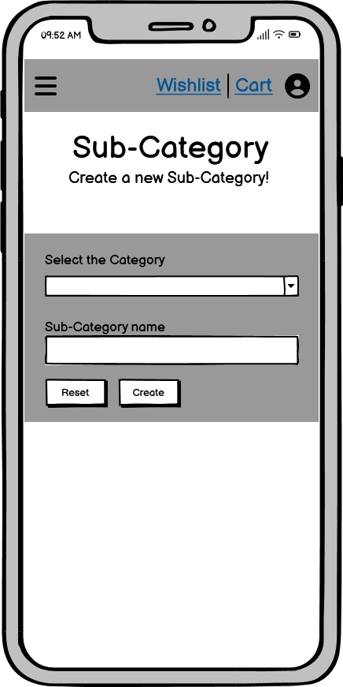
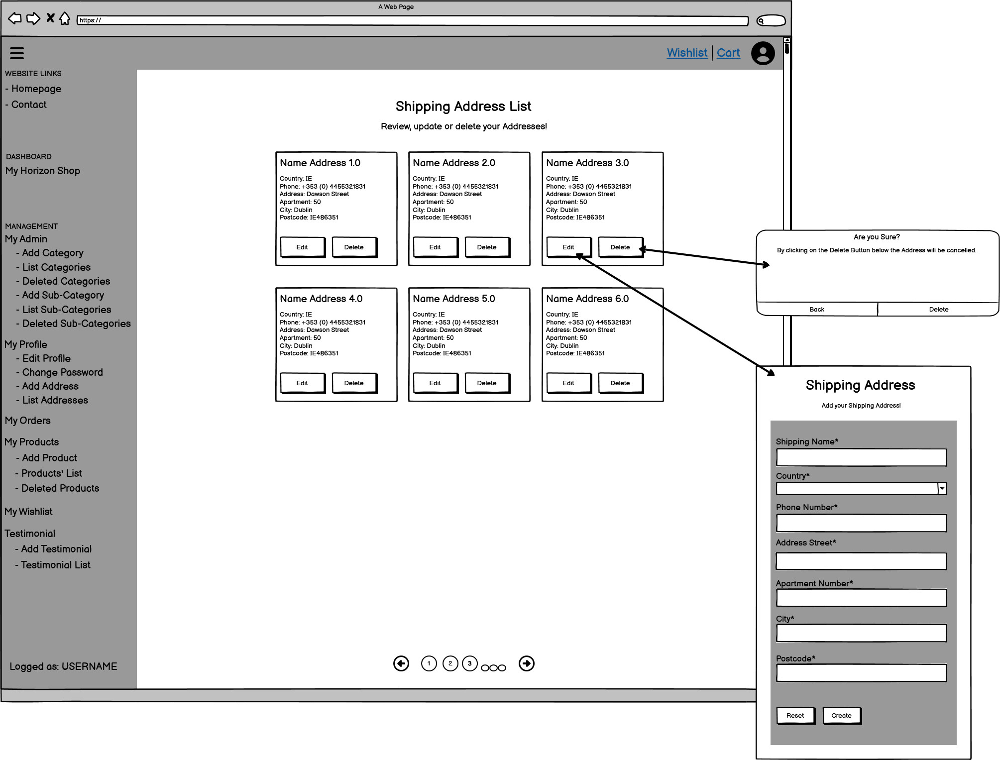
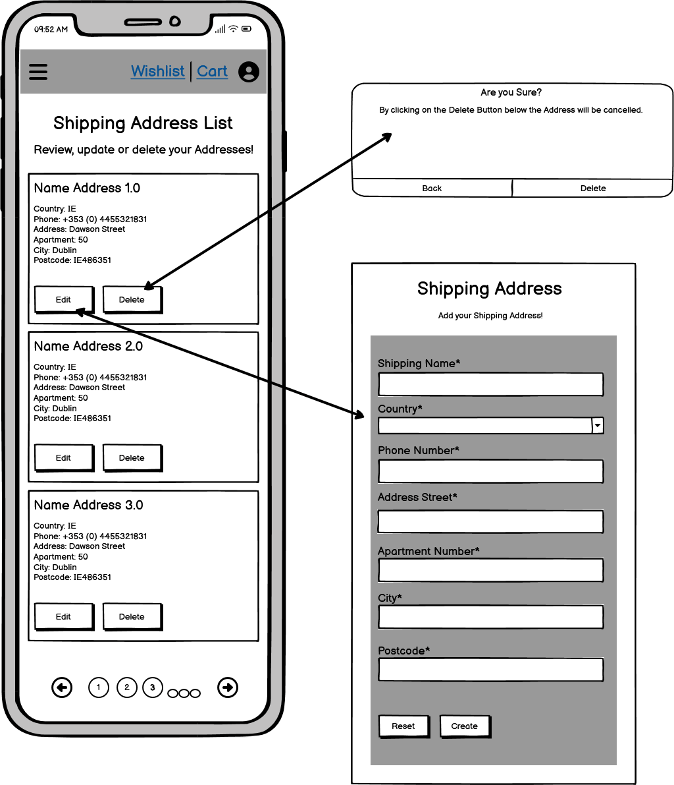
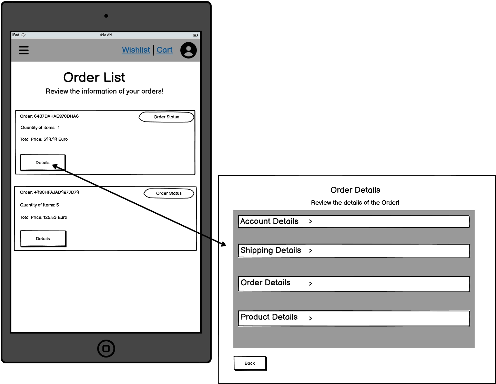
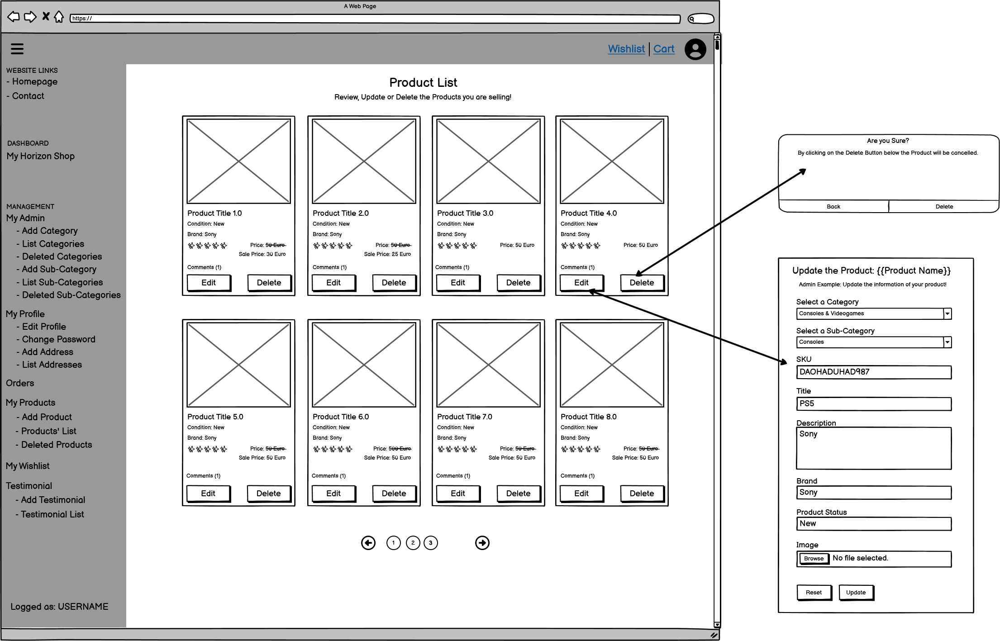
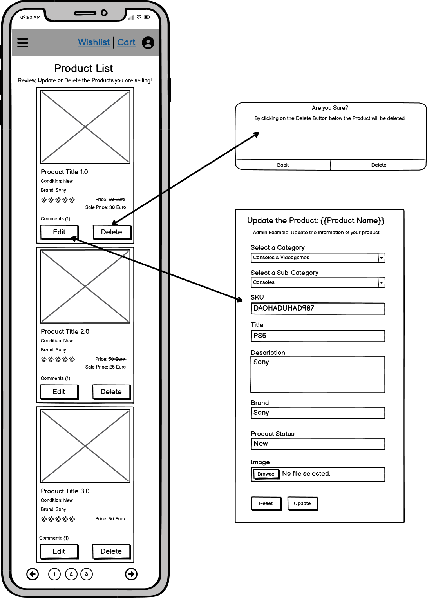
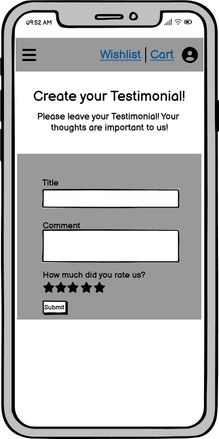

# **Horizon Shop** Website

### **Developer: Claudio Crocilla**


### **Readme Contents Horizon Shop**
- [Overview](#overview)
- [Project](#project)
  - [User Goal](#user-goal)
- [Marketing Strategies](#marketing-strategies)
- [User Experience (UX)](#user-experience-ux)
  - [User Stories](#user-stories)
  - [Use Cases](#use-cases)
    - [Homepage](#home-page)
    - [Contact Us](#contact-us)
    - [Dashboard](#dashboard)
    - [Sign In/Sign Up](#sign-in-sign-up)
- [Design](#design)
  - [Colour Scheme](#colour-scheme)
  - [Typography](#typography)
  - [Images and Videos](#images-and-videos)
- [Features](#features)
  - [Database Schema](#database-schema)
  - [Structure](#structure)
  - [Homepage](#home-page-1)
  - [Contact Us](#contact-us-page)
  - [Sign Up/Sign](#sign-upsign-in-page-and-authentication-process)
  - [Dashboard](#dashboard-1)
  - [404 Error Page](#404-error-page)
- [Wireframe](#wireframe)
- [Technologies Used](#technologies-used)
  - [Languages](#languages)
  - [Frameworks, Libraries & Programs Used](#frameworks-libraries--programs-used)
- [Testing](#testing)
  - [Go to the Testing File](TESTING.md)
- [Development](#deployment)
  - [Github](#github)
  - [Heroku](#heroku-app)
  - [Github Pages](#github-pages)
  - [Forking the GitHub Repository](#forking-the-github-repository)
  - [Local Clone](#local-clone)
- [Credits](#credits)


## **Overview**

##### Internet users all around the world love to buy and sell products online. Since the Covid-19 pandemic hit, our ways to shop have drastically changed. 
##### E-commerce business has grown exponentially making online shopping not only a habit but also a pleasure! Online shopping is in fact part of our life with products available just at a (mouse) click.
##### Horizon Shop is not like any other e-commerce website. All the products that you have ever wanted are there for you. You can browse, buy or sell. Just surf and choose. Hey...We are waiting for you, fill your cart and enjoy your journey with us.

##### The Horizon Shop website is intuitive and user-friendly! The users can register to the website with a few easy steps by entering Username and Email and have access to all Horizon Shop great services! The users can also subscribe to a newsletter and receive regular updates as well as provide/review a testimonial, comment on the Products, Report issues or Request support!


<a href="https://horizonshop.herokuapp.com/" target="_blank" rel="noopener noreferrer"></a>
<br/>
Click in the image above to access the Live Website or [click here!](https://horizonshop.herokuapp.com/ "Horizon Shop")

## **Project** 

### **User Goal**
- Easy, Intuitive and User-Friendly Website!
- Wide compatibility with every Browsers and Devices.
- A fast, easy and intuitive way to buy and sell products.
- Time is precious for everyone and we save yours offering a great buying and selling experience.
- High variety of Services offered to the users.
- Possibility to share customer experience via the Dashboard Page.
- Fellow Customer feedback visible to the users in the Home Page.
- Newsletter available to receive updates/offers via email.
- Possibility to report an issue or request assistance/support via Contact Us Page.


---

## **Marketing Strategies** 

### **SEO**
#### Search Engine Optimization (SEO) is a fundamental tool to improve the traffic of a website. Website ranking high in the results reported by searching engines get more visibilities and hence more prospects converted into customers. Horizon Shop aims at being one of the most sought e-commerce all around the world. Best practices used in Horizon Shop for the SEO are listed below:
- Meta Tag Keywords: A set of the most researched Keywords has been used between Short-tail and Long-tail Keywords (also with the help of the auto-complete feature of google search) in order to tell the Search Engine about the content of Horizon Shop! Keywords such as “great offers”, “good customer service”, “E-commerce” are what the our customers are looking for and can find when googling Horizon Shop.
- Meta Tag Description: The Description is a short snippet paragraph displayed underneath the Website Title Link that describe the Website content. It is the first thing that a Customer see when they search for website. The Horizon Shop tag description include a bumper sticker  implemented to attract customers.  
- Strong and Effective Titles and Headings have been used in Horizon Shop to help Google understand the content of the Website making the pages more user-friendly. 
- Horizon Shop has been realized with one main aim, create a User Friendly Website with a great and easy Design to offer a great user experience to the customers! Particular care has been applied in obtaining great responsiveness thorough the entire website, as quick load times lead to better SEO rankings, making it easier for people to find our website. 
- Together with the responsiveness, the images showing Horizon Shop new and used products have been optimised resulting in faster-page-load to provide the best user experience possible to the customers and consequently improve the websites SEO ranking. 
- CDN have been used in Horizon Shop as CDNs improve a website’s loading speep/performance and consequentially it improves search engine ranking and search engine optimization increasing the SEO of the Website since Google gives priority to websites that have faster load times and those that are easy to crawl repeatedly.


To provide usefull information for search engines a Robot.txt and a Sitemap.xml file has also been created and added to Horizon Shop. 

<br>

### robots.txt
<details>
    <summary>Click here to see the robots.txt content.</summary>

```
User-agent: *
Disallow: /accounts/
Disallow: /dashboard/
Disallow: /cart/
Disallow: /checkout/
Disallow: /wishlist/
Sitemap: https://horizonshop.herokuapp.com/sitemap.xml
```

</details>

<br>

### sitemap.xml
<details>
    <summary>Click here to see the sitemap.xml content.</summary>

```
<?xml version="1.0" encoding="UTF-8"?>
<urlset
      xmlns="http://www.sitemaps.org/schemas/sitemap/0.9"
      xmlns:xsi="http://www.w3.org/2001/XMLSchema-instance"
      xsi:schemaLocation="http://www.sitemaps.org/schemas/sitemap/0.9
            http://www.sitemaps.org/schemas/sitemap/0.9/sitemap.xsd">
<!-- created with Free Online Sitemap Generator www.xml-sitemaps.com -->


<url>
  <loc>https://horizonshop.herokuapp.com/</loc>
  <lastmod>2022-11-21T15:43:51+00:00</lastmod>
  <priority>1.00</priority>
</url>
<url>
  <loc>https://horizonshop.herokuapp.com/contact-us/</loc>
  <lastmod>2022-11-21T15:43:51+00:00</lastmod>
  <priority>0.80</priority>
</url>
<url>
  <loc>https://horizonshop.herokuapp.com/cart/</loc>
  <lastmod>2022-11-21T15:43:51+00:00</lastmod>
  <priority>0.80</priority>
</url>
<url>
  <loc>https://horizonshop.herokuapp.com/accounts/signup/</loc>
  <lastmod>2022-11-21T15:43:51+00:00</lastmod>
  <priority>0.80</priority>
</url>
<url>
  <loc>https://horizonshop.herokuapp.com/accounts/login/</loc>
  <lastmod>2022-11-21T15:43:51+00:00</lastmod>
  <priority>0.80</priority>
</url>
<url>
  <loc>https://horizonshop.herokuapp.com/products/all/</loc>
  <lastmod>2022-11-21T15:43:51+00:00</lastmod>
  <priority>0.80</priority>
</url>
<url>
  <loc>https://horizonshop.herokuapp.com/products/new/</loc>
  <lastmod>2022-11-21T15:43:51+00:00</lastmod>
  <priority>0.80</priority>
</url>
<url>
  <loc>https://horizonshop.herokuapp.com/products/used/</loc>
  <lastmod>2022-11-21T15:43:51+00:00</lastmod>
  <priority>0.80</priority>
</url>
<url>
  <loc>https://horizonshop.herokuapp.com/products/search-by/category/console-videogames/</loc>
  <lastmod>2022-11-21T15:43:51+00:00</lastmod>
  <priority>0.80</priority>
</url>
<url>
  <loc>https://horizonshop.herokuapp.com/products/search-by/subcategory/console/</loc>
  <lastmod>2022-11-21T15:43:51+00:00</lastmod>
  <priority>0.80</priority>
</url>
<url>
  <loc>https://horizonshop.herokuapp.com/products/search-by/subcategory/videogames/</loc>
  <lastmod>2022-11-21T15:43:51+00:00</lastmod>
  <priority>0.80</priority>
</url>
<url>
  <loc>https://horizonshop.herokuapp.com/products/ps5-3w6Hq/details/</loc>
  <lastmod>2022-11-21T15:43:51+00:00</lastmod>
  <priority>0.80</priority>
</url>
<url>
  <loc>https://horizonshop.herokuapp.com/products/ps5/details/</loc>
  <lastmod>2022-11-21T15:43:51+00:00</lastmod>
  <priority>0.80</priority>
</url>
<url>
  <loc>https://horizonshop.herokuapp.com/products/xbox-series-x-1tb-console/details/</loc>
  <lastmod>2022-11-21T15:43:51+00:00</lastmod>
  <priority>0.80</priority>
</url>
<url>
  <loc>https://horizonshop.herokuapp.com/contact-us/terms/</loc>
  <lastmod>2022-11-21T15:43:51+00:00</lastmod>
  <priority>0.80</priority>
</url>
<url>
  <loc>https://horizonshop.herokuapp.com/accounts/password/reset/</loc>
  <lastmod>2022-11-21T15:43:51+00:00</lastmod>
  <priority>0.64</priority>
</url>
<url>
  <loc>https://horizonshop.herokuapp.com/products/all/?sort=price&amp;direction=desc</loc>
  <lastmod>2022-11-21T15:43:51+00:00</lastmod>
  <priority>0.64</priority>
</url>
<url>
  <loc>https://horizonshop.herokuapp.com/products/all/?sort=price&amp;direction=asc</loc>
  <lastmod>2022-11-21T15:43:51+00:00</lastmod>
  <priority>0.64</priority>
</url>
<url>
  <loc>https://horizonshop.herokuapp.com/products/all/?sort=brand&amp;direction=asc</loc>
  <lastmod>2022-11-21T15:43:51+00:00</lastmod>
  <priority>0.64</priority>
</url>
<url>
  <loc>https://horizonshop.herokuapp.com/products/all/?sort=brand&amp;direction=desc</loc>
  <lastmod>2022-11-21T15:43:51+00:00</lastmod>
  <priority>0.64</priority>
</url>
<url>
  <loc>https://horizonshop.herokuapp.com/products/all/?sort=title&amp;direction=asc</loc>
  <lastmod>2022-11-21T15:43:51+00:00</lastmod>
  <priority>0.64</priority>
</url>
<url>
  <loc>https://horizonshop.herokuapp.com/products/all/?sort=title&amp;direction=desc</loc>
  <lastmod>2022-11-21T15:43:51+00:00</lastmod>
  <priority>0.64</priority>
</url>
<url>
  <loc>https://horizonshop.herokuapp.com/products/new/?sort=price&amp;direction=desc</loc>
  <lastmod>2022-11-21T15:43:51+00:00</lastmod>
  <priority>0.64</priority>
</url>
<url>
  <loc>https://horizonshop.herokuapp.com/products/new/?sort=price&amp;direction=asc</loc>
  <lastmod>2022-11-21T15:43:51+00:00</lastmod>
  <priority>0.64</priority>
</url>
<url>
  <loc>https://horizonshop.herokuapp.com/products/new/?sort=brand&amp;direction=asc</loc>
  <lastmod>2022-11-21T15:43:51+00:00</lastmod>
  <priority>0.64</priority>
</url>
<url>
  <loc>https://horizonshop.herokuapp.com/products/new/?sort=brand&amp;direction=desc</loc>
  <lastmod>2022-11-21T15:43:51+00:00</lastmod>
  <priority>0.64</priority>
</url>
<url>
  <loc>https://horizonshop.herokuapp.com/products/new/?sort=title&amp;direction=asc</loc>
  <lastmod>2022-11-21T15:43:51+00:00</lastmod>
  <priority>0.64</priority>
</url>
<url>
  <loc>https://horizonshop.herokuapp.com/products/new/?sort=title&amp;direction=desc</loc>
  <lastmod>2022-11-21T15:43:51+00:00</lastmod>
  <priority>0.64</priority>
</url>
<url>
  <loc>https://horizonshop.herokuapp.com/products/used/?sort=price&amp;direction=desc</loc>
  <lastmod>2022-11-21T15:43:51+00:00</lastmod>
  <priority>0.64</priority>
</url>
<url>
  <loc>https://horizonshop.herokuapp.com/products/used/?sort=price&amp;direction=asc</loc>
  <lastmod>2022-11-21T15:43:51+00:00</lastmod>
  <priority>0.64</priority>
</url>
<url>
  <loc>https://horizonshop.herokuapp.com/products/used/?sort=brand&amp;direction=asc</loc>
  <lastmod>2022-11-21T15:43:51+00:00</lastmod>
  <priority>0.64</priority>
</url>
<url>
  <loc>https://horizonshop.herokuapp.com/products/used/?sort=brand&amp;direction=desc</loc>
  <lastmod>2022-11-21T15:43:51+00:00</lastmod>
  <priority>0.64</priority>
</url>
<url>
  <loc>https://horizonshop.herokuapp.com/products/used/?sort=title&amp;direction=asc</loc>
  <lastmod>2022-11-21T15:43:51+00:00</lastmod>
  <priority>0.64</priority>
</url>
<url>
  <loc>https://horizonshop.herokuapp.com/products/used/?sort=title&amp;direction=desc</loc>
  <lastmod>2022-11-21T15:43:51+00:00</lastmod>
  <priority>0.64</priority>
</url>
<url>
  <loc>https://horizonshop.herokuapp.com/products/search-by/category/console-videogames/?sort=price&amp;direction=desc</loc>
  <lastmod>2022-11-21T15:43:51+00:00</lastmod>
  <priority>0.64</priority>
</url>
<url>
  <loc>https://horizonshop.herokuapp.com/products/search-by/category/console-videogames/?sort=price&amp;direction=asc</loc>
  <lastmod>2022-11-21T15:43:51+00:00</lastmod>
  <priority>0.64</priority>
</url>
<url>
  <loc>https://horizonshop.herokuapp.com/products/search-by/category/console-videogames/?sort=brand&amp;direction=asc</loc>
  <lastmod>2022-11-21T15:43:51+00:00</lastmod>
  <priority>0.64</priority>
</url>
<url>
  <loc>https://horizonshop.herokuapp.com/products/search-by/category/console-videogames/?sort=brand&amp;direction=desc</loc>
  <lastmod>2022-11-21T15:43:51+00:00</lastmod>
  <priority>0.64</priority>
</url>
<url>
  <loc>https://horizonshop.herokuapp.com/products/search-by/category/console-videogames/?sort=title&amp;direction=asc</loc>
  <lastmod>2022-11-21T15:43:51+00:00</lastmod>
  <priority>0.64</priority>
</url>
<url>
  <loc>https://horizonshop.herokuapp.com/products/search-by/category/console-videogames/?sort=title&amp;direction=desc</loc>
  <lastmod>2022-11-21T15:43:51+00:00</lastmod>
  <priority>0.64</priority>
</url>
<url>
  <loc>https://horizonshop.herokuapp.com/products/search-by/category/test-cat/?sort=price&amp;direction=desc</loc>
  <lastmod>2022-11-21T15:43:51+00:00</lastmod>
  <priority>0.64</priority>
</url>
<url>
  <loc>https://horizonshop.herokuapp.com/products/search-by/category/test-cat/?sort=price&amp;direction=asc</loc>
  <lastmod>2022-11-21T15:43:51+00:00</lastmod>
  <priority>0.64</priority>
</url>
<url>
  <loc>https://horizonshop.herokuapp.com/products/search-by/category/test-cat/?sort=brand&amp;direction=asc</loc>
  <lastmod>2022-11-21T15:43:51+00:00</lastmod>
  <priority>0.64</priority>
</url>
<url>
  <loc>https://horizonshop.herokuapp.com/products/search-by/category/test-cat/?sort=brand&amp;direction=desc</loc>
  <lastmod>2022-11-21T15:43:51+00:00</lastmod>
  <priority>0.64</priority>
</url>
<url>
  <loc>https://horizonshop.herokuapp.com/products/search-by/category/test-cat/?sort=title&amp;direction=asc</loc>
  <lastmod>2022-11-21T15:43:51+00:00</lastmod>
  <priority>0.64</priority>
</url>
<url>
  <loc>https://horizonshop.herokuapp.com/products/search-by/category/test-cat/?sort=title&amp;direction=desc</loc>
  <lastmod>2022-11-21T15:43:51+00:00</lastmod>
  <priority>0.64</priority>
</url>
<url>
  <loc>https://horizonshop.herokuapp.com/products/search-by/subcategory/console/?sort=price&amp;direction=desc</loc>
  <lastmod>2022-11-21T15:43:51+00:00</lastmod>
  <priority>0.64</priority>
</url>
<url>
  <loc>https://horizonshop.herokuapp.com/products/search-by/subcategory/console/?sort=price&amp;direction=asc</loc>
  <lastmod>2022-11-21T15:43:51+00:00</lastmod>
  <priority>0.64</priority>
</url>
<url>
  <loc>https://horizonshop.herokuapp.com/products/search-by/subcategory/console/?sort=brand&amp;direction=asc</loc>
  <lastmod>2022-11-21T15:43:51+00:00</lastmod>
  <priority>0.64</priority>
</url>
<url>
  <loc>https://horizonshop.herokuapp.com/products/search-by/subcategory/console/?sort=brand&amp;direction=desc</loc>
  <lastmod>2022-11-21T15:43:51+00:00</lastmod>
  <priority>0.64</priority>
</url>
<url>
  <loc>https://horizonshop.herokuapp.com/products/search-by/subcategory/console/?sort=title&amp;direction=asc</loc>
  <lastmod>2022-11-21T15:43:51+00:00</lastmod>
  <priority>0.64</priority>
</url>
<url>
  <loc>https://horizonshop.herokuapp.com/products/search-by/subcategory/console/?sort=title&amp;direction=desc</loc>
  <lastmod>2022-11-21T15:43:51+00:00</lastmod>
  <priority>0.64</priority>
</url>
<url>
  <loc>https://horizonshop.herokuapp.com/products/search-by/subcategory/videogames/?sort=price&amp;direction=desc</loc>
  <lastmod>2022-11-21T15:43:51+00:00</lastmod>
  <priority>0.64</priority>
</url>
<url>
  <loc>https://horizonshop.herokuapp.com/products/search-by/subcategory/videogames/?sort=price&amp;direction=asc</loc>
  <lastmod>2022-11-21T15:43:51+00:00</lastmod>
  <priority>0.64</priority>
</url>
<url>
  <loc>https://horizonshop.herokuapp.com/products/search-by/subcategory/videogames/?sort=brand&amp;direction=asc</loc>
  <lastmod>2022-11-21T15:43:51+00:00</lastmod>
  <priority>0.64</priority>
</url>
<url>
  <loc>https://horizonshop.herokuapp.com/products/search-by/subcategory/videogames/?sort=brand&amp;direction=desc</loc>
  <lastmod>2022-11-21T15:43:51+00:00</lastmod>
  <priority>0.64</priority>
</url>
<url>
  <loc>https://horizonshop.herokuapp.com/products/search-by/subcategory/videogames/?sort=title&amp;direction=asc</loc>
  <lastmod>2022-11-21T15:43:51+00:00</lastmod>
  <priority>0.64</priority>
</url>
<url>
  <loc>https://horizonshop.herokuapp.com/products/search-by/subcategory/videogames/?sort=title&amp;direction=desc</loc>
  <lastmod>2022-11-21T15:43:51+00:00</lastmod>
  <priority>0.64</priority>
</url>


</urlset>
```

</details>

<br>

### **Social Media**
##### Social Media are great to boost the market of a website! They are an effective tool to connect with more customers and improve the visibility of the website increasing awareness about the brand. Social Media also helps building trust showing company values, but also offers and services!
##### One of the most valuable social media platform is Facebook which has been used to publicize the work and dedication of Horizon Shop and its team.
##### The Horizon Shop Facebook page is a show case of all the unmissable deals on offer:


##### The Horizon Shop Team is always ready for our customer with their dynamicity and kindness to go the extra mail, see our post below to meet some of them:


##### The user that enters in the Facebook Page is Welcomed with a first message: 


##### The Facebook Page can be accessed using the link below: 
 [Horizon Shop Facebook Page](https://www.facebook.com/iehorizonshop)

<br>

### **Newsletter**
##### Newsletters are one of the most powerful digital marketing tools. Thanks to Newsletter management and administrators can directly communicate with prospects and customers in a personalized way providing valuable content and relevant promotions straight to their inboxes. In Horizon Shop anyone can Sign Up for the Newsletter and no registration is required!
##### One of the most used Newsletter is Mailchimp, an all-in-one marketing platform, that helps manage and communicate to clients, customers, and other interested parties. Mailchimp has been implemented in the Footer Section of Horizon Shop!

 

---

## **User Experience (UX)**

### **User Stories**
- #### First Time Visitor Goals
    1. As a First Time visitor of a website dedicated to buying/selling products online, I want to have a visual impact on the Landing Page that will attract my attention.
    2. As a First Time Visitor, I want to be able to easily navigate through the website.
    3. As a First Time Visitor, I want to be able to easily browse/buy/sell the offered products.
    4. As a First Time Visitor, I want to be able to see the services offered by Horizon Shop website.
    5. As a First Time Visitor, I want to find the website pleasant to the eye, visually intuitive, with catchy colours and images.


- #### Returning Visitor Goals
    1. As a Returning Visitor, I want to be able to register to the website.
    2. As a Returning Visitor, I want to be able to buy products.
    3. As a Returning Visitor, I want to be able to sell products.
    4. As a Returning Visitor, I want to be able to report issues.
    5. As a Returning Visitor, I want to be able to request assistance.
    6. As a Returning Visitor, I want to access the website through my social media accounts.


- #### Frequent User Goals
    1. As a Frequent User, I want to see new products/offers.
    2. As a Frequent User, I want to see new services.
    3. As a Frequent User, I want to be able to change my personal registered information (if/when necessary)..
    4. As a frequent User, I want to be able to access my personal information via a Dashboard Page.
    5. As a Frequent User, I want to sign up to the Newsletter to receive updates about new offers on Horizon Shop.
    6. As a Frequent User, I want to report issues.
    7. As a Frequent User, I want to share my personal reviews or leave a comment on the products.
    8. As a Frequent User, I want to share my personal rate on the website products.


For the User Stories and the Epics please refer to the following links:
- [User Stories](https://github.com/users/CCrocilla/projects/3)
- [Epics](https://github.com/CCrocilla/horizon-shop/milestones)

<!-- Use Cases Area -->
### **Use Cases**

### *_Home Page_*
<details>
    <summary>Description</summary>
    
- Users can use this website to buy and sell products online.
- Users should be able to see the available products and services.
- Users should be able to see the latest products added to the website.
- Users should be able to see the offers available.
- Users should be able to see other customers feedback.

</details>

<details>
    <summary>System & Actors</summary>

**System:** E-commerce Website.

**Actors:** Users looking to buy or sell products online.
</details>

<details>
    <summary>Pre-Conditions</summary>

Users should register into the website to be able to buy products.
Users should register into the website to be able to sell products.
Users should register into the website to leave a testimonial.
Users should register into the website to leave a review/comment on a product.
Users should register into the website to rate a product.

</details>

<details>
    <summary>Basic Flow</summary>

- The user browses the internet to buy and/or sell products online and discovers the website. The user navigates to the Home Page, and is attracted by the visual impact of the website.
- The user sees the available products.
- The user sees the available services.
- The user sees the feedback left by the community.
- The user can register to the newsletter.

</details>

<details>
    <summary>Alternative/Exception Flow</summary>

- When the user selects a non-existent page, a 404 Error Page will be prompted guiding the user back to Home Page.
- If the user is not logged in, he/she will not able to leave testimonial, reviews/comments and/or rate products.

</details>
<br/>


### *_Contact Us_*
<details>
    <summary>Description</summary>

- Users can subscribe to the newsletter, report issues or request assistance.
- Users can accept/visualise the terms and conditions.
- Users can use this page to see the general info of Horizon Shop Company (including Address, Email address, phone, and a map showing Horizon Shop HQ).

</details>

<details>
    <summary>System & Actors</summary>

**System:** E-commerce Website.

**Actors:** Users who want to report issues or request assistance or want to check the contact details/location of Horizon Shop.
</details>

<details>
    <summary>Pre-Conditions</summary>
Users should accept the Terms and Conditions to be able to ask for support/report issues.
</details>

<details>
    <summary>Basic Flow</summary>

- The user user browses the internet to buy and/or sell products online and knows about the website. The user navigates to the Home Page then goes into the Contact Us Page to ask for support/report issues.
- The user fills the forms mandatory fields.
- The user must accept the Terms and Conditions to subscribe to the newsletter and/or report issues/ request support.
- The user submits the form.
- The user receives a notification indicating that the form has been submitted successfully.

</details>

<details>
    <summary>Alternative/Exception Flow</summary>

- The user can reset the form.
- When the user selects a non-existent page, a 404 Error Page will be prompted guiding the user back to Home Page.

</details>
<br/>


### *_Products_*
<details>
    <summary>Description</summary>

- Users see the list of Products.
- Users can see the list of Products filtered by All, New, Used, Category or Sub-Category.
- Users can search products using the Search Field.
- Users can add the products to the Cart or to a Wishlist.
- Users can access the details of a product.

</details>

<details>
    <summary>System & Actors</summary>

**System:** E-commerce Website.

**Actors:** User looking to buy products online.
</details>

<details>
    <summary>Pre-Conditions</summary>
Users should register into the website to be able to add products to the Cart.
Users should register into the website to be able to add products to the Wishlist.

</details>

<details>
    <summary>Basic Flow</summary>

- The user browses the internet to buy and/or sell products online and knows about the website. 
- The user sign into the website and navigates to the Home Page.
- The user goes into one of the Product Pages (All Products, New Products, Used Products, Products By Category, Products By Sub-Category). 
- The user see the list of products clearly marked as used or new an icon placed on the top right corner of each product image. 
- The user finds the product that he/she likes and clicks on the Quick Add to Cart or Add to Wishlist Icon. 
- Alternatively the user can click on the Image or the Title of the Product to open the Product Details Page and then add the product to the Cart or Wishlist using the dedicated buttons. 
- The user receives a notification indicating that the product has been added successfully to the Cart or Wishlist.

</details>

<details>
    <summary>Alternative/Exception Flow</summary>

- The user can search product using the Search Field.
- When the user selects a non-existent product, a 404 Error Page will be prompted guiding the user back to the Home Page.
- 
</details>
<br/>


### *_Checkout_*
<details>
    <summary>Description</summary>

- Users see the list of Products using one of the buttons available for All, New, Used, Category or Sub-Category Products or can search product using the Search Field.
- Users can add the product to the Cart.
- Users can add the Shipping Information and proceed to the checkout page.
- Users can enter the correct information in the Payment Form and be redirected to a Payment Success Page.
- Users receive an email confirming that the order has been placed correctly.


</details>

<details>
    <summary>System & Actors</summary>

**System:** E-commerce Website.

**Actors:** User looking to buy products online.
</details>

<details>
    <summary>Pre-Conditions</summary>
Users should register into the website to be able to buy products.
Users should register into the website to be able to add products to the Cart.

</details>

<details>
    <summary>Basic Flow</summary>

- The user browses the internet to buy products online and discovers the website.
- The user signs into the website and navigates to the Home Page.
- The user goes into one of the Products Page (All Products, New Products, Used Products, Products By Category, Products By Sub-Category). 
- The user sees the list of products clearly marked as used or new.  
- The user find the product that he/she likes and can click on the Quick Add to Cart Icon/Button. 
- The user goes into the Cart Page and can change the quantity of product(s) added.
- The user selects a Shipping Address. 
- The user clicks on the Checkout Button.
- The user reviews all the information of the order.
- The user enters a valid payment card and clicks to the Pay Now Button.
- If the payment is valid, the user is redirected to the Payment Success Page and receives a notification indicating the order number of the successful purchase.

</details>

<details>
    <summary>Alternative/Exception Flow</summary>

- Users not logged-in trying to access the Checkout Page, are redirected to the Sign In Page and a notification is displayed.
- The user can search products using the Search Field.
- When the user selects a non-existent product, a 404 Error Page will be prompted guiding the user back to Home Page.

</details>
<br/>


### *_Wishlist_*
<details>
    <summary>Description</summary>

- Users can access the Wishlist page only when they are signed in.
- Users can add products to their private Wishlist.
- Users can see all the information of the products.
- Users can access the product details by clicking on the Image or the Title of the product.

</details>

<details>
    <summary>System & Actors</summary>

**System:** E-commerce Website.

**Actors:** User looking to buy products online.
</details>

<details>
    <summary>Pre-Conditions</summary>
Users should register into the website to be able to add products to the Wishlist.

</details>

<details>
    <summary>Basic Flow</summary>

- The user browses the internet to buy products online and discovers the website.
- The user signs into the website and navigates to the Home Page to see the list of the latest products added to Horizon Shop (or goes into one of the Products Page). 
- The user sees the list of products.  
- The user finds the product that he/she likes and can click on the Quick Add to Wishlist Icon. 
- Alternatively, the user can click on the Image or the Title of the Product to open the Product Details Page and then add the product to the Wishlist using the dedicated buttons. 
- The user receives a notification indicating that the product has been successfully added to the Wishlist.

</details>

<details>
    <summary>Alternative/Exception Flow</summary>

- Users not logged-in trying to access the Wishlist Page, are redirected to the Sign In Page and a notification is displayed.
- When the user selects a non-existent page, a 404 Error Page will be prompted guiding the user back to Home Page.

</details>
<br/>


### *_My Horizon Shop (Dashboard)_*
<details>
    <summary>Description</summary>

<details>
    <summary>Admin Description</summary>
- Admin Users can access My Horizon Shop page only when they are signed in.
- Admin Users can access a number of services divided into separate sub-section listed as follow:

1. My Admin: to add, edit and/or delete Categories and Sub-Categories.  
2. My Profile: to add or edit their personal profile information, change the passwords, register a new address and/or list/delete previously registered shipping addresses.
3. Orders: to see and Review the Customer’s Orders.
4. My Products: to add, edit, delete and/or restore Products, to post the products they want to sell.
5. My Wishlist: to visualise the list of items they want to buy using a dedicated Wishlist section page.
6. My Testimonials: to visualise past or add new testimonials. Once signed-in the Admin User is presented with the possibility to delete/edit past testimonials.

</details>

<details>
    <summary>Customer Description </summary>
- Users can access My Horizon Shop page only when they are signed in.
- Users can access a number of services divided into separate sub-section listed as follow:

1. My Profile: to add or edit their personal profile information, change their passwords, add an avatar, register a new address and/or list/delete previously registered shipping addresses.
2. My Orders: to see and Review their own orders.
3. My Products: to post the products they want to sell as used product in Horizon Shop.  
4. My Wishlist: to visualise the list of items they want to buy using a Wishlist section page.
5. My Testimonials: to visualise past or add new testimonials. Once signed-in the customer user is presented with the possibility to delete/edit past testimonials.

</details>


</details>

<details>
    <summary>System & Actors</summary>

**System:** E-commerce Website.

**Actors:**
Admin that want to manage their own E-Commerce.
Customers that want to access past/present orders, edit or create their profile and/or provide testimonials.

</details>

<details>
    <summary>Pre-Conditions</summary>
Admin/Customers should register into the website to access the page.
</details>

<details>
    <summary>Basic Flow</summary>

- The user browses the internet to buy and/or sell products online and discovers/knows about the website. 
- The user sign into the website and navigates to the Dashboard Page. 
- The user is presented with a list of possible options to access the profile page, the products, the Wishlist, the orders or the testimonials.
- The user clicks into the desired sub-section.
- The user is able to perform a list of desired actions of choice.

</details>

<details>
    <summary>Alternative/Exception Flow</summary>

- Users not logged-in trying to access the Dashboard Page are redirected to the Sign In Page and a notification is displayed.
- Users not logged-in trying to access any other pages of the Dashboard are presented with an Authentication Error message.
- When the user selects a non-existent page, a 404 Error Page will be prompted guiding the user back to Home Page.
</details>
<br/>


### *_Sign In/ Sign Up_*
<details>
    <summary>Description</summary>

- Users can Sign-Up to the website.
- Users can Sign-In to the website.

</details>

<details>
    <summary>System & Actors</summary>

**System:** E-commerce Website.

**Actors:** Users who want to register/sign-in to the website.
</details>

<details>
    <summary>Pre-Conditions</summary>
Users should be willing to register to the website.
</details>

<details>
    <summary>Basic Flow</summary>

- The user browses the internet to buy and/or sell products online and discovers/knows about the website. The user navigates to the Home Page and then goes into the Sign Up Page.
- Users subscribe to the website by filling the mandatory fields.
- Users will receive a confirmation email to their address.
- Users verify the provided email address.
- Users sign-in with the chosen username/email and passwords.


</details>

<details>
    <summary>Alternative/Exception Flow</summary>

- The users can click on the Forgot Password Button if they are not able to sign in.
- The users can click to the Need an Account Button if they need to register.
- When the user selects a non-existent page, a 404 Error Page will be prompted guiding the user back to Home Page.

</details>


---

## **Design**

#### The webpage has been designed to provide a simple, interactive and intuitive view which is able to offer a pleasant experience to customers looking to buy and/or sell products online.
#### Every page has a minimalistic structure which however contains all the relevant features in order to provide the user with an interactive, clear and effective experience.  

- ### **Colour Scheme**
#### The goal is to use a colour palette that will provide the user with a good and positive impact at a first glance when opening the website and through the entire navigation experience.
#### The list of colors is chosen to be pleasing to the eyes providing an excellent contrast that will allow the user to have prolonged navigation hours without tiring the eyes.

Colour Source: 
  - #### [Adobe Color](https://color.adobe.com/create/color-wheel)
  - #### [Color Hunt](https://colorhunt.co/) 
#### The main colors are Dark Navy (#1D273B), Yellow (#F59F00) and Light (#F6F7F8) for text and background, while in the Hero Images a Green Variant (#2FB344) has been used to better highlight some important content of Horizon Shop!
#### Dark Navy (#1D273B) has also been used for the background in the Navbar and Footer. These colors are chosen to provide a better visual contrast of each component.


- ### **Typography**
#### Google Fonts has been used to select the fonts for the Website.
#### The Main font used is 'Ubuntu' while the Sans-serif has been set up as fall-back in case the main font is not loaded.

Source:
  - [Google Fonts](https://fonts.google.com/)


- ### **Images and Videos**
#### Real and effective images have been used to provide a pleasant visual experience to the user.
#### The developer selected those images from the following source to mimic a full immersive e-commerce website.

Sources:  
  - [Pexels](https://www.pexels.com/)

--- 

## **Features**

- ### *__Database Schema__*:
#### The database schema, representing the structure and organization of Horizon Shop database, has been realized using the Software Wondershare EdrawMax defining the primary and foreign key between tables for optimal definition of parents and child tables. A representation of the used schema can be visualised below. 

<details>
    <summary>Click here for the Database Schema </summary>  

</details>


- ### *__Structure__*:
#### The website has been structured in an easy and user-friendly way with 7 main pages. Non-authenticated and authenticated customers are provided with two different page views.
#### The Non-authenticated can visualise and access:
- *Home Page*
- *Contact Us*
- *Sign-In* and *Sign-Up*
- *Products* (The Non-authenticated user can only see the Product's Information but is not allowed to add the Product to the Cart nor to the Wishlist)

#### Authenticated customers are also able to access *Wishlist*, *Cart*, *Chekcout* and the *My Horizon Shop Dashboard* pages for a full experience of the E-commerce.

#### The project has been realize creating a single app for each main section:
- Home App is the main app that stores the landing page of Horizon Shop. Here are displayed the Products (New and Used) and the Testimonials of the customers.
- Contact Us App contains the views, models, urls and form files for the Contact Us Page. The user can send a request via the Contact Us page and the information are stored in the Database.
- Product App contains the views, models, urls files for the Products advertized in Horizon Shop.
- Products Cart App contains the views, models, urls and templates for the management of the Cart.
- Products Checkout App contains the views, models, forms, urls and templates of the Checkout Process for the Orders of the Customers. It also includes the Webhook for the Stripe Payment Process.
- Products Wishlist App contains the views, models, urls that manages the Wishlist of the Customers. The user can add product to his/her own wishlist. 
- Dashboard App includes the views, models, forms, urls and template for all the My Horizon Shop Dashboard Sections. 


#### The Structure of the website and the components used are listed below:


- ### *__Home Page__*:
#### The Home Page shows the clickable logo of the website on the top left and a navigation bar on the top right of the page that includes the Home, Contact Us, Wishlist (Only for Authenticated Users), Cart and My Horizon Shop Dashboard Buttons.
#### The Nav Bar has been extended including the Products Buttons (All Product, New Products, Used Products, Products By Categories) that contains pre-set filters in order to display to the user the desired products.
#### Additionally, the user can avail of the Search Field on the right to search for product Title, Description, Brand, Categories and Sub-Categories and to display both New and Used Product matching the entered query. 

#### The active page is in bold and highlighted in yellow with rounded borders when selected. A small underline animation activates when the user mouse hovers on of the elements in the nav bar, highlighting the content.

#### A Tooltip showing the page name is displayed when hovering with mouse over the Home, Contact, Wishlist and Cart Page.
#### For the Wishlist and Cart Button a Badge has been included displaying the amount of selected products. This has been achieved by using the count() function in the back-end, the value is displayed using Django Template Tags.  

#### By clicking on each one of the Page, the name of the browser tab to the selected option. This has been achieved using the Django Template Tag by applying the extra title to the website name. 

#### Following the Logo and the Navbars the user can see the services offered by Horizon Shop in a dedicated yellow card. These include free delivery option, free return, secure payment and 24/7 support.

#### Below the Services Section, a hero carousel displays images of available products including links to redirect the user to specific offers.

#### Two Sections, Latest New and Latest Used Products, display the latest 4 Products for each type (new and used) added to Horizon Shop.

#### The Used tag gets automatically assigned to a product when the customer user creates the product add. This has been achieved by implementing a function in the back-end that set the Status Used when the creator of the Product is a Customer.
#### Subsequently, when interrogating the Product Database (filtering by the status), the last 4 products are returned into the assigned Views using a Django Template Tag with a for loop differentiating by Status (New or Used).
#### The Testimonials Section shows the latest 3 testimonials provided by other users. The signed-in users can leave a testimonial in their My Horison Shop Dashboard using the Add Testimonial Sub-Section. The Testimonial is then stored in the Database and it is displayed in the Home Page (including the Avatar and Name of the Customer, the Comment and the Rating) by querying the database for the latest 3 testimonials. 
#### The Latest Update Section shows new info about the company or new added services.
#### The Footer section concludes the Home Page, allowing the users to review the Horison Shop Company information, with the possibility to select the different sections of the website via dedicated links. In addition, a Subscribe to the Newsletter Area (built using MailChimp) and the Horizon Shop social media links are included in the footer.

#### Depending on the device used (if laptop, desktop, tablet or smartphone) the position of the Navbar changes, creating a hamburger menu that will be displayed on the top right part of the page to adapt the view for a highly responsive rendering.
#### Those behaviour are consistent in all pages.


- ### *__Contact Us Page__*:
#### This page has Header and Footer consistent with the Home Page.
#### The page is characterized by 3 different sections: 
- Contact Form
- Maps
- Company Details

#### The First Section is characterized by a form that the user can fill with the following information: Full Name, Email Address, Message and a mandatory checkbox for the Terms and Conditions so that the user can submit an Assistance Request or Report an Issue.
#### The user needs to accept the Terms & Conditions Checkbox to being able to move forward.
#### A Reset and a Submit buttons are included.
#### The Reset Button resets the form.
#### After clicking on the Submit Button, if the form is correctly filled in, the user is redirected to the same page and a notification is displayed informing the user that the request has been submitted successfully.
#### Following the form, the page shows a map where the Horizon Shop HQ's Location is displayed.
#### Below the Map the Horizon Shop HQ’s Company Contact Details are displayed (Office address, Email, Phone Number).

#### Depending on the device used (if laptop, desktop, tablet or smartphone) the position of the Navbar changes, creating a hamburger menu that will be displayed on the top right part of the page to adapt the view for a highly responsive rendering.
#### Those behaviour are consistent in all pages.


- ### *__Products__*:
#### The user can select the desired list of products based on pre-filtered pages using the Buttons available in the Home Page (All Products, New, Used, By Categories, By Sub-Categories).

#### The Products are displayed in cards with clickable images that will redirect the user to the Product Details Page. 
#### Following the Image, the card shows: the main information of the Product with a clickable Title (similarly to the click on the image, the user is redirect to the Product Details Page), the Category associated to the product in a Badge, the Rating (if present otherwise "No Rating" is displayed), the full and the Discounted Price, the Comments/Reviews.

#### An *Add to Cart* button is displayed at the bottom right of the card allowing the user to quickly add the product to his/her shopping cart.
#### An *Add to Wishlist* button is displayed at the bottom left of the card allowing the user to quickly add the product to his/her wishlist.

#### The Products can be posted to Horizon Shop by the signed-in Admin and/or by the signed-in Customers (only Used Products) filling-in the Add Product or Sell Product Forms in the Products Sub-Section of My Horizon Shop Dashboard.
#### Once posted, the Product are automatically displayed in the Products Pages and can be reviewed by all users. 

#### The visualization of the Products have been realized using a Django Template Tag For Loop that iterates on the Products Table in the Database based on the pre-set filters and displays the list of Products to the user.

#### By clicking on the Image or the Title of the Product the user can access the Product Details Information and this has been achive adding the slug in the url.


- ### *__Cart__*:
#### The Cart Page has Header and Footer consistent with the Home Page. Only Authenticated Users can add products in the Cart and display them.
#### If the user is not logged in Horizon Shop a message is displayed in a modal with a button that redirect the user to the Sign In Page. The visualization of the modal has been achieved using Django Template Tags with an If Statement that check if the user is logged in. 
#### The user can access the Cart from every page of the website by clicking on the dedicated Cart icon on the Navbar. 
#### By using Context Processor (context_processors is a list of dotted Python paths to callable that are used to populate the context when a template is rendered with a request), it has been possible to calculate the cost of the Order and to display it in the Navbar on the Cart Button. This provide the user with an immediate idea of the purchase value.
#### Once the user enters in the Cart Page or Add a Product to the Cart, a new order is created in the database with a status *Billed* set to False, allowing the user to add multiple products to a single order number. A new order is created only after the previous order has changed status from Billed=False to Billed=True. This change of status is achieved only when the current order and the associated payment process is successfully completed.
#### A "+" and "-" buttons are displayed for each product, to allow the user to adjust the desired quantity.
#### A delete button is displayed for each product, to allow the user to remove the undesired item from the cart.  
#### A Shipping Addresses Drop-Down Menu is available to the user. This is obtained by querying the Shipping_Address Table in the Database to return the list of the available addresses. To proceed to the Checkout Page, the user needs to select a Shipping Address.

#### If no Shipping Address is present a message is display showing a link that redirects the user to the Add Shipping Address Form.  

#### Those behaviour are consistent in all pages.

  

- ### *__Checkout__*:
#### The Checkout Page has Header and Footer consistent with the Home Page. Only Authenticated Users can access the Checkout Page via the Cart Page.
#### If the user is not logged in Horizon Shop, he/she is redirected to the Sign In Page with a “permission denied message” being displayed. This redirection has been realized by creating a Custom Class (LoginRequired) that is an extension of the LoginRequiredMixin Django Class. 
 
#### A summary of all the important order information are displayed to the user, including: 
- Account Details
- Shipping Address Information
- Product Summary
- Costs

#### A *Continue Shopping* Button is displayed at the bottom of the page bringing the user back to the list of all products. 
#### Stripe is a complete payments platform for e-commerce. It provides all the tools needed to accept payments online and in-person from customers around the world and has been used for the Payment Process in Horizon Shop. 
#### A Payment Form is provided to the user to enter the Credit Card Info with a *Pay Now* Button option. The *Pay Now* Button is disable unless the Credit Card entered by the user is valid. This has been achived integrating a function that disable and enable the buttons in the javascript file (stripe-elements.js) present in the js sub-folder of the static folder. 
#### When Entering a valid credit card the Pay Now Button becomes clickable. 
#### By Clicking on the Pay Now a Wheel Spin is displayed providing a clear feedback that the process for the payment is in progress. During this time, the Pay Now Button is disabled to avoid any double click from the user. This has been achieved by implementing a custom function called isLoading that is lunched when the user clicks on the Pay Now Button. 

#### When the Pay Now Button is clicked a Webhook Function (an HTTP-based callback function) is launched. Stripe will send back to Horizon Shop an event that if tagged as succeeded will redirect the user to a Payment Succeeded Page with the Order Number.   

#### In order to Test the Payment Process, a card number, such as 4000 0037 2000 0005 (Ireland) needs to be used. The card number should be entered into the Payment Form, and:
  - A valid future date, such as 02/24 should be utilised.
  - Any three-digit CVC (four digits for American Express cards) should be included.
  - Any values can be used in other field of the form.

#### For further information about the Testing of the Stripe Payment Form please refer to the official stripe docs [Stripe Testing Link](https://stripe.com/docs/testing?testing-method=card-numbers).


- ### *__Sign Up/Sign In Page and Authentication Process__*:
#### The Sign In and Sign Up pages are characterized by a light background color where in the middle center of the page is displayed the Form.
#### The authentication module used for Horizon Shop is Allauth (a set of Django applications dealing with account authentication, registration, management, and third-party (social) account authentication) [Allauth](https://django-allauth.readthedocs.io/en/latest/overview.html).
#### The pages have been directly imported from Allauth and customized for the needs of Horizon Shop.   

#### In the Sign Up Page, there is a form that the user can fill with the following information: Email Address (with confirmation), Username and Password (with confirmation).
#### A Reset and a Sign Up buttons are included.
#### The Reset Button resets the form.
#### By clicking on the Sign Up Button (if all mandatory fields have been filled-in correctly) the user will be redirected to the verification email page and a real email is sent to the user requesting validation. The user is not allowed to sign-in in Horizon Shop until the verification is completed.
#### If the form is not filled-in correctly, a message appears to the user to request to fill-in the information correctly.

#### In the Sign In Page, there is a form that the user can fill with the following information: Email Address (or Username) and Password.
#### A Sign in and a Forgot Password are included.
#### When clicking on Forgot Password the user is redirected to a Password reset form, where the user is prompted to insert the email address to receive an email with the new password.
#### By clicking on the Sign In Button (if all mandatory fields have been filled-in correctly) the user will be redirected to the Homepage.
#### If the form is not filled in correctly, the user is not able to access the web pages.


- ### *__My Horizon Shop__*:
#### My Horizon Shop has been divided in 2 main areas (Management and Dashboard) structured in an easy and user-friendly way with 17 Sub-Sections divided into 7 Main Sections:
- My Horizon Shop
- My Admin (Available to Admin User Only)
- My Profile
- My Orders/Orders
- My Products
- My Wishlist
- My Testimonials
#### The Dashboard shows a Hamburger Menu that toggles the opening and closing of a side Navbar.
#### All the forms have been realized with Crispy Forms of Django and Crispy Bootstrap (Details can be found in the following link: https://pypi.org/project/crispy-bootstrap5/)
#### The Dashboard shows the user's avatar (if present, otherwise an icon is displayed) on the top right of the Navbar that allow the user to quickly access the different lists of the Dashboard and the Sign Out Button to easily exit the website.
#### The Dashboard's Navbar also includes the Wishlist and the Cart Buttons to easily access these pages.  
#### Depending on the device used (laptop, desktop, tablet or smartphone) the sidebar opens and closes automatically allowing the user to select different options from the hamburger menu and/or have a full visual of the page for a highly responsive rendering.
#### Those behaviours are consistent in all sections of Dashboard.
#### The Logo and the sidebar are consistent in all sections.
#### All Dashboard's Sections are listed below (Open the accordion for more information): 


<details>
    <summary>My Horizon Shop</summary>

#### *My Horizon Shop* summarises in just one page-view and with different cards all user’s information. From this page the user can access the Profile of the User as well as the Orders, Products, Addresses and Testimonials. A link “View Details” is present in each card and will redirect the users to the selected list.
#### The Function .count() has been used in this section to display the total number of the selected items.
#### The list of all the transaction of the user is displayed (The Admin is able to review all the Oeders of all the Customers). 

</details>


<details>
    <summary>My Admin</summary>

#### My Admin includes all that is needed to an Admin to manage an E-Commerce and it is accessible only by a signed-in Admin User (No Customer are allowed to access the sub-section of *My Admin*). It is composed by 9 main sub-sections realized using Class base views and functions:

- Add Category
#### The sub-section *Add Category*, realized using a CreateView, allows the Admin to add Categories to Horizon Shop.
#### A Reset and a Create Buttons are displayed.
#### The Reset Button resets the form.
#### After clicking on the Create Button, if the form is correctly filled-in, the Admin User is redirected to the Categories List and a notification message is displayed informing the user that the category has been successfully. created 
#### If the Category already exists the Admin User is prompt with a notification message that will inform him/her that the Category already exists. 

- Categories List
#### The categories in the *Categories List*  are shown in cards (for display consistency through the website).
#### The Categories List has been realized using a ListView. The Admin user can review all information as well as Edit or Delete functions using the dedicated buttons.
#### Consistently with all other pages, when deleting a Category, a notification is triggered to let the Admin User know that the Category has been deleted.

- Add Sub-Category
#### The sub-section *Add Sub-Category*, realized using a CreateView, allows the Admin to add Sub-Categories to Horizon Shop.
#### A Reset and a Create Buttons are displayed.
#### The Reset Button resets the form.
#### After clicking on the Create Button, if the form is correctly filled-in, the Admin User is redirected to the Sub-Categories List and a notification message is displayed informing the user that the sub-categories has been successfully created.
#### If the Sub-Category already exists the Admin User is prompt with a notification message that will inform him/her that the Sub-Category already exists. 

- Sub-Categories List
#### The sub-categories in the *Sub-Categories List*  are shown in cards (for display consistency through the website).
#### The Sub-Categories List has been realized using a ListView. The Admin user can review all information as well as Edit or Delete functions using the dedicated buttons.
#### Consistently with all other pages, when deleting a Sub-Category, a notification is triggered to let the Admin User know that the Sub-Category has been deleted.


</details>


<details>
    <summary>My Profile</summary>

#### *My Profile*, realized using Class base Views, is composed of 4 main sub-sections (Edit Profile, Change Password, Add Address, List Addresses). 


- Edit Profile
#### In *Edit Profile*, realized using a UpdateView, the users can edit their profile changing Username, Email, First and Last Name and Avatar. In here, the users can also see the sign-up and last login date. 


- Change Password
#### The user can change the password using the “Change Password” Page. This has been realized using the PasswordChangeView and PasswordChangeForm provided by Django auth views/forms. The pages have been customized to match the color schema and layout of Horizon Shop.


- Add Address 
#### The sub-section*Add Address*, realized using a CreateView,  allows the user to add his/her Address to Horizon Shop.
#### A Reset and a Create Buttons are displayed.
#### The Reset Button resets the form.
#### After clicking on the Create Button, if the form is correctly filled-in, the user is redirected to the Shipping Addresses List and a notification message is displayed informing the user that the address has been created successfully.


- List Addresses
#### The addresses in the *List Addresses* are shown in cards (for display consistency through the website).
#### The Addresses List has been realized using a ListView. The user can review all information as well as Edit or Delete using the dedicated buttons.
#### Consistently with all other pages, when deleting an address product, a notification is triggered requesting user’s confirmation.


</details>

<details>
    <summary>My Orders/Orders</summary>

- My Orders
#### In *My Order*, realized using a ListView, the users can review the completed orders and check the details using a *Details* dedicated button. This will open a sub-menu with account, shipping, order and products details available for review.

</details>


<details>
    <summary>My Products</summary>

#### *My Products*, realized using Class base Views, is composed of 4 main sub-sections (My Orders, Sell Product, Product List, My Wishlist).  

<details>
    <summary>Admin View</summary>

- Add Product
#### The sub-section *Add Product*, realized using a CreateView, allows the Admin to add new or used products to Horizon Shop. The products added are then displayed in the Homepage on the correct category.
#### A Reset and a Create Buttons are displayed.
#### The Reset Button resets the form.
#### After clicking on the Create Button, if the form is correctly filled-in, the Admin User is redirected to the Product List and a notification message is displayed informing the user that the product has been created successfully.

- Product List 
#### The products in the *Product List* are shown in cards (for display consistency through the website).
#### The Product List has been realized using a ListView. The Admin User can review all information as well as Edit or Delete Products using the dedicated buttons.
#### Consistently with all other pages, when deleting a product, a notification is triggered requesting user’s confirmation.
#### When the Admin User deletes a product, this is displayed in the Deleted Product List. The Admin user is redirected to the Product List and a notification message is displayed informing the user that the Product has been deleted successfully.
#### Once deleted, the product is not anymore displayed in the Horizon Shop Products Pages. 

- Deleted Products List 
#### The products in the *Delete Product List* are shown in cards (for display consistency through the website).
#### The Delete Product List has been realized using a ListView. The Admin User can review all information of the Product and Restore it using the dedicated buttons.
#### Using the Restore Button, the Admin user is redirected to the Product List and a notification message is displayed informing the user that the Product has been restored successfully.
#### Once restored, the products are displayed in the Horizon Shop Products Pages.

</details>

<details>
    <summary>Customer View</summary>

- Sell Product
#### The sub-section *Sell Product*, realized using a CreateView, allows the customer users to sell their products. Horizon Shop provides a free service to show case the used products on the Home page and on the Used Product List.
#### The Sell Product is similar to the Admin Add Product form but with less fields to fill-in. 
#### A Reset and a Create Buttons are displayed.
#### The Reset Button resets the form.
#### After clicking on the Create Button, if the form is correctly filled-in, the user is redirected to his/hers Product List and a notification message is displayed informing the user that the product has been created successfully.


- Product List 
#### The products in the *Product List* are shown in cards (for display consistency through the website).
#### The Product List has been realized using a ListView. The customer user can review all information as well as Edit or Delete Products using the dedicated buttons.
#### Consistently with all other pages, when deleting a product, a notification is triggered requesting user’s confirmation.
</details>

</details>


<details>
    <summary>My Wishlist</summary>

- My Wishlist
#### The products in the *My Wishlist*  are shown in cards (for display consistency through the website).
#### My Wishlist has been realized using a ListView. The customer user can review all the products added to the wishlist.
#### The user can remove the products from the wishlish using the Remove Button. 

</details>


<details>
   <summary>My Testimonials</summary>

#### *My Testimonials* includes 2 sub-sections (*Add Testimonials* and *Testimonials List*).
#### The subsections are consistent in colors and layout with the sections described above.

#### *Add Testimonials* (realized using a CreateView) allows the user to leave a testimonial to Horizon Shop.
#### The latest 3 added testimonials are displayed in the Homepage.

#### For a better visual impact and effective user experience of the testimonials page, the standard Django form has been modified and customised with the possibility of rating each Testimonials with a star system (from 1 to 5).

#### The testimonials in the *Testimonials List*  are shown in cards (for display consistency through the website).

#### The *Testimonials List* has been realized using a ListView. The user can review all information as well as Edit or Delete using the dedicated buttons.

#### Consistently with all other pages, when deleting a Testimonial, a notification is triggered requesting user’s confirmation.

</details>


- ### *__404 Error Page__*:
#### For any broken or incorrect links, the 404 Error page will be triggered. Here an image is displayed in the background with a text box above that will inform the users that the link used is not correct.
#### A Button is present in the text displayed to allow the user to navigate back to the Home Page.  


---

## **Wireframe**
#### Balsamiq has been used in order to create the wireframe.
#### Below you can open the accordions divided by page and by device used (desktop, tablet and smartphone).


- ## Home Page 

<details>
    <summary>Sign In/Sign Up Pages Wireframes</summary> 

<details>
    <summary>Click here for Desktop View - Sign In</summary>  

</details>

<details>
    <summary>Click here for Tablet View - Sign In</summary>

</details>

<details>
    <summary>Click here for Smartphone View - Sign In</summary>

</details>

<details>
    <summary>Click here for Desktop View - Sign Up</summary>  

</details>

<details>
    <summary>Click here for Tablet View - Sign Up</summary>

</details>

<details>
    <summary>Click here for Smartphone View - Sign Up</summary>


</details>


- ## Home Page 

<details>
    <summary>Home Page Wireframes</summary> 

<details>
    <summary>Click here for Desktop View</summary>  

</details>

<details>
    <summary>Click here for Tablet View</summary>

</details>

<details>
    <summary>Click here for Smartphone View</summary>

</details>

</details>


- ## Contact Us Page

<details>
    <summary>Contact Us Page Wireframes</summary>

<details>
    <summary>Click here for Desktop View</summary>

</details>

<details>
    <summary>Click here for Tablet View</summary>

</details>

<details>
    <summary>Click here for Smartphone View</summary>

</details>

</details>


- ## Products Pages

<details>
    <summary>Products Pages Wireframes</summary>

<details>
    <summary>Click here for Desktop View</summary>

</details>

<details>
    <summary>Click here for Tablet View</summary>

</details>

<details>
    <summary>Click here for Smartphone View</summary>

</details>

</details>


- ## Product Details Page

<details>
    <summary>Products Pages Wireframes</summary>

<details>
    <summary>Click here for Desktop View</summary>

</details>

<details>
    <summary>Click here for Tablet View</summary>

</details>

<details>
    <summary>Click here for Smartphone View</summary>

</details>

</details>


- ## Cart Page

<details>
    <summary>Cart Pages Wireframes</summary>

<details>
    <summary>Click here for Empty Cart Desktop View</summary>

</details>

<details>
    <summary>Click here for Cart with Product Desktop View</summary>

</details>

<details>
    <summary>Click here for Tablet View</summary>

</details>

<details>
    <summary>Click here for Smartphone View</summary>

</details>

</details>


- ## Checkout Page

<details>
    <summary>Checkout Page Wireframes</summary>

<details>
    <summary>Click here for Desktop View</summary>

</details>

<details>
    <summary>Click here for Tablet View</summary>

</details>

<details>
    <summary>Click here for Smartphone View</summary>

</details>

</details>


- ## Success Payment Page

<details>
    <summary>Success Payment Page Wireframes</summary>

<details>
    <summary>Click here for Desktop View</summary>

</details>

<details>
    <summary>Click here for Tablet View</summary>

</details>

<details>
    <summary>Click here for Smartphone View</summary>

</details>

</details>


- ## Dashboard


<details>
    <summary>Dashboard Pages Wireframes</summary>

- ### My Horizon Shop
<details>
    <summary>My Horizon Shop Section Wireframes</summary>

<details>
    <summary>Click here for Desktop View - Admin My Horizon Shop Section</summary>

</details>

<details>
    <summary>Click here for Tablet View - Admin My Horizon Shop Section</summary>

</details>

<details>
    <summary>Click here for Smartphone View - Admin My Horizon Shop Section</summary>

</details>

<details>
    <summary>Click here for Desktop View - Customer My Horizon Shop Section</summary>

</details>

<details>
    <summary>Click here for Tablet View - Customer My Horizon Shop Section</summary>

</details>

<details>
    <summary>Click here for Smartphone View - Customer My Horizon Shop Section</summary>

</details>

</details>


- ## Management


<details>
    <summary>Management Pages Wireframes</summary>


- ### My Admin
<details>
    <summary>My Admin Section Wireframes</summary>

<details>
    <summary>Click here for Desktop View - Add Category Sub-Section</summary>

</details>

<details>
    <summary>Click here for Tablet View - Add Category Sub-Section</summary>

</details>

<details>
    <summary>Click here for Smartphone View - Add Category Sub-Section</summary>

</details>

<details>
    <summary>Click here for Desktop View - Categories' List Sub-Section</summary>

</details>

<details>
    <summary>Click here for Tablet View - Categories' List Sub-Section</summary>

</details>

<details>
    <summary>Click here for Smartphone View - Categories' List Sub-Section</summary>

</details>

details>
    <summary>Click here for Desktop View - Deleted Categories Sub-Section</summary>

</details>

<details>
    <summary>Click here for Tablet View - Deleted Categories Sub-Section</summary>

</details>

<details>
    <summary>Click here for Smartphone View - Deleted Categories Sub-Section</summary>

</details>

<details>
    <summary>Click here for Desktop View - Add Sub-Category Sub-Section</summary>

</details>

<details>
    <summary>Click here for Tablet View - Add Sub-Category Sub-Section</summary>

</details>

<details>
    <summary>Click here for Smartphone View - Add Sub-Category Sub-Section</summary>

</details>

<details>
    <summary>Click here for Desktop View - Sub-Categories' List Sub-Section</summary>

</details>

<details>
    <summary>Click here for Tablet View - Sub-Categories' List Sub-Section</summary>

</details>

<details>
    <summary>Click here for Smartphone View - Sub-Categories' List Sub-Section</summary>

</details>

details>
    <summary>Click here for Desktop View - Deleted Sub-Categories Sub-Section</summary>

</details>

<details>
    <summary>Click here for Tablet View - Deleted Sub-Categories Sub-Section</summary>

</details>

<details>
    <summary>Click here for Smartphone View - Deleted Sub-Categories Sub-Section</summary>

</details>

</details>


- ### My Profile
<details>
    <summary>My Profile Section Wireframes</summary>

<details>
    <summary>Click here for Desktop View - Edit Profile Sub-Section</summary>

</details>

<details>
    <summary>Click here for Tablet View - Edit Profile Sub-Section</summary>

</details>

<details>
    <summary>Click here for Smartphone View - Edit Profile Sub-Section</summary>

</details>

<details>
    <summary>Click here for Desktop View - Change Profile Sub-Section</summary>

</details>

<details>
    <summary>Click here for Tablet View - Change Profile Sub-Section</summary>

</details>

<details>
    <summary>Click here for Smartphone View - Change Profile Sub-Section</summary>

</details>

<details>
    <summary>Click here for Desktop View - Add Address Sub-Section</summary>

</details>

<details>
    <summary>Click here for Tablet View - Add Address Sub-Section</summary>

</details>

<details>
    <summary>Click here for Smartphone View - Add Address Sub-Section</summary>

</details>

<details>
    <summary>Click here for Desktop View - Addresses' List Sub-Section</summary>

</details>

<details>
    <summary>Click here for Tablet View - Addresses' List Sub-Section</summary>

</details>

<details>
    <summary>Click here for Smartphone View - Addresses' List Sub-Section</summary>

</details>

</details>


- ### My Orders/Orders
<details>
    <summary>My Orders/Orders Section Wireframes</summary>

<details>
    <summary>Click here for Desktop View - Admin Orders Section</summary>

</details>

<details>
    <summary>Click here for Tablet View - Admin Orders Section</summary>

</details>

<details>
    <summary>Click here for Smartphone View - Admin Orders Section</summary>

</details>

<details>
    <summary>Click here for Desktop View - Customer My Orders Section</summary>

</details>

<details>
    <summary>Click here for Tablet View - Customer My Orders Section</summary>

</details>

<details>
    <summary>Click here for Smartphone View - Customer My Orders Section</summary>

</details>

<details>
    <summary>Click here for Desktop View - Order Details Sub-Section</summary>

</details>

<details>
    <summary>Click here for Tablet View - Order Details</summary>

</details>

<details>
    <summary>Click here for Smartphone View - Order Details</summary>

</details>

</details>


- ### My Products
<details>
    <summary>My Products Section Wireframes</summary>

<details>
    <summary>Click here for Desktop View - Admin Add Product Sub-Section</summary>

</details>

<details>
    <summary>Click here for Tablet View - Admin Add Product Sub-Section</summary>

</details>

<details>
    <summary>Click here for Smartphone View - Admin Add Product Sub-Section</summary>

</details>

<details>
    <summary>Click here for Desktop View - Customer Sell Product Sub-Section</summary>

</details>

<details>
    <summary>Click here for Tablet View - Customer Sell Product Sub-Section</summary>

</details>

<details>
    <summary>Click here for Smartphone View - Customer Sell Product Sub-Section</summary>

</details>

<details>
    <summary>Click here for Desktop View - Products' List Sub-Section</summary>

</details>

<details>
    <summary>Click here for Tablet View - Products' List Sub-Section</summary>

</details>

<details>
    <summary>Click here for Smartphone View - Products' List Sub-Section</summary>

</details>

<details>
    <summary>Click here for Desktop View - Deleted Products Sub-Section</summary>

</details>

<details>
    <summary>Click here for Tablet View - Deleted Products Sub-Section</summary>

</details>

<details>
    <summary>Click here for Smartphone View - Deleted Products Sub-Section</summary>

</details>

</details>


- ### My Wishlist
<details>
    <summary>My Wishlist Section Wireframes</summary>

<details>
    <summary>Click here for Desktop View - My Wishlist Section</summary>

</details>

<details>
    <summary>Click here for Tablet View - My Wishlist Section</summary>

</details>

<details>
    <summary>Click here for Smartphone View - My Wishlist Section</summary>

</details>

</details>


- ### My Testimonials
<details>
    <summary>My Testimonials Section Wireframes</summary>

<details>
    <summary>Click here for Desktop View - Add Testimonials Sub-Section</summary>

</details>

<details>
    <summary>Click here for Tablet View - Add Testimonials Sub-Section</summary>

</details>

<details>
    <summary>Click here for Smartphone View - Add Testimonials Sub-Section</summary>

</details>

<details>
    <summary>Click here for Desktop View - Testimonial List Sub-Section</summary>

</details>

<details>
    <summary>Click here for Tablet View - Testimonial List Sub-Section</summary>

</details>

<details>
    <summary>Click here for Smartphone View - Testimonial List Sub-Section</summary>

</details>

</details>

</details>

- ## 404 Error Page

<details>
    <summary>My Feedback Section Wireframes</summary>
    
<details>
    <summary>Click here for Desktop View</summary>

</details>

<details>
    <summary>Click here for Tablet View</summary>

</details>

<details>
    <summary>Click here for Smartphone View</summary>

</details>


</details>

---

## **Technologies Used**

- ### **Languages**

#### The Languages used are:
 - HTML5
 - CSS3
 - JAVASCRIPT
 - PYTHON + DJANGO

#### Only custom HTML, CSS, JavaScript, Python Code has been used.


- ### **Frameworks, Libraries & Programs Used** 

#### Django Framework has been utilized.

- #### Google Fonts: 
    - #### Google fonts were used for the font in all pages throughout the project.

- #### Font Awesome:
    - #### Font Awesome was used on all pages throughout the website to add icons for aesthetic and UX purposes.

- #### Git: 
    - #### Git was used for version control by utilizing the Gitpod terminal to commit to Git and Push to GitHub.

- #### GitHub: 
    - #### GitHub is used to store the projects code after being pushed from Git.

- #### Balsamiq: 
    - #### Balsamiq was used to create the wireframes during the design process.

- #### TinyPNG
    - #### TinyPNG has been used to compress images.

- #### Convertio
    - #### Convertio has been used to convert the images in webp exxtension.

- #### Heroku
    - #### Heroku is a Platform as a Service (PaaS) and it has been used to run the Parkland website application entirely on the cloud.

- #### PostgreSQL 
    -  #### PostgreSQL is a powerful, open source object-relational database system and it has been used for the Parkland Project. 
  
- #### Bootstrap 5
    -  #### Bootstrap is a framework for building responsive, mobile-first, sites with jsDelivr and a template starter page used in Parkland. 

- #### Wondershare EdrawMax:
    - #### Wondershare EdrawMax has been used to create the Database Schema for the website.

- #### Microsoft Whiteboard:
    - #### This is an infinite, collaborative canvas for effective meetings and engaging learning. Whiteboard was used to summarise the programming steps, the layout and the rationale behind those. Whiteboard has been used together with the Wondershare EdrawMax.

- #### AWS S3
    - #### Used to store all the static files.  

- #### Stripe Payment System
    - #### Stripe, a payment service provider that lets merchants accept credit and debit cards or other payments, has been used for the Payment System in Horizon Shop.

- #### Gmail
    - #### Gmail has been used to send the emails including reset passwords email, verification emails customer emails. A dedicated Horizon Shop address has been created.  

- #### Mailchimp
    - #### Mailchimp is a marketing automation platform and email marketing service that have been used for the Newsletter System in Horizon Shop.  

---

## **Testing**


[Go to the Testing File](TESTING.md) 👉


---

## **Development** 
### Deployment:

- ### **Github**
The repository for the project Horizon Shop has been created using Github using the following procedures:
1. Create a Github account [Github.com](https://github.com/)
2. In the top left Github Home Page click on the green New Button in order to create a new repository
3. Select the Template if available (Example: Code-Institute-Org/gitpod-full-template)
4. Choose the Repository name
5. Click on the Create Repository Button in order to create the repository
6. Install the Gitpod Extension in your browser
7. Once Gitpod Extension has been installed, accessing the repository previously created, click on the Gitpod Button
8. A new page will be opened and the Workspace will be created
   

- ### **Heroku App**
Heroku is a platform as a service (PaaS) used to run, operate the Horizon Shop website application entirely in the cloud using the following procedures:
1.	Create an Heroku Account [Heroku.com](https://www.heroku.com/)
2.	In the top right of the “Welcome to Heroku” Screen click on the New drop-down menu
3.	Click on the Create “New App Button”
4.	Select an App Name (Example: Horizon Shop)
5.	Choose the region: “Europe”
6.	Click on the Create App Button
7.	Go in the Settings Tab
8.	In the Config Vars section click on the Reveal Config Vars Button
9.	Enter “PORT” in the Key field, “8000” in the Value field and then press Add
10. Ensure that the following key are set up in order to run the project Horizon Shop: 
    - AWS_ACCESS_KEY_ID
    - AWS_SECRET_ACCESS_KEY
    - DATABASE_URL
    - EMAIL_HOST_PASSWORD
    - EMAIL_HOST_USER
    - SECRET_KEY
    - STRIPE_PUBLIC_KEY
    - STRIPE_SECRET_KEY
    - STRIPE_WH_SECRET
    - USE_AWS
11.	Go in the Buildpacks section and click on the Add Buildpack Button
12.	Select python and press Save Changes
13.	Go in the Deploy Tab 
14.	In the Deployment method section select Github to connect with your repository
15.	In the App connected to Github section type the name of the repository (Example: Horizon Shop) and then press Add
16.	Go in the Manual section, select the correct branch and click on Deploy Branch
17.	Click on the View Button as soon as the deploy is finished and you will be redirected to a new page with your application. 


- ### **GitHub Pages**
A project can be deployed to GitHub Pages using the following steps:
1.	Log in to GitHub and locate the GitHub Repository created
2.	Click on the Setting Button
3.	On the left menu bar, click on the "Pages" Tab
4.	Under "Source", click the dropdown called "None" and select "Main"
5.	The page will automatically refresh
6.	When the website is displayed, on top of this page you can see the link of the live website 


<!-- Forking Content from Code Institute Readme File Sample -->
- ### **Forking the GitHub Repository**  
By forking the GitHub Repository we make a copy of the original repository on our GitHub account to view and/or make changes without affecting the original repository by using the following steps:
1.	Log in to GitHub and locate the GitHub Repository
2.	At the top of the Repository (not top of page) just above the "Settings" Button on the menu, locate the "Fork" Button
3.	You should now have a copy of the original repository in your GitHub account


- ### **Local Clone**
By creating a Local Clone you will be able to create a copy of the repository that is avilable in your local computer.
In order to create a Local Clone follow the steps below: 
1.	Log in to GitHub and locate the GitHub Repository that you want to clone
2.	Click on the Code Button
3.	To clone the repository using HTTPS, under "Clone with HTTPS", copy the link
4.	Open Git Bash
5.	Change the current working directory to the location where you want the cloned directory to be made
6.	Type git clone as shown in the example below and then paste the URL copied in Step 3
>$ git clone https://github.com/YOUR-USERNAME/YOUR-REPOSITORY
1. Press Enter 
2. Your local clone will be created


---

## **Credits**

#### Thanks to my Mentor, Narender Singh, for his guide and support in the realization of this project, and for always being available to talk to me even on a Sunday night!!
#### Thanks to the useful references and suggestions derived from sources listed below, I manage to gain a deeper understanding of how Django works and is used, including the integration with HTML. In addition, continuous trial and error tests provided a useful means to further experiment on the usage of these programming languages for the creation of the site.

- ### Content & Media
#### The landing Page of the website was initially realised using a bootstrap template. This Template has been gradually updated to meet the need of the website. 

#### A Django framework has been used for the realization of the site. The content of the application is entirely customised. In order to consolidate the knowledge acquired during the Code Institute Course dedicated to Django (as well as the HTML, CSS and Javascript), I have used the websites listed below studying and focussing on the writing coding procedures and its best practices:
- [Medium.com](https://medium.com/@inceptiondj.info/html-css-coding-best-practice-fadb9870a00f)
- [Learn.shayhowe.com](https://learn.shayhowe.com/html-css/writing-your-best-code/)

#### Additional studies for a better understanding of Django have been carried out using the following source and video tutorials:
- [W3School - Django](https://www.w3schools.com/django/) 
- [Javatpoint.com - Django Tutorial](https://www.javatpoint.com/django-tutorial)
- [Django-rest-framework.org - Django Views](https://www.django-rest-framework.org/api-guide/views/)
- [pythonguides.com](https://pythonguides.com/python-django-filter/)
- [Thanks to Codemy.com for the Django Tutorial](https://www.youtube.com/watch?v=B40bteAMM_M)
- [Thanks to CodingEntrepreneurs - Youtube Video Function Based View to Class Based View](https://www.youtube.com/watch?v=SNXn76SI1Ks)
- [Djangoproject.com - Creating Forms from Models](https://docs.djangoproject.com/en/dev/topics/forms/modelforms/#controlling-which-fields-are-used-with-fields-and-exclude)


#### Messages Framework has been implemented in Parkland and here is the link source for the studies:
- [Djangoproject.com - Messages](https://docs.djangoproject.com/en/4.1/ref/contrib/messages/)


#### The most complex developing portion of the Horizon Shop Website application were:
- The realization of the Cart.
- The logic associated to the "Add/Remove to Cart" functionality.
- The logic associated to it including the filtering on the Products/Order Tables.
- The interaction between tables into the database to being able to display the correct information on the front-end.
- The implementation of the Checkout Page and Stripe as payment method.
- The Webhook Handler. 


#### Thanks to the Website listed below that have been inspirational and helped me understand better Django contents I have created and customeized my own code in order to realize all the logics necessary for the Cart and the Checkout process including the Stripe Payment System.
#### Below the sources of studies: 
- [Thanks to Very Academy - Python Django Project Ecommerce Store](https://www.youtube.com/watch?v=UqSJCVePEWU&t=8724s)
- [Thanks to JustDjango - Django and Stripe Payment Tutorials](https://www.youtube.com/watch?v=722A27IoQnk&t=2257s)
- [Stripe.com/docs](https://stripe.com/docs/payments/checkout)
- [Stripe.com - Payment Status Updates](https://stripe.com/docs/payments/payment-intents/verifying-status)
- [Stripe.com - Triggering Actions with Webhooks](https://stripe.com/docs/payments/handling-payment-events)


#### The following website were inspirational and helped me understanding how to structure the logic on the queries and how to structure them in a better way. I have customized and created my own code taking inspiration from:
- [Djangoproject.com - Making queries](https://docs.djangoproject.com/en/4.1/topics/db/queries/)
- [pythonguides.com](https://pythonguides.com/python-django-filter/)
- [Thanks to StackOverflow and the Comunity - Difference Queryset](https://stackoverflow.com/questions/5945912/how-to-get-the-difference-of-two-querysets-in-django)
- [Thanks to Codemy.com - Youtube Video Fetch Data](https://www.youtube.com/watch?v=H3joYTIRqKk&list=PLCC34OHNcOtqW9BJmgQPPzUpJ8hl49AGy&index=6)
- [Thanks to Very Academy - Youtube video Ecommerce Store](https://www.youtube.com/watch?v=UqSJCVePEWU&list=PLOLrQ9Pn6caxY4Q1U9RjO1bulQp5NDYS_)
- [Books.agiliq.com - How to use Q](https://books.agiliq.com/projects/django-orm-cookbook/en/latest/query_relatedtool.html)
  

#### Listed here additional sources of the studies: 
- [Developer.mozilla.org - Django](https://developer.mozilla.org/en-US/docs/Learn/Server-side/Django)
- [Bootstrap 5](https://getbootstrap.com/docs/5.0/getting-started/introduction/)
- [Developer.mozilla.org - Flexbox](https://developer.mozilla.org/en-US/docs/Web/CSS/CSS_Flexible_Box_Layout/Basic_Concepts_of_Flexbox)

#### Source for the Template of the Landing Page:
- [Thanks to Themewagon for the Bootstrap 5 Template](https://themewagon.com/)

#### Listed here the source of studies for the automation testing: 
- [Djangoproject.com - Testing Overview](https://docs.djangoproject.com/en/4.1/topics/testing/overview/)
- [Djangoproject.com - Testing tools](https://docs.djangoproject.com/en/dev/topics/testing/tools/)
- [Developer.mozilla.org](https://developer.mozilla.org/en-US/docs/Learn/Server-side/Django/Testing)
- [Thanks to Very Academy it was possible to gain deeper knowledge on how to write Test Automation](https://www.youtube.com/watch?v=UqSJCVePEWU&t=8724s)


- [Favicon.io](https://favicon.io/) was used to include the favicon in the website.


#### For the realization of the 404 error page I found a guide on how to create the file here: 
- [Levelup.gitconnected.com](https://levelup.gitconnected.com/django-customize-404-error-page-72c6b6277317)

#### Thanks to Kasia Bogucka and Narender Singh for suggesting the use of github wiki site to create the Markdown file. They have also provided the link for the Sample Readme of Code Institute.
- [Sample Readme File - Code Institute](https://github.com/Code-Institute-Solutions/SampleREADME)
- [Markdown - Cheatsheet](https://github.com/adam-p/markdown-here/wiki/Markdown-Cheatsheet)

#### Thanks to the Guide prepared by the Code Institute Team is was very simple to migrate the Database from PostgreSQL to ElephantSQL.

#### All the Images as well as the Video included in the Home Page have been taken from [Pexels.com](https://www.pexels.com/)

#### But most of all thanks to my girlfriend Rosi Davi who is always supporting me in this amazing journey!
#### Thank you to the entire Code Institute Team and the Slack Community for their feedback, help and support. 
