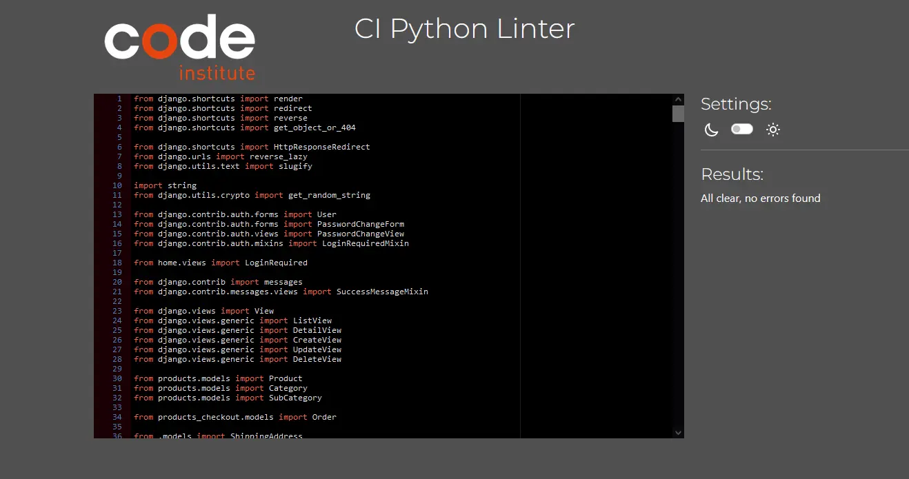

# **Horizon Shop** Website

### **Developer: Claudio Crocilla**


### **Readme Contents Horizon Shop**
- [Overview](#overview)
- [Project](#project)
  - [User Goal](#user-goal)
- [Marketing Strategies](#marketing-strategies)
- [User Experience (UX)](#user-experience-ux)
  - [User Stories](#user-stories)
  - [Use Cases](#use-cases)
    - [Homepage](#home-page)
    - [Contact Us](#contact-us)
    - [Dashboard](#dashboard)
    - [Sign In/Sign Up](#sign-in-sign-up)
- [Design](#design)
  - [Colour Scheme](#colour-scheme)
  - [Typography](#typography)
  - [Images and Videos](#images-and-videos)
- [Features](#features)
  - [Database Schema](#database-schema)
  - [Structure](#structure)
  - [Homepage](#home-page-1)
  - [Contact Us](#contact-us-page)
  - [Sign Up/Sign](#sign-upsign-in-page-and-authentication-process)
  - [Dashboard](#dashboard-1)
  - [404 Error Page](#404-error-page)
- [Wireframe](#wireframe)
- [Technologies Used](#technologies-used)
  - [Languages](#languages)
  - [Frameworks, Libraries & Programs Used](#frameworks-libraries--programs-used)
- [Testing](#testing)
  - [Lighthouse Validator](#lighthouse-validator)
  - [Test Cases](#test-cases)
  - [Automation Testing](#list-of-automated-test-cases-perfomed)
  - [Additional Tests](#additional-tests)
  - [Bugs](#bugs)
  - [Future Implementation](#future-implementation)
- [Development](#deployment)
  - [Github](#github)
  - [Heroku](#heroku-app)
  - [Github Pages](#github-pages)
  - [Forking the GitHub Repository](#forking-the-github-repository)
  - [Local Clone](#local-clone)
- [Credits](#credits)


## **Overview**

#### Internet users all around the world love to buy and sell products online. Since the Covid-19 pandemic hit, our ways to shop have drastically changed. 
#### E-commerce business has grown exponentially making online shopping not only a habit but also a pleasure! Online shopping is in fact part of our life with products available just at a (mouse) click.
#### Horizon Shop is not like any other e-commerce website. All the products that you have ever wanted are there for you. You can browse, buy or sell. Just surf and choose. Hey...We are waiting for you fill your cart and enjoy your journey with us.

#### The Horizon shop website is intuitive and user-friendly! The users can register to the website with a few easy steps by entering Username and Email and have access to all Horizon Shop great services! The users can also subscribe to a newsletter and receive regular updates as well as provide/review a testimonial, comment on the Products, Report issues or Request support!


<a href="https://horizonshop.herokuapp.com/" target="_blank" rel="noopener noreferrer"></a>
<br/>
Click in the image above to access the Live Website or [click here!](https://horizonshop.herokuapp.com/ "Horizon Shop")

## **Project** 

### **User Goal**
- Easy, Intuitive and User-Friendly Website!
- Wide compatibility with every Browsers and Devices.
- A fast, easy and intuitive way to buy and sell products.
- Time is precious for everyone and we save yours offering a great buying and selling system.
- High variety of Services offered to the users.
- Possibility to share customer experience via the Dashboard Page.
- Fellow Customer feedback visible to the users in the Home Page.
- Newsletter available to receive updates/offers via email.
- Possibility to report an issue or request assistance/support via Contact Us Page.


---

## **Marketing Strategies** 

### **SEO**
Customers all around the world looking to buy and/or sell products when search for their next eCommerce looks for example at the description of the Websites in the Search Results. 
To make sure that Horizon Shop is more visible it was crucial to put in place some SEO practice in order to increase the traffic on the Website and more opportunities to convert prospects into customers.
Best practices used in Horizon Shop for the SEO: 
- Meta Tag Keywords: A set of the most researched Keywords has been used between Short-tail and Long-tail Keywords (also with the help of the auto-complete feature of google search) in order to tell to the Search Engine about the content of Horizon Shop! Keywords are important because they are what people are searching for and the content you are providing to fill that need.
- Meta Tag Description: The Description is a short snippet paragraph displayed underneath the Website Title Link that describe the Website content. It is the first thing that a Customer see when they search for website and it was implemented a specific and relevant Description that attract customers. 
- Strong and Effective Titles and Heading has been used in Horizon Shop to help Google understand the content of the Website, but also because the pages more user-friendly. 
- Horizon Shop has been realized with just one idea, create a User Friendly Website with a great and easy Design in order to offer a great user experience to the customers! This is because quick load times lead to better Search Engine Optimization (SEO) rankings, making it easier for people to find your website in the first place
- To provide the best user experience possible to the customers and improve the websites' SEO ranking as well as improving the pages load speed all the Images has been optimized.

To provide usefull information for search engines a Robot.txt and a Sitemap.xml file has also been created and added to Horizon Shop. 

### robots.txt
```
User-agent: *
Disallow: /accounts/
Disallow: /dashboard/
Disallow: /cart/
Disallow: /checkout/
Disallow: /wishlist/
Sitemap: https://horizonshop.herokuapp.com/sitemap.xml
```

### sitemap.xml
```
<?xml version="1.0" encoding="UTF-8"?>
<urlset
      xmlns="http://www.sitemaps.org/schemas/sitemap/0.9"
      xmlns:xsi="http://www.w3.org/2001/XMLSchema-instance"
      xsi:schemaLocation="http://www.sitemaps.org/schemas/sitemap/0.9
            http://www.sitemaps.org/schemas/sitemap/0.9/sitemap.xsd">
<!-- created with Free Online Sitemap Generator www.xml-sitemaps.com -->


<url>
  <loc>https://horizonshop.herokuapp.com/</loc>
  <lastmod>2022-11-21T15:43:51+00:00</lastmod>
  <priority>1.00</priority>
</url>
<url>
  <loc>https://horizonshop.herokuapp.com/contact-us/</loc>
  <lastmod>2022-11-21T15:43:51+00:00</lastmod>
  <priority>0.80</priority>
</url>
<url>
  <loc>https://horizonshop.herokuapp.com/cart/</loc>
  <lastmod>2022-11-21T15:43:51+00:00</lastmod>
  <priority>0.80</priority>
</url>
<url>
  <loc>https://horizonshop.herokuapp.com/accounts/signup/</loc>
  <lastmod>2022-11-21T15:43:51+00:00</lastmod>
  <priority>0.80</priority>
</url>
<url>
  <loc>https://horizonshop.herokuapp.com/accounts/login/</loc>
  <lastmod>2022-11-21T15:43:51+00:00</lastmod>
  <priority>0.80</priority>
</url>
<url>
  <loc>https://horizonshop.herokuapp.com/products/all/</loc>
  <lastmod>2022-11-21T15:43:51+00:00</lastmod>
  <priority>0.80</priority>
</url>
<url>
  <loc>https://horizonshop.herokuapp.com/products/new/</loc>
  <lastmod>2022-11-21T15:43:51+00:00</lastmod>
  <priority>0.80</priority>
</url>
<url>
  <loc>https://horizonshop.herokuapp.com/products/used/</loc>
  <lastmod>2022-11-21T15:43:51+00:00</lastmod>
  <priority>0.80</priority>
</url>
<url>
  <loc>https://horizonshop.herokuapp.com/products/search-by/category/console-videogames/</loc>
  <lastmod>2022-11-21T15:43:51+00:00</lastmod>
  <priority>0.80</priority>
</url>
<url>
  <loc>https://horizonshop.herokuapp.com/products/search-by/subcategory/console/</loc>
  <lastmod>2022-11-21T15:43:51+00:00</lastmod>
  <priority>0.80</priority>
</url>
<url>
  <loc>https://horizonshop.herokuapp.com/products/search-by/subcategory/videogames/</loc>
  <lastmod>2022-11-21T15:43:51+00:00</lastmod>
  <priority>0.80</priority>
</url>
<url>
  <loc>https://horizonshop.herokuapp.com/products/ps5-3w6Hq/details/</loc>
  <lastmod>2022-11-21T15:43:51+00:00</lastmod>
  <priority>0.80</priority>
</url>
<url>
  <loc>https://horizonshop.herokuapp.com/products/ps5/details/</loc>
  <lastmod>2022-11-21T15:43:51+00:00</lastmod>
  <priority>0.80</priority>
</url>
<url>
  <loc>https://horizonshop.herokuapp.com/products/xbox-series-x-1tb-console/details/</loc>
  <lastmod>2022-11-21T15:43:51+00:00</lastmod>
  <priority>0.80</priority>
</url>
<url>
  <loc>https://horizonshop.herokuapp.com/contact-us/terms/</loc>
  <lastmod>2022-11-21T15:43:51+00:00</lastmod>
  <priority>0.80</priority>
</url>
<url>
  <loc>https://horizonshop.herokuapp.com/accounts/password/reset/</loc>
  <lastmod>2022-11-21T15:43:51+00:00</lastmod>
  <priority>0.64</priority>
</url>
<url>
  <loc>https://horizonshop.herokuapp.com/products/all/?sort=price&amp;direction=desc</loc>
  <lastmod>2022-11-21T15:43:51+00:00</lastmod>
  <priority>0.64</priority>
</url>
<url>
  <loc>https://horizonshop.herokuapp.com/products/all/?sort=price&amp;direction=asc</loc>
  <lastmod>2022-11-21T15:43:51+00:00</lastmod>
  <priority>0.64</priority>
</url>
<url>
  <loc>https://horizonshop.herokuapp.com/products/all/?sort=brand&amp;direction=asc</loc>
  <lastmod>2022-11-21T15:43:51+00:00</lastmod>
  <priority>0.64</priority>
</url>
<url>
  <loc>https://horizonshop.herokuapp.com/products/all/?sort=brand&amp;direction=desc</loc>
  <lastmod>2022-11-21T15:43:51+00:00</lastmod>
  <priority>0.64</priority>
</url>
<url>
  <loc>https://horizonshop.herokuapp.com/products/all/?sort=title&amp;direction=asc</loc>
  <lastmod>2022-11-21T15:43:51+00:00</lastmod>
  <priority>0.64</priority>
</url>
<url>
  <loc>https://horizonshop.herokuapp.com/products/all/?sort=title&amp;direction=desc</loc>
  <lastmod>2022-11-21T15:43:51+00:00</lastmod>
  <priority>0.64</priority>
</url>
<url>
  <loc>https://horizonshop.herokuapp.com/products/new/?sort=price&amp;direction=desc</loc>
  <lastmod>2022-11-21T15:43:51+00:00</lastmod>
  <priority>0.64</priority>
</url>
<url>
  <loc>https://horizonshop.herokuapp.com/products/new/?sort=price&amp;direction=asc</loc>
  <lastmod>2022-11-21T15:43:51+00:00</lastmod>
  <priority>0.64</priority>
</url>
<url>
  <loc>https://horizonshop.herokuapp.com/products/new/?sort=brand&amp;direction=asc</loc>
  <lastmod>2022-11-21T15:43:51+00:00</lastmod>
  <priority>0.64</priority>
</url>
<url>
  <loc>https://horizonshop.herokuapp.com/products/new/?sort=brand&amp;direction=desc</loc>
  <lastmod>2022-11-21T15:43:51+00:00</lastmod>
  <priority>0.64</priority>
</url>
<url>
  <loc>https://horizonshop.herokuapp.com/products/new/?sort=title&amp;direction=asc</loc>
  <lastmod>2022-11-21T15:43:51+00:00</lastmod>
  <priority>0.64</priority>
</url>
<url>
  <loc>https://horizonshop.herokuapp.com/products/new/?sort=title&amp;direction=desc</loc>
  <lastmod>2022-11-21T15:43:51+00:00</lastmod>
  <priority>0.64</priority>
</url>
<url>
  <loc>https://horizonshop.herokuapp.com/products/used/?sort=price&amp;direction=desc</loc>
  <lastmod>2022-11-21T15:43:51+00:00</lastmod>
  <priority>0.64</priority>
</url>
<url>
  <loc>https://horizonshop.herokuapp.com/products/used/?sort=price&amp;direction=asc</loc>
  <lastmod>2022-11-21T15:43:51+00:00</lastmod>
  <priority>0.64</priority>
</url>
<url>
  <loc>https://horizonshop.herokuapp.com/products/used/?sort=brand&amp;direction=asc</loc>
  <lastmod>2022-11-21T15:43:51+00:00</lastmod>
  <priority>0.64</priority>
</url>
<url>
  <loc>https://horizonshop.herokuapp.com/products/used/?sort=brand&amp;direction=desc</loc>
  <lastmod>2022-11-21T15:43:51+00:00</lastmod>
  <priority>0.64</priority>
</url>
<url>
  <loc>https://horizonshop.herokuapp.com/products/used/?sort=title&amp;direction=asc</loc>
  <lastmod>2022-11-21T15:43:51+00:00</lastmod>
  <priority>0.64</priority>
</url>
<url>
  <loc>https://horizonshop.herokuapp.com/products/used/?sort=title&amp;direction=desc</loc>
  <lastmod>2022-11-21T15:43:51+00:00</lastmod>
  <priority>0.64</priority>
</url>
<url>
  <loc>https://horizonshop.herokuapp.com/products/search-by/category/console-videogames/?sort=price&amp;direction=desc</loc>
  <lastmod>2022-11-21T15:43:51+00:00</lastmod>
  <priority>0.64</priority>
</url>
<url>
  <loc>https://horizonshop.herokuapp.com/products/search-by/category/console-videogames/?sort=price&amp;direction=asc</loc>
  <lastmod>2022-11-21T15:43:51+00:00</lastmod>
  <priority>0.64</priority>
</url>
<url>
  <loc>https://horizonshop.herokuapp.com/products/search-by/category/console-videogames/?sort=brand&amp;direction=asc</loc>
  <lastmod>2022-11-21T15:43:51+00:00</lastmod>
  <priority>0.64</priority>
</url>
<url>
  <loc>https://horizonshop.herokuapp.com/products/search-by/category/console-videogames/?sort=brand&amp;direction=desc</loc>
  <lastmod>2022-11-21T15:43:51+00:00</lastmod>
  <priority>0.64</priority>
</url>
<url>
  <loc>https://horizonshop.herokuapp.com/products/search-by/category/console-videogames/?sort=title&amp;direction=asc</loc>
  <lastmod>2022-11-21T15:43:51+00:00</lastmod>
  <priority>0.64</priority>
</url>
<url>
  <loc>https://horizonshop.herokuapp.com/products/search-by/category/console-videogames/?sort=title&amp;direction=desc</loc>
  <lastmod>2022-11-21T15:43:51+00:00</lastmod>
  <priority>0.64</priority>
</url>
<url>
  <loc>https://horizonshop.herokuapp.com/products/search-by/category/test-cat/?sort=price&amp;direction=desc</loc>
  <lastmod>2022-11-21T15:43:51+00:00</lastmod>
  <priority>0.64</priority>
</url>
<url>
  <loc>https://horizonshop.herokuapp.com/products/search-by/category/test-cat/?sort=price&amp;direction=asc</loc>
  <lastmod>2022-11-21T15:43:51+00:00</lastmod>
  <priority>0.64</priority>
</url>
<url>
  <loc>https://horizonshop.herokuapp.com/products/search-by/category/test-cat/?sort=brand&amp;direction=asc</loc>
  <lastmod>2022-11-21T15:43:51+00:00</lastmod>
  <priority>0.64</priority>
</url>
<url>
  <loc>https://horizonshop.herokuapp.com/products/search-by/category/test-cat/?sort=brand&amp;direction=desc</loc>
  <lastmod>2022-11-21T15:43:51+00:00</lastmod>
  <priority>0.64</priority>
</url>
<url>
  <loc>https://horizonshop.herokuapp.com/products/search-by/category/test-cat/?sort=title&amp;direction=asc</loc>
  <lastmod>2022-11-21T15:43:51+00:00</lastmod>
  <priority>0.64</priority>
</url>
<url>
  <loc>https://horizonshop.herokuapp.com/products/search-by/category/test-cat/?sort=title&amp;direction=desc</loc>
  <lastmod>2022-11-21T15:43:51+00:00</lastmod>
  <priority>0.64</priority>
</url>
<url>
  <loc>https://horizonshop.herokuapp.com/products/search-by/subcategory/console/?sort=price&amp;direction=desc</loc>
  <lastmod>2022-11-21T15:43:51+00:00</lastmod>
  <priority>0.64</priority>
</url>
<url>
  <loc>https://horizonshop.herokuapp.com/products/search-by/subcategory/console/?sort=price&amp;direction=asc</loc>
  <lastmod>2022-11-21T15:43:51+00:00</lastmod>
  <priority>0.64</priority>
</url>
<url>
  <loc>https://horizonshop.herokuapp.com/products/search-by/subcategory/console/?sort=brand&amp;direction=asc</loc>
  <lastmod>2022-11-21T15:43:51+00:00</lastmod>
  <priority>0.64</priority>
</url>
<url>
  <loc>https://horizonshop.herokuapp.com/products/search-by/subcategory/console/?sort=brand&amp;direction=desc</loc>
  <lastmod>2022-11-21T15:43:51+00:00</lastmod>
  <priority>0.64</priority>
</url>
<url>
  <loc>https://horizonshop.herokuapp.com/products/search-by/subcategory/console/?sort=title&amp;direction=asc</loc>
  <lastmod>2022-11-21T15:43:51+00:00</lastmod>
  <priority>0.64</priority>
</url>
<url>
  <loc>https://horizonshop.herokuapp.com/products/search-by/subcategory/console/?sort=title&amp;direction=desc</loc>
  <lastmod>2022-11-21T15:43:51+00:00</lastmod>
  <priority>0.64</priority>
</url>
<url>
  <loc>https://horizonshop.herokuapp.com/products/search-by/subcategory/videogames/?sort=price&amp;direction=desc</loc>
  <lastmod>2022-11-21T15:43:51+00:00</lastmod>
  <priority>0.64</priority>
</url>
<url>
  <loc>https://horizonshop.herokuapp.com/products/search-by/subcategory/videogames/?sort=price&amp;direction=asc</loc>
  <lastmod>2022-11-21T15:43:51+00:00</lastmod>
  <priority>0.64</priority>
</url>
<url>
  <loc>https://horizonshop.herokuapp.com/products/search-by/subcategory/videogames/?sort=brand&amp;direction=asc</loc>
  <lastmod>2022-11-21T15:43:51+00:00</lastmod>
  <priority>0.64</priority>
</url>
<url>
  <loc>https://horizonshop.herokuapp.com/products/search-by/subcategory/videogames/?sort=brand&amp;direction=desc</loc>
  <lastmod>2022-11-21T15:43:51+00:00</lastmod>
  <priority>0.64</priority>
</url>
<url>
  <loc>https://horizonshop.herokuapp.com/products/search-by/subcategory/videogames/?sort=title&amp;direction=asc</loc>
  <lastmod>2022-11-21T15:43:51+00:00</lastmod>
  <priority>0.64</priority>
</url>
<url>
  <loc>https://horizonshop.herokuapp.com/products/search-by/subcategory/videogames/?sort=title&amp;direction=desc</loc>
  <lastmod>2022-11-21T15:43:51+00:00</lastmod>
  <priority>0.64</priority>
</url>


</urlset>
```


### **Social Media**


### **Newsletter**


---

## **User Experience (UX)**

### **User Stories**
- #### First Time Visitor Goals
    1. As a First Time visitor of a website dedicated to buying/selling products online, I want to have a visual impact on the Landing Page that will attract my attention.
    2. As a First Time Visitor, I want to be able to easily navigate through the website.
    3. As a First Time Visitor, I want to be able to easily browse/buy/sell the offered products.
    4. As a First Time Visitor, I want to be able to see the services offered by Horizon Shop website.
    5. As a First Time Visitor, I want to find the website pleasant to the eye, visually intuitive, with catchy colours and images.


- #### Returning Visitor Goals
    1. As a Returning Visitor, I want to be able to register to the website.
    2. As a Returning Visitor, I want to be able to buy products.
    3. As a Returning Visitor, I want to be able to sell products.
    4. As a Returning Visitor, I want to be able to report issues.
    5. As a Returning Visitor, I want to be able to request assistance.
    6. As a Returning Visitor, I want to access the website through my social media accounts.


- #### Frequent User Goals
    1. As a Frequent User, I want to see new products/offers.
    2. As a Frequent User, I want to see new services.
    3. As a Frequent User, I want to be able to change my personal registered information (if necessary).
    4. As a frequent User, I want to be able to access my personal information via a Dashboard Page.
    5. As a Frequent User, I want to sign up to the Newsletter to receive updates about new offers on Horizon Shop.
    6. As a Frequent User, I want to report issues.
    7. As a Frequent User, I want to share my personal review or leave a comment on the products.
    8. As a Frequent User, I want to share my personal rate on the products in the website.


For the User Stories and the Epics please refer to the following links:
- [User Stories](https://github.com/users/CCrocilla/projects/3)
- [Epics](https://github.com/CCrocilla/horizon-shop/milestones)

<!-- Use Cases Area -->
### **Use Cases**

### *_Home Page_*
<details>
    <summary>Description</summary>
    
- Users can use this website to buy and sell products online.
- Users should be able to read the Instructions/FAQ.
- Users should be able to see the available products and services.
- Users should be able to see the latest products added to the website.
- Users should be able to see the offers available.
- Users should be able to see other customers feedback.
- The home page also provides information about the history and rational 

</details>

<details>
    <summary>System & Actors</summary>

**System:** E-commerce Website.

**Actors:** User looking to buy or sell products online.
</details>

<details>
    <summary>Pre-Conditions</summary>

Users should register into the website to be able to buy products.
Users should register into the website to be able to sell products.
Users should register into the website to leave a testimonial.
Users should register into the website to leave a review/comment on a product.
Users should register into the website to rate a product.

</details>

<details>
    <summary>Basic Flow</summary>

- The user browses to buy and/or sell products online and discovers the website. The user navigates to the Home Page, and is attracted by the visual impact of the website.
- The user sees the available products.
- The user sees the available services.
- The user sees the feedback left by the community.
- The user can register to the newsletter.

</details>

<details>
    <summary>Alternative/Exception Flow</summary>

- When the user selects a non-existent page, a 404 Error Page will be prompted guiding the user back to Home Page.
- If the user is not logged in, he/she will not able to leave testimonial, reviews/comment and rate products.

</details>
<br/>


### *_Contact Us_*
<details>
    <summary>Description</summary>

- Users can subscribe to the newsletter, report issues or request assistance.
- Users can accept/visualise the terms and conditions.
- Users can use this page to see the general info of Horizon Shop Company (including Address, Email address, phone, and a map showing Horizon Shop HQ).

</details>

<details>
    <summary>System & Actors</summary>

**System:** E-commerce Website.

**Actors:** Users who want to report issues or request assistance.
</details>

<details>
    <summary>Pre-Conditions</summary>
Users should accept the Terms and Conditions to be able to ask for support/report issues.
</details>

<details>
    <summary>Basic Flow</summary>

- The user browses for buy and/or sell products online and discovers the website. The user navigates to the Home Page and then goes into the Contact Us Page.
- The user fills the forms mandatory fields.
- The user must accept the Terms and Conditions to subscribe to the newsletter and/or report issues/ request support.
- The user submits the form.
- The user receives a notification indicating that the form has been submitted successfully.

</details>

<details>
    <summary>Alternative/Exception Flow</summary>

- The user can reset the form.
- When the user selects a non-existent page, a 404 Error Page will be prompted guiding the user back to Home Page.

</details>
<br/>


### *_Products_*
<details>
    <summary>Description</summary>

- Users see the list of Products.
- Users can see the list of Products filtered for All, New, Used, Category or Sub-Category.
- Users can search product using the Search Field.
- Users can add the Product to the Cart or to a Wishlist.
- Users can access the details of a Product.

</details>

<details>
    <summary>System & Actors</summary>

**System:** E-commerce Website.

**Actors:** User looking to buy products online.
</details>

<details>
    <summary>Pre-Conditions</summary>
Users should register into the website to be able to add products to the cart.
Users should register into the website to be able to add products to the wishlist.

</details>

<details>
    <summary>Basic Flow</summary>

- The user browses for buy products online and discovers the website.
- The user sign into the website and navigates to the Home Page.
- The user goes into one of the Products Page (All Products, New Products, Used Products, Products By Category, Products By Sub-Category). 
- The user see the list of Products recognizing which one is a new one and used one thanks to an Icon placed on each Product to better identify them.  
- The user find the product that he/she likes and can click on the Quick Add to Cart or Add to Wishlist Icon. 
- Alternatively the user can click on the Image or the Title of the Product to open the Product Details Page and then add the product to the Cart or Wishlist using the dedicated buttons. 
- The user receives a notification indicating that the product has been added successfully to the Cart or Wishlist.

</details>

<details>
    <summary>Alternative/Exception Flow</summary>

- The user can search product using the Search Field.
- When the user selects a non-existent product, a 404 Error Page will be prompted guiding the user back to Home Page.

</details>
<br/>


### *_Checkout_*
<details>
    <summary>Description</summary>

- Users see the list of Products using one of the buttons available for All, New, Used, Category or Sub-Category Products or can search product using the Search Field.
- Users can add the Product to the Cart.
- Users can add the Shipping Information and prodceed to the checkout page.
- Users that enter the correct information in the Payment Form are redirected to a Payment Success Page
- Users receives an email confirming that the order has been placed correctly.

</details>

<details>
    <summary>System & Actors</summary>

**System:** E-commerce Website.

**Actors:** User looking to buy products online.
</details>

<details>
    <summary>Pre-Conditions</summary>
Users should register into the website to be able to add products to the cart.
Users should register into the website to be able to buy products.

</details>

<details>
    <summary>Basic Flow</summary>

- The user browses for buy products online and discovers the website.
- The user sign into the website and navigates to the Home Page.
- The user goes into one of the Products Page (All Products, New Products, Used Products, Products By Category, Products By Sub-Category). 
- The user see the list of Products recognizing which one is a new one and used one thanks to an Icon placed on each Product to better identify them.  
- The user find the product that he/she likes and can click on the Quick Add to Cart Icon/Button. 
- The user goes into the Cart Page and can change the quantity of product(s) added.
- The user selects a Shipping Address. 
- The user click on the Checkout Button
- The user review all the information of his/her own order.
- The user enter a valid payment card and clicks to the Pay Now Button.
- The user if the payment is valid, is redirected to the Payment Success Page and receives a notification indicating that the product(s) have been purchase successfully indicating also the order number.

</details>

<details>
    <summary>Alternative/Exception Flow</summary>

- The user can search product using the Search Field.
- When the user selects a non-existent product, a 404 Error Page will be prompted guiding the user back to Home Page.

</details>
<br/>


### *_Wishlist_*
<details>
    <summary>Description</summary>

- Users can access the Wishlist page only when they are signed in.
- Users can add products to their private wishlist.
- Users can see all the information of the Product.
- Users can access the product details by clicking on the Image or the Title of the Product.

</details>

<details>
    <summary>System & Actors</summary>

**System:** E-commerce Website.

**Actors:** User looking to buy products online.
</details>

<details>
    <summary>Pre-Conditions</summary>
Users should register into the website to be able to add products to the wishlist.

</details>

<details>
    <summary>Basic Flow</summary>

- The user browses for buy products online and discovers the website.
- The user sign into the website and navigates to the Home Page to see the list of the latest Products added to Horizon Shop (or goes into one of the Products Page). 
- The user see the list of Products.  
- The user find the product that he/she likes and can click on the Quick Add to Wishlist Icon. 
- Alternatively the user can click on the Image or the Title of the Product to open the Product Details Page and then add the product to the Wishlist using the dedicated buttons. 
- The user receives a notification indicating that the product has been added successfully to the Cart or Wishlist.

</details>

<details>
    <summary>Alternative/Exception Flow</summary>

- Users not logged in that try to access the Wishlist Page are redirected to the Sign In Page and a notification is displayed.
- When the user selects a non-existent page, a 404 Error Page will be prompted guiding the user back to Home Page.

</details>
<br/>


### *_My Horizon Shop (Dashboard)_*
<details>
    <summary>Description</summary>

<details>
    <summary>Admin Description</summary>
- Admin Users can access My Horizon Shop page only when they are signed in.
- Admin Users can access a number of services divided into separate sub-section listed as follow:

1. My Admin: to add, edit and/or delete Categories and Sub-Categories or to add, edit, delete and/or restore Products and Review the Orders or the Customers.  
2. My Profile: to add or edit their personal profile information, change their passwords, register a new address and/or list/delete previously registered shipping addresses.
3. My Products: to see the orders, to post the products they want to sell and visualise the list of items they want to buy using a wishlist sub-section page.
4. My Testimonials: to visualise past or add new testimonials. Once signed-in the user is presented with the possibility to delete/edit past testimonials.

</details>

<details>
    <summary>Customer Description </summary>
- Users can access My Horizon Shop page only when they are signed in.
- Users can access a number of services divided into separate sub-section listed as follow:

1. My Profile: to add or edit their personal profile information, change their passwords, add an avatar, register a new address and/or list/delete previously registered shipping addresses.
2. My Products: to see their orders, to post the products they want to sell and visualise the list of items they want to buy using a wishlist sub-section page.
3. My Testimonials: to visualise past or add new testimonials. Once signed-in the user is presented with the possibility to delete/edit past testimonials.

</details>


</details>

<details>
    <summary>System & Actors</summary>

**System:** E-commerce Website.

**Actors:**
Admin that want to manage their own E-Commerce.
Customer that want to access past/present orders, rewards, edit or create their profile and/or provide testimonials.
</details>

<details>
    <summary>Pre-Conditions</summary>
Admin/Customers should register into the website to access the page.
</details>

<details>
    <summary>Basic Flow</summary>

- The user browses for buy and/or sell products online and discovers the website. 
- The user sign into the website and navigates to the Dashboard Page. 
- The user is presented with a list of possible options to access their profile page, thier products, the wishlist, their orders or the testimonials.
- The user clicks into the desired sub-section.
- The user is able to perform a list of desired actions of choice.

</details>

<details>
    <summary>Alternative/Exception Flow</summary>

- Users not logged in that try to access the Dashboard Page are redirected to the Sign In Page and a notification is displayed.
- Users not logged in that try to access are presented with an Authentication Error message in any other page of the Dashboard Page.
- When the user selects a non-existent page, a 404 Error Page will be prompted guiding the user back to Home Page.
</details>
<br/>


### *_Sign In/ Sign Up_*
<details>
    <summary>Description</summary>

- Users can sign-up to the website.
- Users can sign-in to the website.

</details>

<details>
    <summary>System & Actors</summary>

**System:** E-commerce Website.

**Actors:** Users who want to register/sign-in to the website.
</details>

<details>
    <summary>Pre-Conditions</summary>
Users should be willing to register to the website.
</details>

<details>
    <summary>Basic Flow</summary>

- The user browses for buy and/or sell products online and discovers the website. The user navigates to the Home Page and then goes into the Sign Up Page.
- Users subscribe to the website by filling the mandatory fields.
- Users will receive a confirmation email to their address.
- Users verify the provided email address.
- Users sign-in with the chosen username/email and passwords.


</details>

<details>
    <summary>Alternative/Exception Flow</summary>

- The users can click on the Forgot Password Button if they are not able to sign in.
- The users can click to the Need an Account Button if they need to register.
- When the user selects a non-existent page, a 404 Error Page will be prompted guiding the user back to Home Page.

</details>


---

## **Design**

#### The webpage has been designed to provide a simple, interactive and intuitive view which is able to offer a pleasant experience to customers looking to buy and sell products online.
#### Every page has a minimalistic structure which however contains all the relevant features in order to provide the user with an interactive, clear and effective experience.  

- ### **Colour Scheme**
#### The goal is to use a colour palette that will provide the user with a good and positive impact at a first glance, when opening the website and through the entire navigation experience.
#### The list of colors is chosen to be pleasing to the eyes providing an excellent contrast that will allow the user to have prolonged navigation hours without tiring the eyes.

Colour Source: 
  - #### [Adobe Color](https://color.adobe.com/create/color-wheel)
  - #### [Color Hunt](https://colorhunt.co/) 
#### The main colors are Dark Navy (#1D273B), Yellow (#F59F00) and Light (#F6F7F8) for text and background, while in the Hero Images has also been used a Green Variant (#2FB344) to highlight better some important content of Horizon Shop!
#### Dark Navy (#1D273B) it has also been used for the background in the Navbar and Footer. These colors are chosen to highlight different components and to make a good contrast providing a better view of those components.
 

- ### **Typography**
#### Google Fonts has been used to select the fonts for the Website.
#### The Main font used is 'Ubuntu' while the Sans-serif has been set up as fall-back in case the main font is not loaded.

Source:
  - [Google Fonts](https://fonts.google.com/)


- ### **Images and Videos**
#### Real and effective images have been used to provide a pleasant visual experience to the user.
#### The developer selected those images from the following source to mimic a full immersive e-commerce website.

Sources:  
  - [Pexels](https://www.pexels.com/)

--- 

## **Features**

- ### *__Database Schema__*:
#### The database schema, representing the structure and organization of Horizon Shop database, has been realized using the Software Wondershare EdrawMax defining the primary and foreign key between tables for optimal definition of parents and child tables. A representation of the used schema can be visualised below. 

<details>
    <summary>Click here for the Database Schema </summary>  

</details>


- ### *__Structure__*:
#### The website has been structured in an easy and user-friendly way with 7 main pages. Non-authenticated and authenticated customers are provided with two different page views.
#### The Non-authenticated can visualise and access:
- *Home Page*
- *Contact Us*
- *Sign-In* and *Sign-Up*
- *Products* (The Non-authenticated user can only see the Product's Information but he/she is not allowed to add the Product to the Cart nor to the Wishlist)

#### While authenticated customers are also able to access *Wishlist*, *Cart*, *Chekcout* and the *My Horizon Shop Dashboard* pages for a full experience of the Ecommerce.

#### The project has been realize creating a single app for each main section:
- Home App is the main app that stores the landing page of Horizon Shop. Here are displayed the Products (New and Used) and the Testimonials of the customers.
- Contact Us App contains the views, models, urls and forms files for the Contact Us Page. The user can send a request via the Contact Us page and the information are stored in the Database.
- Product App contains the views, models, urls files for the Products present in Horizon Shop.
- Products Cart App contains the views, models, urls and templates for the management of the Cart.
- Products Checkout App contains the views, models, forms, urls and templates of the Checkout Process for the Orders of the Customer. It also includes the Webhook for the Stripe Payment Process!
- Products Wishlist App contains the views, models, urls that manages the Wishlist of the Customers. The user can add product to his/her own wishlist. 
- Dashboard App includes the views, models, forms, urls and template for all the My Horizon Shop Dashboard Sections. 


#### The Structure of the website and the components used are listed below:


- ### *__Home Page__*:
#### The Home Page shows the clickable logo of the website on the top left and a navigation bar on the top right of the page that includes the Home, Contact Us, Wishlist (Only Authenticated Users), Cart and My Horizon Shop Dashboard Buttons.
#### The Nav Bar has been extended including the Products Buttons (All Product, New Products, Used Products, Products By Categories) that contains preset filters in order to display to the user the Products that they choose.
#### Additionally the user can also use the Search Field on the right that allow to search for Title, Description, Brand, Categories and Sub-Categories and will display both New and Used Product that matches the query entered by the user. 

#### The active page is in bold and highlighted in yellow with rounded borders when selected and a small underline animation activates when the user mouse hovers on of the elements in the nav bar, highlighting the content.

#### A Tooltip showing the page name is displayed hovering the mouse over the Home, Contact, Wishlist and Cart.
#### For the Wishlist and Cart Button a Badge has been included displaying the amount of products present in each page. This has been achived by using the count() function in the backend and displaying it the value using Django Template Tags.  

#### By clicking on each one of the Page, the Browser name changes displaying to the User the Current Page visualized and this has been achived using the Django Template Tag and applying extra title to the original one. 

#### Following the Logo and the Navbars the user can see the services offered by Horizon Shop in a dedicated yellow card.

#### Below the Services Section an hero carousel that displays images of Products is available and included are the link to redirect the user for the specific offers.

#### Two Section dedicated to the latest products added to Horizon Shop are also present. The Section are Latest New and Used Products and display the latest 4 Products for each type added to Horizon Shop.

#### This has been achived by implementing a function in the backend that set the Product posted in Status Used if the creator of the Product is a Customer.
#### Then interrogating the Product Database filtering for the status of the Product in the Views they have been returned in the context and displayed in the Homepage using a Django Template Tag with an for loop to differentiate the content depending on the type of status (New or Used).
#### The Testimonials Section shows the latest 3 testimonials provided by other users. The Signed in user can leave a testimonial in his/her own My Horison Shop Dashboard using the Add Testimonial Sub-Section. The Testimonial is then stored in the Database and it is displayed in the Home Page (including the Avatar and Name of the Customer, the Comment and the Rating) by filtering in the database for the latest 3 testimonial. 
#### The Latest Update Section shows new info about the company or new added services.
#### The Footer section concludes the Home Page, allowing the users to review the Company information of Horison Shop, providing the possibility to select the different sections of the website via dedicated links, displaying a Subscribe to the Newsletter Area (built using Mailchimp) and visualizing the Horizon Shop social media link that will open the social media page in a new page.

#### Depending on the device used (if laptop, desktop, tablet or smartphone) the position of the nav bar changes, creating a hamburger menu that will be displayed on the top right part of the page to adapt the view for a highly responsive rendering.
#### Those behaviour are consistent in all pages.


- ### *__Contact Us Page__*:
#### This page has Header and Footer consistent with the Home Page.
#### The page is characterized by 3 different sections: 
- Contact Form
- Maps
- Company Details

#### The First Section is characterized by a form that the user can fill with the following information: Full Name, Email Address, Message and a mandatory checkbox for the Terms and Conditions so that the user can to submit the his/her own Assistance Request or Report an Issue.
#### The user needs to accept the Terms & Conditions Checkbox to being able to move forward.
#### A Reset and a Submit buttons are included.
#### The Reset Button resets the form.
#### After clicking on the Submit Button, if the form is correctly filled in, the user is redirected to the same page and a notification is displayed informing the user that the request has been submitted successfully.
#### Following the form, the page shows a map where the Horizon Shop HQ's Location is displayed.
#### Below the Map the Hirozon Shop HQ’s Company Contact Details and Location are displayed (Address Office, Email, Phone Number).

#### Depending on the device used (if laptop, desktop, tablet or smartphone) the position of the nav bar changes, creating a hamburger menu that will be displayed on the top right part of the page to adapt the view for a highly responsive rendering.
#### Those behaviour are consistent in all pages.


- ### *__Products__*:
#### All Products Pages have Header and Footer consistent with the Home Page.
#### The user can select which list of products want to display based on pre-filtered pages using the Buttons available in the Home Page (All Products, New, Used, By Categories, By Sub-Categories)

#### The Products are displayed in a Card with a clickable Image that will redirect the user to the Product Details Page. 
#### Following the Image, the card shows the main information of the Product with a clickble Title of the Product (as per the Image the user is redirect to the Product Details Page), the Category associated to the product in a Badge, the Rating (if present otherwise "No Rating" is displayed), the Price and the Discounted Price if present, the Comments/Reviews.
#### An *Add to Cart* button is displayed at the bottom right of the card allowing the user to quickly add the Product to his/her own shopping cart.
#### An *Add to Wishlist* button is displayed at the bottom left of the card allowing the user to quickly add the Product to his/her own wishlist.

#### The Products can be posted to Horizon Shop by the Signed In Admin and/or by the Signed In Customers (only Used Products) filling in the Add Product or Sell Product Forms in the Products Sub-Section of My Horizon Shop Dashboard.
#### Once posted the Product are automatically displayed in the Products Pages and can be reviewed by all users. 

#### The visualization of the Products have been realized using a Django Template Tag For Loop that iterate on the Products Table in the Database based on the pre-set filters and display to the user the list of Products.

#### By clicking on the Image or the Title of the Product the user can access the Product Details Information and this has been achive adding the slug in the url.


- ### *__Cart__*:
#### The Cart Page has Header and Footer consistent with the Home Page. Only Authenticated Users can add products in the Cart and display them.
#### If the user is not logged in Horizon Shop a message is displayed in a modal with a button that redirect the user to the Sign In Page. The visualization of the modal instead of the Cart has been achived using Django Template Tags with an If Statement that check if the user is logged in. 
#### The user can access the Cart from every page in the website by clicking on the dedicated Cart icon on the Navbar. 
#### By using Context Processor (context_processors is a list of dotted Python paths to callables that are used to populate the context when a template is rendered with a request) it has been possible to also calculate in a function the cost of the Order for the user and display it in the Navbar on the Cart Button to provide to the user for a better experience. 
#### Once the user enter for the first time in the Cart Page or Add a Product to the Cart a new order is created in the database with a status *Billed* set to False, and this allow the user to add multiple products to a single order number. A new order is created only after the previous order has changed status from Billed=False to Billed=True and this is achiveble only processing the current order and after the payment process is completed successfully.
#### A "+" and "-" buttons are displayed for each product to allow the user to adjust the quantity.
#### A delete button is displayed for each product to allow the user to remove it from the cart.  
#### A Shipping Addresses Drop-Down is displayed thanks to the form dedicated that queries the Shippping_Address Table in the Database and return the list of Address of the signed in user. To proceed to the Checkout Page, the user needs to select a Shipping Address.

#### If no Shipping Address is present for the user a message is display with a link that redirect the user to the Add Shipping Address Form.  

#### Those behaviour are consistent in all pages.
  

- ### *__Checkout__*:
#### The Checkout Page has Header and Footer consistent with the Home Page. Only Authenticated Users can access the Checkout Page via the Cart Page.
#### If the user is not logged in Horizon Shop the user is redirected to the Sign In Page. The redirect the user to the Sign In Page has been realized by creating a Custom Class (LoginRequired) that is an extension of the LoginRequiredMixin Django Class. In this way it was possible to add a permission denied message to display to the user when they are redirected.  
 
#### A summary of all the important information of the order are displayed to the user: 
- Account Details
- Shipping Address Information
- Product Summary
- Costs

#### A *Continue Shopping* Button is displayed at the bottom of the page that can bring the user back to the list of all products. 
#### Stripe is a complete payments platform for e-commerce and not just that. It provides all the tools needed to accept payments online and in-person from customers around the world and has been used for the Payment Process in Horizon Shop. 
#### A Payment Form where the user can enter the Credit Card Info and a *Pay Now* Button are present. The *Pay Now* Button is disable unless the Credit Card entered by the user is valid. This has been achived integrating a function that disable and enable the buttons in the javascript file (stripe-elements.js) present in the js sub-folder of the static folder. 
#### Entering a valid credit card the Button is clickable. 
#### By Clicking on the Pay Now a Wheel Spin is displayed instead of the Button providing a clear feedback to the user that the process for the payment is in progress disabling the button in order to avoid any double click from the user. This has been achived by implementing a custom function called isLoading that is lunched when the user clicks on the Pay Now Button. 

#### When the Pay Now button is clicked a Webhook Function (an HTTP-based callback function) is lunched. Stripe will send back to Horizon Shop an event that if succeded will display to the user a Payment Succeded Page with the Order Number.   

#### In order to Test the Payment Process, use a card number, such as 4000 0037 2000 0005 (Ireland). Enter the card number in the Payment Form, and:
  - Use a valid future date, such as 02/24.
  - Use any three-digit CVC (four digits for American Express cards).
  - Use any value you like for other form fields.

#### For further information about the Testing of the Stripe Payment Form please refer to the official stripe docs [Stripe Testing Link](https://stripe.com/docs/testing?testing-method=card-numbers).


- ### *__Sign Up/Sign In Page and Authentication Process__*:
#### The Sign In and Sign Up pages are haracterized by a light background color where in the middle center of the page is displayed the Form.
#### The authentication module used for Horizon Shop is Allauth (a set of Django applications dealing with account authentication, registration, management, and third-party (social) account authentication) [Allauth](https://django-allauth.readthedocs.io/en/latest/overview.html).
#### The pages have been directly imported from Allauth and customized for the needs of Horizon Shop.   

#### In the Sign Up Page, there is a form that the user can fill with the following information: Email Address (with confirmation), Username and Password (with confirmation).
#### A Reset and a Sign Up buttons are included.
#### The Reset Button resets the form.
#### By clicking on the Sign Up Button (if all mandatory fields have been filled-in correctly) the user will be redirected to the verification email page and a real email is sent to the user requesting validation. The user is not allowed to sign-in in Horizon Shop until the verification is completed.
#### If the form is not filled-in correctly, a message appears to the user to request to fill-in the information correctly.

#### In the Sign In Page, there is a form that the user can fill with the following information: Email Address (or Username) and Password.
#### A Sign in and a Forgot Password are included.
#### When clicking on Forgot Password the user is redirected to a Password reset form, where the user is prompted to insert the email address to receive an email with the new password.
#### By clicking on the Sign In Button (if all mandatory fields have been filled-in correctly) the user will be redirected to the Homepage.
#### If the form is not filled in correctly, the user is not able to access the web pages.


- ### *__My Horizon Shop (Dashboard)__*:
#### The Dashboard has been divided in 2 main areas (Management and Dashboard) structured in an easy and user-friendly way with 17 Sub-Sections divided in 5 Main Sections:
- My Admin (Available to Admin User Only)
- My Horizon Shop
- My Profile
- My Bookings
- My Feedback
#### The Dashboard shows an Hamburger Menu that toggles the opening and closing of a side Navbar.
#### All the forms have been realized with Crispy Forms of Django and Crispy Bootstrap (Details can be found in the following link: https://pypi.org/project/crispy-bootstrap5/)
#### The Dashboard shows the user's avatar (if present, otherwise an icon is diplayed) on the top right of the Navbar that allow the user quickly access the different lists of the Dashboard and the Logout Button allowing the user to easily exit the website.
#### The Dashboard's Navbar also includes the Wishlist and the Cart Buttons to easily access them.  
#### Depending on the device used (laptop, desktop, tablet or smartphone) the sidebar opens and closes automatically allowing the user to select different options from the hamburger menu and/or have a full visual of the page for a highly responsive rendering.
#### Those behaviours are consistent in all sections of Dashboard.
#### The Logo and the Sidebar are consistent in all sections.

#### All Dashboard's Sections listed below (Open the accordion for more information): 

<details>
    <summary>My Admin</summary>

#### My Admin includes all the needed to an Admin to manage an E-Commerce and it is accessible only by a signed in Admin User (No Customer are allowed to access the sub-section of *My Admin*). It is composed by 7/8 main sub-sections realized using class base views and functions:

- Add Category
#### *Add Category* has been realized using a CreateView and this sub-section allows the Admin to add Categories to Horizon Shop.
#### A Reset and a Create buttons are displayed.
#### The Reset Button resets the form.
#### After clicking on the Create Button, if the form is correctly filled in, the Admin User is redirected to the Categories List and a notification message is displayed informing the user that the address has been created successfully.
#### If the Category already exists the Admin User is prompt with a message that let him know that the Category already exist in a notification message. 

- Categories List
#### In the *Categories List* for a consistent display setting through the website, the Categories List are shown in cards.
#### The Categories List has been realized using a ListView. The user can review all information as well as Edit or Delete functions using dedicated buttons.
#### Consistently with all other pages deleting an Category triggers a notification that let the Admin User know that the Category has been deleted.

- Add Sub-Category
#### *Add Sub-Category* has been realized using a CreateView and this sub-section allows the Admin User to add Sub-Categories to Horizon Shop.
#### A Reset and a Create buttons are displayed.
#### The Reset Button resets the form.
#### After clicking on the Create Button, if the form is correctly filled in, the Admin User is redirected to the Sub-Categories List and a notification message is displayed informing the user that the address has been created successfully.
#### If the Sub-Category already exists the Admin User is prompt with a message that let him know that the Sub-Category already exist in a notification message. 

- Sub-Categories List
#### In the *Sub-Categories List* for a consistent display setting through the website, the Sub-Categories List are shown in cards.
#### The Sub-Categories List has been realized using a ListView. The Admin User can review all information as well as Edit or Delete functions using dedicated buttons.
#### Consistently with all other pages deleting an Category triggers a notification that let the Admin User know that the Category has been deleted.

- Add Product
#### *Add Product* has been realized using a CreateView and this sub-section allows the Admin User to add new or used Product to Horizon Shop. The products added are then displayed in the Homepage on the correct category.
#### A Reset and a Create buttons are displayed.
#### The Reset Button resets the form.
#### After clicking on the Create Button, if the form is correctly filled in, the Admin user is redirected to the Product List and a notification message is displayed informing the user that the Product has been created successfully.

- Product List 
#### In *Product List* for a consistent display setting through the website, the Products are shown in cards.
#### The Product List has been realized using a ListView. The Admin User can review all information as well as Edit or Delete Products using dedicated buttons.
#### Consistently with all other pages deleting an Product triggers a pop-up message requesting user’s confirmation.
#### When the Admin User delete a product, the Product is then displayed in the Deleted Product List the Admin user is redirected to the Product List and a notification message is displayed informing the user that the Product has been deleted successfully.
#### Once Deleted the product is not displayed anymore in the Horizon Shop Products Pages. 

- Deleted Products List 
#### In *Deleted Products* for a consistent display setting through the website, the Products are shown in cards.
#### The Product List has been realized using a ListView. The Admin User can review all information of the Product and Restore it using the dedicated button.
#### Using the Restore button the Admin user is redirected to the Product List and a notification message is displayed informing the user that the Product has been restored successfully.
#### Once Restored the Products are displayed in the Horizon Shop Products Pages.

</details>


<details>
    <summary>My Horizon Shop</summary>

#### *My Horizon Shop* summarises in just one page-view and with different cards all user’s information allowing to access Orders, Testimonials and more. A link “View Details” is present in each card and will redirect the users to the selected list.

#### The Function .count() has been used in this section to display the total number of the selected items.

</details>


<details>
    <summary>My Profile</summary>

#### *My Profile* is composed of 4 main sub-section (Edit Profile, Change Password, Add Address, List Addresses) realized using class base views. 


- Edit Profile
#### In *Edit Profile*, realized using a UpdateView, the users can edit their own profile changing Username, Email, First and Last Name and Avatar. The User can also see the Date when he/she has sign up in Horizon Shop and the Last Login. 


- Change Password
#### The user can change the password using the “Change Password” Page. This has been realized using the PasswordChangeView and PasswordChangeForm provided by Django auth views/forms. The pages have been customized to match the color schema and layout of Horizon Shop.


- Add Address 
#### *Add Address* has been realized using a CreateView and this sub-section allows the user to add his/her own Address to Horizon Shop.
#### A Reset and a Create buttons are displayed.
#### The Reset Button resets the form.
#### After clicking on the Create Button, if the form is correctly filled in, the user is redirected to the Shipping Addresses List and a notification message is displayed informing the user that the address has been created successfully.


- List Addresses
#### In the *List Addresses* for a consistent display setting through the website, the Addresses are shown in cards.
#### The Addresses List has been realized using a ListView. The user can review all information as well as Edit or Delete using dedicated buttons.
#### Consistently with all other pages deleting an Address triggers a pop-up message requesting user’s confirmation.

</details>

<details>
    <summary>My Products</summary>

#### *My Products* is composed of 4 main sub-section (My Orders, Sell Product, Product List, My Wishlist) realized using class base views. 

- My Orders
#### In *My Order*, realized using a ListView, the users can review all information of the completed orders and check the details of the order using a *Details* dedicated buttons.

- Sell Product
#### *Sell Product* has been realized using a CreateView and this sub-section allows the user to sell their own products that will be exposed for free on the Home page and on the Used Product List.
#### The Sell Product is similar to the Add Product of the Admin but with less fields to fill in. 
#### A Reset and a Create buttons are displayed.
#### The Reset Button resets the form.
#### After clicking on the Create Button, if the form is correctly filled in, the user is redirected to the his/her own Product List and a notification message is displayed informing the user that the Product has been created successfully.

- Product List 
#### In *Product List* for a consistent display setting through the website, the Products are shown in cards.
#### The Product List has been realized using a ListView. The user can review all information as well as Edit or Delete using dedicated buttons.
#### Consistently with all other pages deleting an Product triggers a pop-up message requesting user’s confirmation.

- My Wishlist
#### In *My Wishlist* for a consistent display setting through the website, the Products are shown in cards.
#### My Wishlist has been realized using a ListView. The user can review all the product added to the wishlist.
#### The user can remove the product from the wishlish using a Remove Button. 

</details>

<details>
   <summary>My Testimonials</summary>

#### *My Testimonials* includes 2 sub-section (*Add Testimonials* and *Testimonials List*).
#### The subsections are consistent in colors and layout with the Sections described above.

#### *Add Testimonials* (realized using a CreateView) allows the user to leave a Testimonials to Horizon Shop.
#### The latest 3 Testimonials added are displayed in the Homepage.

#### In order to realize a better visual impact Testimonials page a combination between the forms provided by Django and a custom form has been used where each Testimonials can be rated with a star system (from 1 to 5) for easy-to-use and effective view.
#### In the Testimonials List for a consistent display setting through the website, the logged-in user Testimonials are shown in cards.

#### The *Testimonials List* has been realized using a ListView. The user can review all information as well as Edit or Delete using dedicated buttons.
#### Consistently with all other pages deleting a Testimonials triggers a pop-up message requesting user’s confirmation.

</details>


- ### *__404 Error Page__*:
#### For any broken or incorrect links, the 404 Error page will be triggered. Here the user will have an image displayed in the background and above text box that will inform the users that the page is not correct.
#### A button is present in the text displayed in order to allow the user to navigate back to the Home Page.  

---

## **Wireframe**
#### Balsamiq has been used in order to create the wireframe.
#### Below you can open the accordions divided by page and by device used (desktop, tablet and smartphone).


- ## Home Page 

<details>
    <summary>Home Page Wireframes</summary> 

<details>
    <summary>Click here for Desktop View - Anonymous </summary>  

</details>

<details>
    <summary>Click here for Desktop View - Authenticated </summary>  

</details>

<details>
    <summary>Click here for Tablet View</summary>

</details>

<details>
    <summary>Click here for Smartphone View</summary>

</details>

</details>


- ## Contact Us Page

<details>
    <summary>Contact Us Page Wireframes</summary>

<details>
    <summary>Click here for Desktop View</summary>

</details>

<details>
    <summary>Click here for Tablet View</summary>

</details>

<details>
    <summary>Click here for Smartphone View</summary>

</details>

</details>

- ## Dashboard


<details>
    <summary>Dashboard Pages Wireframes</summary>

- ### My Profile
<details>
    <summary>My Profile Section Wireframes</summary>

<details>
    <summary>Click here for Desktop View - Edit Profile Sub-Section</summary>

</details>

<details>
    <summary>Click here for Tablet View - Edit Profile Sub-Section</summary>

</details>

<details>
    <summary>Click here for Smartphone View - Edit Profile Sub-Section</summary>

</details>

<details>
    <summary>Click here for Desktop View - Change Profile Sub-Section</summary>

</details>

<details>
    <summary>Click here for Tablet View - Change Profile Sub-Section</summary>

</details>

<details>
    <summary>Click here for Smartphone View - Change Profile Sub-Section</summary>

</details>

</details>


- ### My Testimonials
<details>
    <summary>My Feedback Section Wireframes</summary>

<details>
    <summary>Click here for Desktop View - Add Feedback Sub-Section</summary>

</details>

<details>
    <summary>Click here for Tablet View - Add Feedback Sub-Section</summary>

</details>

<details>
    <summary>Click here for Smartphone View - Add Feedback Sub-Section</summary>

</details>

<details>
    <summary>Click here for Desktop View - Feedback List Sub-Section</summary>

</details>

<details>
    <summary>Click here for Tablet View - Feedback List Sub-Section</summary>

</details>

<details>
    <summary>Click here for Smartphone View - Feedback List Sub-Section</summary>

</details>

</details>

</details>

- ## 404 Error Page

<details>
    <summary>My Feedback Section Wireframes</summary>
    
<details>
    <summary>Click here for Desktop View</summary>

</details>

<details>
    <summary>Click here for Tablet View</summary>

</details>

<details>
    <summary>Click here for Smartphone View</summary>

</details>


</details>
---

## **Technologies Used**

- ### **Languages**

#### The Languages used are:
 - HTML5
 - CSS3
 - JAVASCRIPT
 - PYTHON + DJANGO

#### Only custom HTML, CSS, JavaScript, Python Code has been used.


- ### **Frameworks, Libraries & Programs Used** 

#### Django Framework has been used.

- #### Google Fonts: 
    - #### Google fonts were used for the font in all pages throughout the project.

- #### Font Awesome:
    - #### Font Awesome was used on all pages throughout the website to add icons for aesthetic and UX purposes.

- #### Git: 
    - #### Git was used for version control by utilizing the Gitpod terminal to commit to Git and Push to GitHub.

- #### GitHub: 
    - #### GitHub is used to store the projects code after being pushed from Git.

- #### Balsamiq: 
    - #### Balsamiq was used to create the wireframes during the design process.

- #### TinyPNG
    - #### TinyPNG has been used to compress images.

- #### Convertio
    - #### Convertio has been used to convert the images in webp exxtension.

- #### Heroku
    - #### Heroku is a Platform as a Service (PaaS) and it has been used to run the Parkland website application entirely on the cloud.

- #### PostgreSQL 
    -  #### PostgreSQL is a powerful, open source object-relational database system and it has been used for the Parkland Project. 
  
- #### Bootstrap 5
    -  #### Bootstrap is a framework for building responsive, mobile-first, sites with jsDelivr and a template starter page used in Parkland. 

- #### Wondershare EdrawMax:
    - #### Wondershare EdrawMax has been used to create the Database Schema for the website.

- #### Microsoft Whiteboard:
    - #### This is an infinite, collaborative canvas for effective meetings and engaging learning. Whiteboard was used to summarise the programming steps, the layout and the rationale behind those. Whiteboard has been used together with the Wondershare EdrawMax.

- #### AWS S3
    - #### Used to store all all the static files. 

- #### Stripe Payment System
    - #### Stripe is a payment services provider that lets merchants accept credit and debit cards or other payments and it has been used for the Payment System in Horizon Shop.

- #### Gmail
    - #### Gmail has been used to send the email. A dedicated email address has been created. 

---

## **Testing**
The testing phases have been carried out using the **PIP8 Python Validator**. No errors have been identified from the Validators as can be seen in the screenshots below:

- **Python**

<details>
    <summary>PIP8 Python Validator</summary>


<details>
    <summary>Click here for PIP8 Python Validator - Horizon Shop [urls.py]</summary>

</details>

<details>
    <summary>Click here for PIP8 Python Validator - Horizon Shop [settings.py]</summary>

</details>

<details>
    <summary>Click here for PIP8 Python Validator - Contact [urls.py]</summary>

</details>

<details>
    <summary>Click here for PIP8 Python Validator - Contact [views.py]</summary>

</details>

<details>
    <summary>Click here for PIP8 Python Validator - Contact [forms.py]</summary>

</details>

<details>
    <summary>Click here for PIP8 Python Validator - Dashboard [urls.py]</summary>

</details>

<details>
    <summary>Click here for PIP8 Python Validator - Dashboard [views.py]</summary>

</details>

<details>
    <summary>Click here for PIP8 Python Validator - Dashboard [forms.py]</summary>

</details>


</details>

The testing phases have been also carried out using the **W3C Javascript Validator**, **W3C CSS Validator** and **W3C Markup Validator**(in all pages). No errors have been identified from the Validators as can be seen in the screenshot below: 

- **JavaScript**

<details>
    <summary>W3C Javascript Validator</summary>

<details>
    <summary>Click here for W3C Javascript Validator - Script.js</summary>

</details>

</details>

- **CSS**

<details>
    <summary>W3C CSS Validator</summary>

<details>
    <summary>Click here for W3C CSS Validator - Custom-style.css</summary>

</details>

<details>
    <summary>Click here for W3C CSS Validator - Rating-stars.css</summary>

</details>

</details>

- **HTML**

<details>
    <summary>W3C Markup Validator</summary>

<details>
    <summary>Click here for W3C Markup Validator - Home Page</summary>

</details>

<details>
    <summary>Click here for W3C Markup Validator - Contact Us</summary>

</details>

<details>
    <summary>Click here for W3C Markup Validator - Sign In</summary>

</details>

<details>
    <summary>Click here for W3C Markup Validator - Sign Up</summary>

</details>

<details>
    <summary>Click here for W3C Markup Validator - Sign Out</summary>

</details>

<details>
    <summary>Click here for W3C Markup Validator - Dashboard</summary>

</details>

<details>
    <summary>Click here for W3C Markup Validator - Edit Profile</summary>

</details>

<details>
    <summary>Click here for W3C Markup Validator - Change Password</summary>

</details>

<details>
    <summary>Click here for W3C Markup Validator - Add Feedback</summary>

</details>

<details>
    <summary>Click here for W3C Markup Validator - Edit Feedback</summary>

</details>

<details>
    <summary>Click here for W3C Markup Validator - Details Feedback</summary>

</details>

<details>
    <summary>Click here for W3C Markup Validator - Delete Feedback</summary>

</details>

</details>


- ### **Lighthouse Validator**
Below it is possible to taka e look at the result obtained in Lighthouse:

<details>
    <summary>Click here for for Lighthouse Desktop - Homepage</summary>

</details>

<details>
    <summary>Click here for for Lighthouse Mobile - Homepage</summary>

</details>

<details>
    <summary>Click here for for Lighthouse Desktop - Contact Us</summary>

</details>

<details>
    <summary>Click here for for Lighthouse Mobile - Contact Us</summary>

</details>

<details>
    <summary>Click here for for Lighthouse Desktop - Sign In</summary>

</details>

<details>
    <summary>Click here for for Lighthouse Mobile - Sign In</summary>

</details>

<details>
    <summary>Click here for for Lighthouse Desktop - Sign Up</summary>

</details>

<details>
    <summary>Click here for for Lighthouse Mobile - Sign Up</summary>

</details>

<details>
    <summary>Click here for for Lighthouse Desktop - Sign Out</summary>

</details>

<details>
    <summary>Click here for for Lighthouse Mobile - Sign Out</summary>

</details>

<details>
    <summary>Click here for for Lighthouse Desktop - Password Reset Desktop</summary>

</details>

<details>
    <summary>Click here for for Lighthouse Mobile - Password Reset Desktop</summary>

</details>

<details>
    <summary>Click here for for Lighthouse Desktop - My Horizon Shop</summary>

</details>

<details>
    <summary>Click here for for Lighthouse Mobile - My Horizon Shop</summary>

</details>

<details>
    <summary>Click here for for Lighthouse Desktop - Edit Profile</summary>

</details>

<details>
    <summary>Click here for for Lighthouse Mobile - Edit Profile</summary>

</details>

<details>
    <summary>Click here for for Lighthouse Desktop - Change Password Profile</summary>

</details>

<details>
    <summary>Click here for for Lighthouse Mobile - Change Password Profile</summary>

</details>

<details>
    <summary>Click here for for Lighthouse Desktop - Add Feedback</summary>

</details>

<details>
    <summary>Click here for for Lighthouse Mobile - Add Feedback</summary>

</details>

<details>
    <summary>Click here for for Lighthouse Desktop - Feedback List</summary>

</details>

<details>
    <summary>Click here for for Lighthouse Mobile - Feedback List</summary>

</details>

<details>
    <summary>Click here for for Lighthouse Desktop - Error 404</summary>

</details>

<details>
    <summary>Click here for for Lighthouse Mobile - Error 404</summary>

</details>


- ### **Test Cases**

- #### List of Manual Test Cases perfomed. 
All the Tests have also been performed in all the Devices and the tests includes also Layout testing. 

| Page | Feature | Expected Result | Status |
| --- | --- | --- | --- |
| Home | Header | Make sure that the Logo and the nav bar are displayed on the top part of the Home Page. | Pass |
| Home | Header | Make sure that non-authenticated users can only access Home, Contact Us, Products, Sign In/Up Pages. | Pass |
| Home | Header | Make sure that non-authenticated users cannot add product to the Cart or to the Wishlist. | Pass |
| Home | Header | Make sure that authenticated user can see/access Home, Contact Us, Products, Wishlist and all the customer sections of My Horizon Shop Dashboard. | Pass |
| Home | Header | Make sure that by clicking on the Logo the user is redirected to the Home Page. | Pass |
| Home | Header | Make sure that by clicking to one of the Products Button the user is redirected to the Products List selected. | Pass |
| Home | Header | Make sure that by using the search field the user is redirected to the Products List displaying the products that match the query entered by the user. | Pass |
| Home | Horizon Shop Service | Make sure that the Services of Horizon Shop are displayed with no overlap with the Logos, Nav Bar and/or text. | Pass |
| Home | Hero Offer Section | Make sure that the Images in a Carousel are displayed with the correct text/buttons. | Pass |
| Home | Hero Offer Section | Make sure that only Carousel and it's content does not overlap with other contents. | Pass |
| Home | Latest New Products | Make sure that the latest 4 New Products added to Horizon Shop are displayed in cards with no overlap with other sections. | Pass |
| Home | Latest New Products | Make sure that in each New Product Card the correct information are displayed (Title, Category, Rating, Price, Comments' Quantity, Buttons Cart and Wishlist) for Authenticated Users. | Pass |
| Home | Latest New Products | Make sure that in each New Product Card the correct information are displayed (Title, Category, Rating, Price, Comments' Quantity) for Non-Authenticated Users. | Pass |
| Home | Latest Used Products | Make sure that the latest 4 Used Products added to Horizon Shop are displayed in cards with no overlap with other sections. | Pass |
| Home | Latest Used Products | Make sure that in each Used Product Card the correct information are displayed (Title, Category, Rating, Price, Comments' Quantity, Buttons Cart and Wishlist) for Authenticated Users. | Pass |
| Home | Latest Used Products | Make sure that in each Used Product Card the correct information are displayed (Title, Category, Rating, Price, Comments' Quantity) for Non-Authenticated Users. | Pass |
| Home | Testimonials Section | Make sure that the Testimonials area displays a carousel with Users’ Testimonials.| Pass |
| Home | Testimonials Section | Make sure that the user can use the arrows to switch between Testimonials. | Pass |
| Home | Testimonials Section | Make sure that are displayed properly including the Comment, the Rating, the Avatar and the Username of the User. | Pass |
| Home | Footer | Make sure that the footer displays the information of the company | Pass |
| Home | Footer | Make sure that the footer provides the link to access the social media and when clicking on the icons a new tab is opened | Pass |
| Home | Footer | Make sure that the user can sign up with an email address to receive the newsletter.| Pass |
| Home | Footer | Make sure that by clicking on the newsletter form button if no email or an invalid email has been entered an error message is displayed to the user. | Pass |
| Home | Footer | Make sure that by clicking on the newsletter form button if correct email has been entered a success message notification is displayed to the user | Pass |
| Contact Us | Form Section | Make sure that the information are displayed correctly in the page and no overlap/cut-off are present. | Pass |
| Contact Us | Form Section | Make sure all the fields (Full Name, Email, Message) are editable. | Pass |
| Contact Us | Form Section | Make sure the checkboxes Terms & Condition is clickable. | Pass |
| Contact Us | Form Section | Make sure all the fields (Full Name, Email, Message, Terms & Condition) are mandatory. | Pass |
| Contact Us | Form Section | Make sure that the Reset Form Button works and deletes all the information entered in the form. | Pass |
| Contact Us | Form Section | Make sure that the Submit Button works and provides a clear message to the user. | Pass |
| Contact Us | Maps | Make sure that the Map with the location of the company is properly displayed. | Pass |
| Contact Us | Location Section | Make sure that the company details are displayed properly. | Pass |
| Contact Us | Location Section | Make sure that the company details don't overlap with other parts of the Contact Us Page. | Pass |
| Contact Us | Location Section | Make sure that the company details includes the Address, Email and Phone Number. | Pass |
| Wishlist | Wishlist List | Make sure that only authenticated users can see/access the wishlist. | Pass |
| Wishlist | Wishlist List | Make sure that the authenticated users can see only their own wished products. | Pass |
| Wishlist | Wishlist List | Make sure that the authenticated users can see the list of products in cards and no overlaps are present. | Pass |
| Cart | Cart Page | Make sure that non-authenticated users can see a message informing them to log in Horizon Shop to see the content of the Cart. | Pass |
| Cart | Cart Page | Make sure that the authenticated users can see/acces the Cart Page. | Pass |
| Cart | Cart Page | Make sure taht if no product has been added to the Cart, the user see a Background Image and message informing that no Products are present. | Pass |
| Cart | Cart Page | Make sure taht if no product has been added to the Cart, a button that redirect the user to the list of products is displayed. | Pass |
| Cart | Cart Page | Make sure that the users can see the list of products added if present and no overlaps are present. | Pass |
| Cart | Cart Page | Make sure that the users can see update the quantity of products added using dedicated buttons. | Pass |
| Cart | Cart Page | Make sure that the users can see the list of his/her own Shipping Addresses. | Pass |
| Cart | Cart Page | Make sure that if the user does not have any Shipping Address saved a message is displayed to the user with a link to redirect to the Address Creation. | Pass |
| Cart | Cart Page | Make sure that a clickable Checkout Button is displayed. | Pass |
| Cart | Cart Page | Make sure that by clicking on the Checkout Button the user is redirected to the Checkout page. | Pass |
| Checkout | Summary | Make sure that a summary with the important information of the order are displayed. | Pass |
| Checkout | Summary | Make sure that the summary contains the User Details. | Pass |
| Checkout | Summary | Make sure that the summary contains the Shipping Address Details. | Pass |
| Checkout | Summary | Make sure that the summary contains the List of Products present in the Cart of the user. | Pass |
| Checkout | Stripe | Make sure that the Stripe Payment Form is displayed. | Pass |
| Checkout | Stripe | Make sure that the a Pay Now Button is displayed and it is disabled if the form is not filled in correctly. | Pass |
| Checkout | Stripe | Make sure that the a Continue Shopping Button is displayed and that redirect the user to the All Products List Page. | Pass |
| Checkout | Stripe | Make sure that the fields in the Payment form are editable. | Pass |
| Checkout | Stripe | Make sure that if a non valid *Credit/Debit Card* and/or incorrect *Valid Date* are entered an error message is displayed to the user. | Pass |
| Checkout | Stripe | Make sure that if the form is correctly filled in the Pay Now button is clickable. | Pass |
| Checkout | Payment Success | Make sure that by clicking on the Pay Now Button a Wheel Spinner is displayed and the Pay Now Button is not visible. | Pass |
| Checkout | Payment Success | Make sure that by clicking on the Pay Now Button if the Payment is processed correctly, the user is redirected to the Payment Success Page. | Pass |
| Checkout | Payment Success | Make sure that by clicking on the Pay Now Button if the Payment is processed correctly. | Pass |
| Checkout | Email Success | Make sure that the user receives an email confirming that the order has been processed correctly. | Pass |
| Checkout | Payment Fail | Make sure that by clicking on the Pay Now Button if the Payment fails, the user is redirected to the Payment Failed Page. | Pass |
| Checkout | Payment Fail | Make sure that by clicking on the Pay Now Button if the Payment fails. | Pass |
| Checkout | Email Fail | Make sure that the user receives an email confirming that the order has not been processed. | Pass |
| Dashboard | My Horizon Shop | Make sure that only authenticated user can access and view the content of the My Horizon Shop Page. | Pass |
| Dashboard | My Horizon Shop | Make sure that Quick Access Link Card are displayed correctly. | Pass |
| Dashboard | My Horizon Shop | Make sure that the correct value of the Quick Access Link Cards is displayed in each card. | Pass |
| Dashboard | My Horizon Shop | Make sure that from the cards it is possible to access the relative sub-section. | Pass |
| Management | My Admin | Make sure that the My Admin Section includes the Add Category/Sub-Category, Categories/Sub-Categories List, Add Product, Product List and Deleted Product List. | Pass |
| Management | My Admin | Make sure that only Admin User can access the My Admin Section and the relative Sub-Sections. | Pass |
| My Admin | Add Category | Make sure that by clicking Add Category the Admin User is able to access the Add Category Page form. | Pass |
| My Admin | Add Category | Make sure that after filling-in the form, the Admin User is redirected to the Categories List Page if the form is valid. | Pass |
| My Admin | Add Category | Make sure that after the redirect to the Categories List Page a Message is displayed to the Admin User confirming the creation of the Category. | Pass |
| My Admin | Add Category | Make sure that the Admin User is obliged to fill the mandatory fields correctly. | Pass |
| My Admin | Category List | Make sure that by clicking Category List Sub-Section the Admin Admin User is able to see the Categories added. | Pass |
| My Admin | Category List | Make sure that the Admin Admin User can visualise the name of the Category. | Pass |
| My Admin | Category List | Make sure that a Delete button is present and that the Admin User can click on the Delete button to delete the entered category. | Pass |
| My Admin | Category List | Make sure that by clicking on the Delete Button a modal requesting confirmation to the Admin User in opened. | Pass |
| My Admin | Category List | Make sure that after confirmation the Admin User is redirected to the Category List and a message confirm that deletion of the Category id displayed. | Pass |
| My Admin | Category List | Make sure that an Edit button is displayed. | Pass |
| My Admin | Category List | Make sure that by clicking on the Edit button the Admin User can update the information of a previous entered Category. | Pass |
| My Admin | Category List | Make sure that every page is responsive and that no overlaps are presents. | Pass |
| My Admin | Add Sub-Category | Make sure that by clicking Add Sub-Category the Admin Admin User is able to access the Add Sub-Category Page form. | Pass |
| My Admin | Add Sub-Category | Make sure that after filling-in the form, the Admin Admin User is redirected to the Sub-Categories List Page if the form is valid. | Pass |
| My Admin | Add Sub-Category | Make sure that after the redirect to the Sub-Categories List Page a Message is displayed to the Admin User confirming the creation of the Sub-Category. | Pass |
| My Admin | Add Sub-Category | Make sure that the Admin User is obliged to fill the mandatory fields correctly. | Pass |
| My Admin | Category List | Make sure that by clicking Sub-Category List Sub-Section the Admin Admin User is able to see the Sub-Categories added. | Pass |
| My Admin | Category List | Make sure that the Admin Admin User can visualise the name of the Sub-Category and the Category associated to. | Pass |
| My Admin | Category List | Make sure that a Delete button is present and that the Admin User can click on the Delete button to delete the entered Sub-Category. | Pass |
| My Admin | Category List | Make sure that by clicking on the Delete Button a modal requesting confirmation to the Admin User in opened. | Pass |
| My Admin | Category List | Make sure that after confirmation the Admin User is redirected to the Sub-Category List and a message confirm that deletion of the Sub-Category id displayed. | Pass |
| My Admin | Category List | Make sure that an Edit button is displayed. | Pass |
| My Admin | Category List | Make sure that by clicking on the Edit button the Admin User can update the information of a previous entered Sub-Category. | Pass |
| My Admin | Category List | Make sure that every page is responsive and that no overlaps are presents. | Pass |
| My Admin | Add Product | Make sure that by clicking Add Product the Admin Admin User is able to access the Add Product Page form. | Pass |
| My Admin | Add Product | Make sure that after filling-in the form and clicking on the Create Button, the Admin User is redirected to the Products List Page if the form is valid. | Pass |
| My Admin | Add Product | Make sure that after the redirect to the Products List Page a Message is displayed to the Admin User confirming the creation of the Product. | Pass |
| My Admin | Add Product | Make sure that the Admin User is obliged to fill the mandatory fields correctly. | Pass |
| My Admin | Product List | Make sure that by clicking Product List Sub-Section the Admin Admin User is able to see the Products added. | Pass |
| My Admin | Product List | Make sure that the Admin Admin User can visualise all the information of the Products. | Pass |
| My Admin | Product List | Make sure that a Delete button is present and that by click on it the entered Product is set as Deleted and it is not available in any of the Products List. | Pass |
| My Admin | Product List | Make sure that by clicking on the Delete Button a modal requesting confirmation to the Admin User in opened. | Pass |
| My Admin | Product List | Make sure that after confirmation the Admin User is redirected to the Product List and a message confirm that deletion of the Product id displayed. | Pass |
| My Admin | Product List | Make sure that an Edit button is displayed. | Pass |
| My Admin | Product List | Make sure that by clicking on the Edit button the Admin User can update the information of a previous entered Product. | Pass |
| My Admin | Product List | Make sure that every page is responsive and that no overlaps are presents. | Pass |
| My Admin | Deleted Product List | Make sure that by clicking Deleted Product List Sub-Section the Admin Admin User is able to see the Products that are in Deleted Status. | Pass |
| My Admin | Deleted Product List | Make sure that the Admin Admin User can visualise basic information of the Deleted Products. | Pass |
| My Admin | Deleted Product List | Make sure that a Restore button is present and that by click on it the Product is restored and available in all the Products List. | Pass |
| My Admin | Deleted Product List | Make sure that after restoring the product the Admin User is redirected to the Product List and a message confirm that restore of the Product id displayed. | Pass |
| Dashboard | My Profile | Make sure that the My Profile Section includes the Edit Profile, Change word, Add Cars and Cars List Sub-Sections. | Pass |
| My Profile | Edit Profile | Make sure that by clicking Edit Profile the Admin User is able to access the personal information form. | Pass |
| My Profile | Edit Profile | Make sure that in the Edit Profile Form the user can edit only his/her own personal information. | Pass |
| My Profile | Change password | Make sure that by clicking Change word Sub-Section the user is able to successfully access the Change password Page. | Pass |
| My Profile | Change password | Make sure that in the Change password Form the user can change the password associated to his/her account. | Pass |
| Dashboard | My Products | Make sure that the My Profile Section includes the Edit Profile, Change word, Add Cars and Cars List Sub-Sections. | Pass |
| My Products | My Order | Make sure that by clicking to My Order Sub-Section the User is able to see the completed orders. | Pass |
| My Products | My Order | Make sure that the User can visualise the basic information about the order (Order Number, Order Status, Order Date). | Pass |
| My Products | My Order | Make sure that a Details button is present and that by click on it the user can see the details of the Order. | Pass |
| My Products | My Order | Make sure that in the Details Page the Accout, the Shipping Address, the Products Summary and the Costs Details are displayed.  | Pass |
| My Products | My Order | Make sure that every page is responsive and that no overlaps are presents. | Pass |
| My Products | Sell Product | Make sure that by clicking Add Product the User is able to access the Add Product Page form. | Pass |
| My Products | Sell Product | Make sure that after filling-in the form and clicking on the Create Button, the User is redirected to the Products List Page if the form is valid. | Pass |
| My Products | Sell Product | Make sure that after the redirect to the Products List Page a Message is displayed to the User confirming the creation of the Product. | Pass |
| My Products | Sell Product | Make sure that the User is obliged to fill the mandatory fields correctly. | Pass |
| My Products | Product List | Make sure that by clicking Product List Sub-Section the User is able to see the Products added. | Pass |
| My Products | Product List | Make sure that the User can visualise all the information of the Products. | Pass |
| My Products | Product List | Make sure that a Delete button is present and that by click on it the entered Product is set as Deleted and it is not available in any of the Products List. | Pass |
| My Products | Product List | Make sure that by clicking on the Delete Button a modal requesting confirmation to the User in opened. | Pass |
| My Products | Product List | Make sure that after confirmation the User is redirected to the Product List and a message confirm that deletion of the Product id displayed. | Pass |
| My Products | Product List | Make sure that an Edit button is displayed. | Pass |
| My Products | Product List | Make sure that by clicking on the Edit button the User can update the information of a previous entered Product. | Pass |
| My Products | Product List | Make sure that every page is responsive and that no overlaps are presents. | Pass |
| My Products | My Wishlist | Make sure that by clicking My Wishlist Sub-Section the user is able to access his/her own personal wishlist. | Pass |
| My Products | My Wishlist | Make sure that the authenticated users can see the list of products in cards and no overlaps are present. | Pass |
| My Products | My Wishlist | Make sure that the user can remove the product from the wishlist by clicking on a remove button displayed on each card. | Pass |
| My Products | My Wishlist | Make sure that the remove button redirected the user to the Wishlist Sub-Section and a message confirming that the product has been removed is displayed. | Pass |
| Dashboard | My Testimonials | Make sure that the My Testimonials Section includes the Add Testimonial and Testimonials List Sub-Sections. | Pass |
| My Testimonials | Add Testimonial | Make sure that by clicking Add Testimonial the user is able to access the Add Testimonial Page form. | Pass |
| My Testimonials | Add Testimonial | Make sure that after filling-in the form, the user is redirected to the Testimonials List Page if the form is valid. | Pass |
| My Testimonials | Add Testimonial | Make sure that after the redirect to the Testimonials List Page a Message is displayed to the user confirming the creation of the Testimonials. | Pass |
| My Testimonials | Add Testimonial | Make sure that the user is obliged to fill the mandatory fields correctly. | Pass |
| My Testimonials | Testimonials List | Make sure that by clicking Testimonials List Sub-Section the user is able to access his/her own personal Testimonials List. | Pass |
| My Testimonials | Testimonials List | Make sure that the user can visualise the information of his/her own Testimonials. | Pass |
| My Testimonials | Testimonials List | Make sure that a Delete button is present and that the user can click on the Delete button to delete the entered Testimonials. | Pass |
| My Testimonials | Testimonials List | Make sure that by clicking on the Delete Button a modal requesting confirmation to the user in opened. | Pass |
| My Testimonials | Testimonials List | Make sure that after confirmation the user is redirected to the Testimonials List and a message confirm that deletion of the Testimonials id displayed. | Pass |
| My Testimonials | Testimonials List | Make sure that an Edit button is displayed. | Pass |
| My Testimonials | Testimonials List | Make sure that by clicking on the Edit button the user can update the information of a previous entered Testimonials. | Pass |
| My Testimonials | Testimonials List | Make sure that every page is responsive and that no overlap are presents. | Pass |


- #### List of Automated Test Cases perfomed:
#### The Automation testing is the process of testing the software (as well as other tech products) to ensure it meets the requirements. In Horizon Shop 10 Automated Tests have been designed and run, all with positive final results. 

#### The Tests have been included in the tests folder and have been divided by type allowing a better visualization of the tests carried out. See below for further details:

- Urls Automation Testing: The urls tests aim to ensure that all the urls in the application are functioning correctly calling the matched View.

- Views Automation Testing: The aim of the Views Automation Testing is to ensure that once the views are called they return a status code 200 meaning that the View is working correctly.

- Forms Automation Testing: The aim of the Forms Automation Testing is to ensure that when filling-in the form (or when trying to send an empty form), only if all the information is populated correctly the form is sent, otherwise it is not possible to proceed. 


### **Additional Tests**
Tests have been performed on Firefox, Microsoft Edge, Chrome and Safari and the result is consistent in all the browsers. 

Additional tests include checks on different devices using the Toggle Device Emulation in Firefox and Microsoft Edge. Below the list of devices used for the tests through the Responsive Design Mode in Firefox is shown:
* iPhone 12 Pro Max
* iPad Pro
* iPad 
* Moto 4G
* Samsung Galaxy S20 Ultra
* Surface Duo

### **Bugs**
- No other bugs could be found in the website during the test phase.


### **Future Implementation**
A milion of additional features are ready to be implemented in the future to offer a better user experience and a better website and services to Horizon Shop that unfrotunately have not been implmented because of the time available. The essential features have been integrated in order to provide a . 

- Out of Stock Functionality: 
The Out of Stock Functionality will allow to have a Store quantity for each New Product and let the Customer determinate how many quantity of product they want to sell too.

- Multi Image per Products
Implement the management of multi images per product. This will increase the possibility for selling products. 

- Analytics Data
Collection of information from the selling of the products as well as the Orders placed displaying the graphs with some interesting report on what the user search the most and which one are the main category were the user buy products. 

- Reward Point 
User that sell or buy products should receive rewards point that can be used to redeem prices. An example of usage is the possibility to use the reward point to collect discounts. 

- Quantity Products
User should be able to select the quantity of the desired product before to add it in the cart and add the relative quantity preselected. 


---

## **Development** 
### Deployment

- ### **Github**
The repository for the project Horizon Shop has been created using Github using the following procedures:
1. Create a Github account [Github.com](https://github.com/)
2. In the top left Github Home Page click on the green New Button in order to create a new repository
3. Select the Template if available (Example: Code-Institute-Org/gitpod-full-template)
4. Choose the Repository name
5. Click on the Create Repository Button in order to create the repository
6. Install the Gitpod Extension in your browser
7. Once Gitpod Extension has been installed, accessing the repository previously created, click on the Gitpod Button
8. A new page will be opened and the Workspace will be created
   

- ### **Heroku App**
Heroku is a platform as a service (PaaS) used to run, operate the Horizon Shop website application entirely in the cloud using the following procedures:
1.	Create an Heroku Account [Heroku.com](https://www.heroku.com/)
2.	In the top right of the “Welcome to Heroku” Screen click on the New drop-down menu
3.	Click on the Create “New App Button”
4.	Select an App Name (Example: Horizon Shop)
5.	Choose the region: “Europe”
6.	Click on the Create App Button
7.	Go in the Settings Tab
8.	In the Config Vars section click on the Reveal Config Vars Button
9.	Enter “PORT” in the Key field, “8000” in the Value field and then press Add
10.	Go in the Buildpacks section and click on the Add Buildpack Button
11.	Select python and press Save Changes
12.	Go in the Deploy Tab 
13.	In the Deployment method section select Github to connect with your repository
14.	In the App connected to Github section type the name of the repository (Example: Horizon Shop) and then press Add
15.	Go in the Manual section, select the correct branch and click on Deploy Branch
16.	Click on the View Button as soon as the deploy is finished and you will be redirected to a new page with your application. 


- ### **GitHub Pages**
The project was deployed to GitHub Pages using the following steps:
1.	Log in to GitHub and locate the GitHub Repository created
2.	Click on the Setting Button
3.	On the left menu bar, click on the "Pages" Tab
4.	Under "Source", click the dropdown called "None" and select "Main"
5.	The page will automatically refresh
6.	When the website is disployed, on top of this page you can see the link of the live website 


<!-- Forking Content from Code Institute Readme File Sample -->
- ### **Forking the GitHub Repository**  
By forking the GitHub Repository we make a copy of the original repository on our GitHub account to view and/or make changes without affecting the original repository by using the following steps:
1.	Log in to GitHub and locate the GitHub Repository
2.	At the top of the Repository (not top of page) just above the "Settings" Button on the menu, locate the "Fork" Button
3.	You should now have a copy of the original repository in your GitHub account


- ### **Local Clone**
By creating a Local Clone you will be able to create a copy of the repository that is avilable in your local computer.
In order to create a Local Clone follow the steps below: 
1.	Log in to GitHub and locate the GitHub Repository that you want to clone
2.	Click on the Code Button
3.	To clone the repository using HTTPS, under "Clone with HTTPS", copy the link
4.	Open Git Bash
5.	Change the current working directory to the location where you want the cloned directory to be made
6.	Type git clone as shown in the example below and then paste the URL copied in Step 3
>$ git clone https://github.com/YOUR-USERNAME/YOUR-REPOSITORY
1. Press Enter 
2. Your local clone will be created


---

## **Credits**

#### Thanks to my Mentor, Narender Singh, for his guide and support in the realization of this project, for his availability and for being willing to talk to me on a Sunday night!!
#### Thanks to the useful references and suggestions derived from sources listed below, I manage to gain a deeper understanding of how Django works and is used, including the integration with HTML. In addition, continuous trial and error tests provided a useful means to further experiment on the usage of these used programming languages for the creation of the site.


- ### Content & Media
#### The landing Page of the website was initially realised using a bootstrap template. This Template has been gradually updated to meet the need of the website. A Django framework has been used for the realization of the site. The content of the application is entirely customised. In order to consolidate the knowledge acquired during the Code Institute Course dedicated to Django (as well as the HTML, CSS and Javascript), I have used the websites listed below studying and focussing on the writing coding procedures and its best practices:
- [Medium.com](https://medium.com/@inceptiondj.info/html-css-coding-best-practice-fadb9870a00f)
- [Learn.shayhowe.com](https://learn.shayhowe.com/html-css/writing-your-best-code/)

#### Additional studies for a better understanding of Django have been carried out using the following source and video tutorials:
- [W3School - Django](https://www.w3schools.com/django/) 
- [Javatpoint.com - Django Tutorial](https://www.javatpoint.com/django-tutorial)
- [Django-rest-framework.org - Django Views](https://www.django-rest-framework.org/api-guide/views/)
- [pythonguides.com](https://pythonguides.com/python-django-filter/)
- [Thanks to Codemy.com for the Django Tutorial](https://www.youtube.com/watch?v=B40bteAMM_M)
- [Thanks to CodingEntrepreneurs - Youtube Video Function Based View to Class Based View](https://www.youtube.com/watch?v=SNXn76SI1Ks)
- [Djangoproject.com - Creating Forms from Models](https://docs.djangoproject.com/en/dev/topics/forms/modelforms/#controlling-which-fields-are-used-with-fields-and-exclude)


#### Messages Framework has been implemented in Parkland and here is the link source for the studies:
- [Djangoproject.com - Messages](https://docs.djangoproject.com/en/4.1/ref/contrib/messages/)


#### The most complex developing portions of the Parkland Website application were:


#### The following website were inspirational and helped me understanding how to structure the logic on the gravity of the coin entered in the table. I have customized and created my own code taking inspiration from:
- [Djangoproject.com - Making queries](https://docs.djangoproject.com/en/4.1/topics/db/queries/)
- [pythonguides.com](https://pythonguides.com/python-django-filter/)
- [Thanks to StackOverflow and the Comunity - Difference Queryset](https://stackoverflow.com/questions/5945912/how-to-get-the-difference-of-two-querysets-in-django)
- [Thanks to Codemy.com - Youtube Video Fetch Data](https://www.youtube.com/watch?v=H3joYTIRqKk&list=PLCC34OHNcOtqW9BJmgQPPzUpJ8hl49AGy&index=6)
- [Books.agiliq.com - How to use Q](https://books.agiliq.com/projects/django-orm-cookbook/en/latest/query_relatedtool.html)


#### Listed here additional sources of the studies: 

- [Developer.mozilla.org - Django](https://developer.mozilla.org/en-US/docs/Learn/Server-side/Django)
- [Bootstrap 5](https://getbootstrap.com/docs/5.0/getting-started/introduction/)
- [Developer.mozilla.org - Flexbox](https://developer.mozilla.org/en-US/docs/Web/CSS/CSS_Flexible_Box_Layout/Basic_Concepts_of_Flexbox)


#### Source for the Template of the Landing Page:
- [Thanks to Themewagon for the Bootstrap 5 Template](https://themewagon.com/)


#### Listed here the source of studies for the automation testing: 
- [Djangoproject.com - Testing Overview](https://docs.djangoproject.com/en/4.1/topics/testing/overview/)
- [Djangoproject.com - Testing tools](https://docs.djangoproject.com/en/dev/topics/testing/tools/)
- [Developer.mozilla.org](https://developer.mozilla.org/en-US/docs/Learn/Server-side/Django/Testing)

- [Favicon.io](https://favicon.io/) was used to include the favicon in the website.


#### For the realization of the 404 error page I found a guide on how to create the file here: 
- [Levelup.gitconnected.com](https://levelup.gitconnected.com/django-customize-404-error-page-72c6b6277317)

#### Thanks to Kasia Bogucka and Narender Singh for suggesting the use of github wiki site to create the Markdown file. They have also provided the link for the Sample Readme of Code Institute.
- [Sample Readme File - Code Institute](https://github.com/Code-Institute-Solutions/SampleREADME)
- [Markdown - Cheatsheet](https://github.com/adam-p/markdown-here/wiki/Markdown-Cheatsheet)

#### All the Images as well as the Video included in the Home Page have been taken from [Pexels.com](https://www.pexels.com/)

#### But most of all thanks to my girlfriend Rosi Davi who is always supporting me in this amazing journey!
#### Thank you to the entire Code Institute Team and the Slack Community for their feedback, help and support. 
