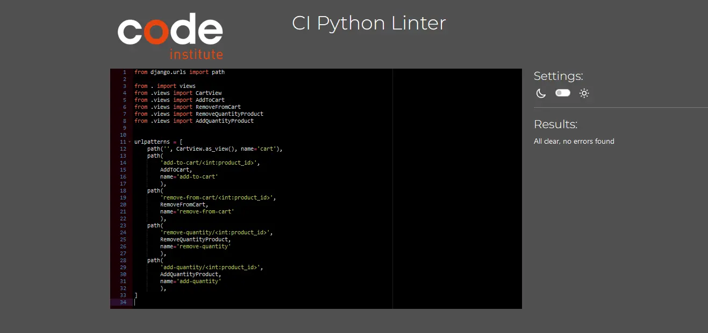
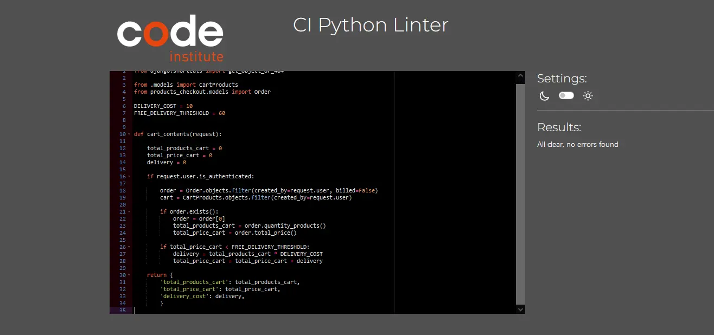
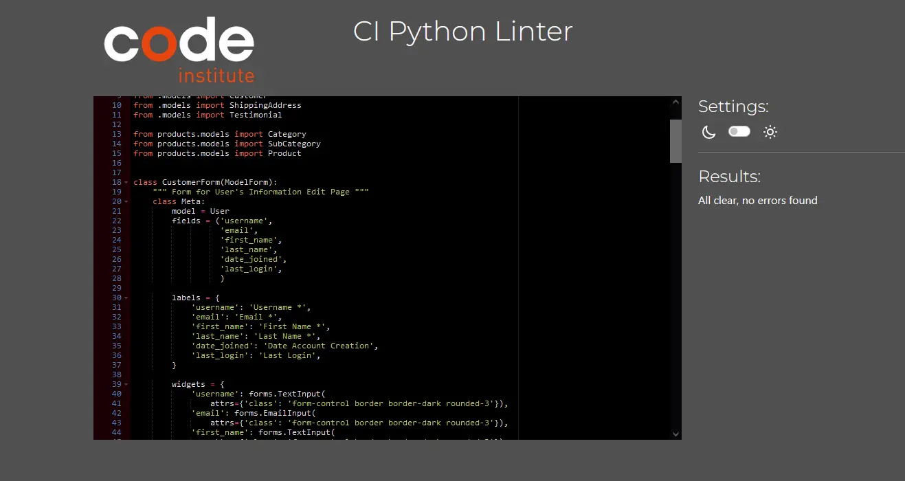
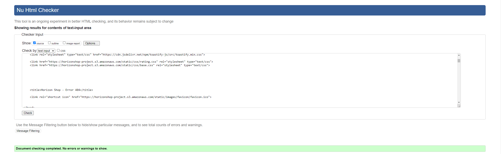

# **Testing - Horizon Shop** Website

### **Developer: Claudio Crocilla**

👈 [Go to the Readme File](README.md)

### **Testing Contents Horizon Shop**
- [Testing](#testing)
  - [Lighthouse Validator](#lighthouse-validator)
  - [Test Cases](#test-cases)
  - [Automation Testing](#list-of-automated-test-cases-perfomed)
  - [Additional Tests](#additional-tests)
  - [Bugs](#bugs)
  - [Future Implementation](#future-implementation)

## **Testing**
The testing phases have been carried out using the **Code Institute PIP8 Python Validator**. No errors have been identified from the Validators as it can be seen in the screenshots below:

- **Python**

    
PIP8 Python Validator

    
Click here for the CI Python Linter Validator - Home [views.py]

    
Click here for the CI Python Linter Validator - Home [urls.py]

    
Click here for the CI Python Linter Validator - Home [models.py]

    
Click here for the CI Python Linter Validator - Contact_Us [views.py]

    
Click here for the CI Python Linter Validator - Contact_Us [urls.py]

    
Click here for the CI Python Linter Validator - Contact_Us [models.py]

    
Click here for the CI Python Linter Validator - Contact_Us [forms.py]

    
Click here for the CI Python Linter Validator - Products [admin.py]

    
Click here for the CI Python Linter Validator - Products [views.py]

    
Click here for the CI Python Linter Validator - Products [urls.py]

    
Click here for the CI Python Linter Validator - Products [models.py]

    
Click here for the CI Python Linter Validator - Products [forms.py]

    
Click here for the CI Python Linter Validator - Products [admin.py]

    
Click here for the CI Python Linter Validator - Products_Cart [views.py]

    
Click here for the CI Python Linter Validator - Products_Cart [urls.py]

    
Click here for the CI Python Linter Validator - Products_Cart [models.py]

    
Click here for the CI Python Linter Validator - Products_Cart [forms.py]

    
Click here for the CI Python Linter Validator - Products_Cart [context-processors.py]

    
Click here for the CI Python Linter Validator - Products_Cart [admin.py]

    
Click here for the CI Python Linter Validator - Products_Checkout [views.py]

    
Click here for the CI Python Linter Validator - Products_Checkout [urls.py]

    
Click here for the CI Python Linter Validator - Products_Checkout [models.py]

    
Click here for the CI Python Linter Validator - Products_Checkout [forms.py]

    
Click here for the CI Python Linter Validator - Products_Checkout [admin.py]

    
Click here for the CI Python Linter Validator - Products_Wishlist [views.py]

    
Click here for the CI Python Linter Validator - Products_Wishlist [models.py]

    
Click here for the CI Python Linter Validator - Products_Wishlist [context-processors.py]

    
Click here for the CI Python Linter Validator - Products_Wishlist [admin.py]

    
Click here for the CI Python Linter Validator - Dashboard [views.py]

    
Click here for the CI Python Linter Validator - Dashboard [urls.py]

    
Click here for the CI Python Linter Validator - Dashboard [models.py]

    
Click here for the CI Python Linter Validator - Dashboard [forms.py]

    
Click here for the CI Python Linter Validator - Dashboard [signals.py]

    
Click here for the CI Python Linter Validator - Dashboard [admin.py]

 

The testing phases have been also carried out using the **W3C Javascript Validator**, **W3C CSS Validator** and **W3C Markup Validator**(in all pages). No errors have been identified from the Validators as it can be seen in the screenshot below:  

- **JavaScript**

    
W3C Javascript Validator

    
Click here for W3C Javascript Validator - Navbar_Script.js

    
Click here for W3C Javascript Validator - Stripe_Element.js

    
Click here for W3C Javascript Validator - Script.js

 

- **CSS**

    
W3C CSS Validator

    
Click here for W3C CSS Validator - Base.css

    
Click here for W3C CSS Validator - Rating-stars.css

 

- **HTML**

    
W3C Markup Validator

    
Click here for W3C Markup Validator - Home Page

    
Click here for W3C Markup Validator - Contact Us

    
Click here for W3C Markup Validator - Sign In

    
Click here for W3C Markup Validator - Sign Up

    
Click here for W3C Markup Validator - Sign Out

    
Click here for W3C Markup Validator - All Products

    
Click here for W3C Markup Validator - New Products

    
Click here for W3C Markup Validator - Used Products

    
Click here for W3C Markup Validator - Search By Category

    
Click here for W3C Markup Validator - Search By Sub-Category

    
Click here for W3C Markup Validator - Product Details

    
Click here for W3C Markup Validator - Cart

    
Click here for W3C Markup Validator - Checkout

    
Click here for W3C Markup Validator - Payment Success

    
Click here for W3C Markup Validator - Wishlist

    
Click here for W3C Markup Validator - My Horizon Shop

    
Click here for W3C Markup Validator - [Admin] Add Category

    
Click here for W3C Markup Validator - [Admin] List Categories

    
Click here for W3C Markup Validator - [Admin] Update Category

    
Click here for W3C Markup Validator - [Admin] Deleted Categories

    
Click here for W3C Markup Validator - [Admin] Add Sub-Category

    
Click here for W3C Markup Validator - [Admin] List Sub-Categories

    
Click here for W3C Markup Validator - [Admin] Update Sub-Category

    
Click here for W3C Markup Validator - [Admin] Deleted Sub-Categories

    
Click here for W3C Markup Validator - [Admin] Add Product

    
Click here for W3C Markup Validator - [Admin] List Products

    
Click here for W3C Markup Validator - [Admin] Update Product

    
Click here for W3C Markup Validator - [Admin] Deleted Products

    
Click here for W3C Markup Validator - [Admin/Customer] Edit Profile 

    
Click here for W3C Markup Validator - [Admin/Customer] Change Password

    
Click here for W3C Markup Validator - [Admin/Customer] Add Address 

    
Click here for W3C Markup Validator - [Admin/Customer] List Addresses 

    
Click here for W3C Markup Validator - [Admin/Customer] Update Address

    
Click here for W3C Markup Validator - [Admin/Customer] Delete Address

    
Click here for W3C Markup Validator - [Admin/Customer] My Orders

    
Click here for W3C Markup Validator - [Admin/Customer] Order Details

    
Click here for W3C Markup Validator - [Admin/Customer] Sell Product

    
Click here for W3C Markup Validator - [Admin/Customer] Products' List

    
Click here for W3C Markup Validator - [Admin/Customer] Update Product

    
Click here for W3C Markup Validator - [Admin/Customer] Wishlist

    
Click here for W3C Markup Validator - [Admin/Customer] Add Testimonial

    
Click here for W3C Markup Validator - [Admin/Customer] Testimonial List

    
Click here for W3C Markup Validator - [Admin/Customer] Update Testimonial

    
Click here for W3C Markup Validator - [Admin/Customer] Delete Testimonial

    
Click here for W3C Markup Validator - Error 404

 

- ### **Lighthouse Validator**
Below it is possible to take a look at the result obtained in Lighthouse:

    
Click here for Lighthouse the Lighthouse Results

    
Click here for Lighthouse Desktop - Homepage

    
Click here for Lighthouse Mobile - Homepage

    
Click here for Lighthouse Desktop - Contact Us

    
Click here for Lighthouse Mobile - Contact Us

    
Click here for Lighthouse Desktop - All Products

    
Click here for Lighthouse Mobile - All Products

    
Click here for Lighthouse Desktop - New Products

    
Click here for Lighthouse Mobile - New Products

    
Click here for Lighthouse Desktop - Used Products

    
Click here for Lighthouse Mobile - Used Products

    
Click here for Lighthouse Desktop - Products Search By

    
Click here for Lighthouse Mobile - Products Search By

    
Click here for Lighthouse Desktop - Products Details

    
Click here for Lighthouse Mobile - Products Details

    
Click here for Lighthouse Desktop - Cart

    
Click here for Lighthouse Mobile - Cart

    
Click here for Lighthouse Desktop - Checkout

    
Click here for Lighthouse Mobile - Checkout

    
Click here for Lighthouse Desktop - Payment Success

    
Click here for Lighthouse Mobile - Payment Success

    
Click here for Lighthouse Desktop - My Horizon Shop

    
Click here for Lighthouse Mobile - My Horizon Shop

    
Click here for Lighthouse Desktop - [Admin] Add Category 

    
Click here for Lighthouse Mobile - [Admin] Add Category 

    
Click here for Lighthouse Desktop - [Admin] List Categories 

    
Click here for Lighthouse Mobile - [Admin] List Categories 

    
Click here for Lighthouse Desktop - [Admin] Update Category 

    
Click here for Lighthouse Mobile - [Admin] Update Category 

    
Click here for Lighthouse Desktop - [Admin] Deleted Categories 

    
Click here for Lighthouse Mobile - [Admin] Deleted Categories 

    
Click here for Lighthouse Desktop - [Admin] Add Sub-Category 

    
Click here for Lighthouse Mobile - [Admin] Add Sub-Category 

    
Click here for Lighthouse Desktop - [Admin] List Sub-Categories 

    
Click here for Lighthouse Mobile - [Admin] List Sub-Categories 

    
Click here for Lighthouse Desktop - [Admin] Update Sub-Category 

    
Click here for Lighthouse Mobile - [Admin] Update Sub-Category 

    
Click here for Lighthouse Desktop - [Admin] Deleted Sub-Categories 

    
Click here for Lighthouse Mobile - [Admin] Deleted Sub-Categories 

    
Click here for Lighthouse Desktop - [Admin] Add Product 

    
Click here for Lighthouse Mobile - [Admin] Add Product 

    
Click here for Lighthouse Desktop - [Admin] Update Product 

    
Click here for Lighthouse Mobile - [Admin] Update Product 

    
Click here for Lighthouse Desktop - [Admin] Deleted Product

    
Click here for Lighthouse Mobile - [Admin] Deleted Product

    
Click here for Lighthouse Desktop - [Admin/Customer] Edit Profile

    
Click here for Lighthouse Mobile - [Admin] Edit Profile

    
Click here for Lighthouse Desktop - [Admin/Customer] Change Password Profile

    
Click here for Lighthouse Mobile - [Admin/Customer] Change Password Profile

    
Click here for Lighthouse Desktop - [Admin/Customer] Add Address

    
Click here for Lighthouse Mobile - [Admin/Customer] Add Address

    
Click here for Lighthouse Desktop - [Admin/Customer] List Address

    
Click here for Lighthouse Mobile - [Admin/Customer] List Address

    
Click here for Lighthouse Desktop - [Admin/Customer] Update Address

    
Click here for Lighthouse Mobile - [Admin/Customer] Update Address

    
Click here for Lighthouse Desktop - [Admin/Customer] Delete Address

    
Click here for Lighthouse Mobile - [Admin/Customer] Delete Address

    
Click here for Lighthouse Desktop - [Admin/Customer] My Orders

    
Click here for Lighthouse Mobile - [Admin/Customer] My Orders

    
Click here for Lighthouse Desktop - [Admin/Customer] Order Details

    
Click here for Lighthouse Mobile - [Admin/Customer] Order Details

    
Click here for Lighthouse Desktop - [Admin/Customer] Sell Product

    
Click here for Lighthouse Mobile - [Admin/Customer] Sell Product

    
Click here for Lighthouse Desktop - [Admin/Customer] Products' List

    
Click here for Lighthouse Mobile - [Admin/Customer] Products' List

    
Click here for Lighthouse Desktop - [Admin/Customer] Update Product

    
Click here for Lighthouse Mobile - [Admin/Customer] Update Product

    
Click here for Lighthouse Desktop - [Admin/Customer] My Wishlist

    
Click here for Lighthouse Mobile - [Admin/Customer] My Wishlist

    
Click here for Lighthouse Desktop - [Admin/Customer] Add Testimonial

    
Click here for Lighthouse Mobile - [Admin/Customer] Add Testimonial

    
Click here for Lighthouse Desktop - [Admin/Customer] List Testimonials

    
Click here for Lighthouse Mobile - [Admin/Customer] List Testimonials

    
Click here for Lighthouse Desktop - [Admin/Customer] Update Testimonial

    
Click here for Lighthouse Mobile - [Admin/Customer] Update Testimonial

    
Click here for Lighthouse Desktop - [Admin/Customer] Delete Testimonial

    
Click here for Lighthouse Mobile - [Admin/Customer] Delete Testimonial

    
Click here for Lighthouse Desktop - Sign In

    
Click here for Lighthouse Mobile - Sign In

    
Click here for Lighthouse Desktop - Sign Up

    
Click here for Lighthouse Mobile - Sign Up

    
Click here for Lighthouse Desktop - Sign Out

    
Click here for Lighthouse Mobile - Sign Out

 

### **Test Cases**

  - #### List of Manual Test Cases perfomed.
All the Tests, icluding Layout Testing have been performed in all Devices. 

    
Click here to see the list of Manual Tests

| Page | Feature | Expected Result | Status |
| --- | --- | --- | --- |
| Home | Header | Make sure that the Logo and the Navbar are displayed on the top part of the Home Page. | Pass |
| Home | Header | Make sure that non-authenticated users can only access Home, Contact Us, Products, Sign In/Up Pages. | Pass |
| Home | Header | Make sure that non-authenticated users cannot add product to the Cart or to the Wishlist. | Pass |
| Home | Header | Make sure that authenticated user can see/access Home, Contact Us, Products, Cart, Wishlist and all the customer sections of My Horizon Shop Dashboard. | Pass |
| Home | Header | Make sure that by clicking on the Logo the user is redirected to the Home Page. | Pass |
| Home | Header | Make sure that by clicking onto one of the Products Button the user is redirected to the Products List selected. | Pass |
| Home | Header | Make sure that by using the search field the user is redirected to the Products List displaying the products that match the query entered by the user. | Pass |
| Home | Horizon Shop Service | Make sure that the Services of Horizon Shop are displayed with no overlap with the Logos, Navbar and/or text. | Pass |
| Home | Hero Offer Section | Make sure that the Images in a Carousel are displayed with the correct text/buttons. | Pass |
| Home | Hero Offer Section | Make sure that the Carousel and its content do not overlap with other website contents. | Pass |
| Home | Latest New Products | Make sure that the latest 4 New Products added to Horizon Shop are displayed in cards with no overlap with other sections. | Pass |
| Home | Latest New Products | Make sure that in each New Product Card the correct information is displayed (Title, Category, Rating, Price, Comments' Quantity, Buttons Cart and Wishlist) for Authenticated Users. | Pass |
| Home | Latest New Products | Make sure that in each New Product Card the correct information is displayed (Title, Category, Rating, Price, Comments' Quantity) for Non-Authenticated Users. | Pass |
| Home | Latest Used Products | Make sure that the latest 4 Used Products added to Horizon Shop are displayed in cards with no overlap with other sections. | Pass |
| Home | Latest Used Products | Make sure that in each Used Product Card, the correct information is displayed (Title, Category, Rating, Price, Comments' Quantity, Buttons Cart and Wishlist) for Authenticated Users. | Pass |
| Home | Latest Used Products | Make sure that in each Used Product Card the correct information is displayed (Title, Category, Rating, Price, Comments' Quantity) for Non-Authenticated Users. | Pass |
| Home | Testimonials Section | Make sure that the Testimonials area displays a carousel with Users’ Testimonials.| Pass |
| Home | Testimonials Section | Make sure that the user can use the arrows to switch between Testimonials. | Pass |
| Home | Testimonials Section | Make sure that Testimonials are displayed properly including the Comment, the Rating, the Avatar and the Username of the User. | Pass |
| Home | Footer | Make sure that the footer displays the information of the company | Pass |
| Home | Footer | Make sure that the footer provides the link to access the social media and when clicking on the icons a new tab is opened | Pass |
| Home | Footer | Make sure that the user can sign up with an email address to receive the newsletter.| Pass |
| Home | Footer | Make sure that, by clicking on the newsletter form button, if no email or an invalid email has been entered an error message is displayed to the user. | Pass |
| Home | Footer | Make sure that by clicking on the newsletter form button, if a correct email has been entered, a success message notification is displayed to the user | Pass |
| Contact Us | Form Section | Make sure that the information is displayed correctly in the page and no overlap/cut-off are present. | Pass |
| Contact Us | Form Section | Make sure all the fields (Full Name, Email, Message) are editable. | Pass |
| Contact Us | Form Section | Make sure the checkboxes Terms & Condition is clickable. | Pass |
| Contact Us | Form Section | Make sure all the fields (Full Name, Email, Message, Terms & Condition) are mandatory. | Pass |
| Contact Us | Form Section | Make sure that the Reset Form Button works and deletes all the information entered in the form. | Pass |
| Contact Us | Form Section | Make sure that the Submit Button works and provides a clear message to the user. | Pass |
| Contact Us | Maps | Make sure that the Map with the location of the company is properly displayed. | Pass |
| Contact Us | Location Section | Make sure that the company details are displayed properly. | Pass |
| Contact Us | Location Section | Make sure that the company details don't overlap with other parts of the Contact Us Page. | Pass |
| Contact Us | Location Section | Make sure that the company details includes the Address, Email and Phone Number. | Pass |
| Wishlist | Wishlist List | Make sure that only authenticated users can see/access the wishlist. | Pass |
| Wishlist | Wishlist List | Make sure that the authenticated users can see only their own wished products. | Pass |
| Wishlist | Wishlist List | Make sure that the authenticated users can see the list of products in cards and no overlaps are present. | Pass |
| Cart | Cart Page | Make sure that non-authenticated users can see a message informing them to log in Horizon Shop to see the content of the Cart. | Pass |
| Cart | Cart Page | Make sure that the authenticated users can see/access the Cart Page. | Pass |
| Cart | Cart Page | Make sure that if no product has been added to the Cart, the user sees a Background Image and message informing that no Products are present. | Pass |
| Cart | Cart Page | Make sure that if no product has been added to the Cart, a button that redirects the user to the list of products is displayed. | Pass |
| Cart | Cart Page | Make sure that the users can see the list of products added and no overlaps are present. | Pass |
| Cart | Cart Page | Make sure that the users can see the quantity of added products being update when using the dedicated buttons. | Pass |
| Cart | Cart Page | Make sure that the users can see the list of their Shipping Addresses. | Pass |
| Cart | Cart Page | Make sure that if the user does not have any Shipping Address saved, a message is displayed to the user with a link to go back to the Address Creation. | Pass |
| Cart | Cart Page | Make sure that a clickable Checkout Button is displayed. | Pass |
| Cart | Cart Page | Make sure that by clicking on the Checkout Button the user is redirected to the Checkout page. | Pass |
| Checkout | Summary | Make sure that a summary with the important information of the order is displayed. | Pass |
| Checkout | Summary | Make sure that the summary contains the User Details. | Pass |
| Checkout | Summary | Make sure that the summary contains the Shipping Address Details. | Pass |
| Checkout | Summary | Make sure that the summary contains the List of Products present in the user cart. | Pass |
| Checkout | Stripe | Make sure that the Stripe Payment Form is displayed. | Pass |
| Checkout | Stripe | Make sure that the a Pay Now Button is displayed and/or is disabled if the form is not filled in correctly. | Pass |
| Checkout | Stripe | Make sure that a Continue Shopping Button, that redirects the user to the All Products List Page, is displayed.  | Pass |
| Checkout | Stripe | Make sure that the fields in the Payment form are editable. | Pass |
| Checkout | Stripe | Make sure that if a invalid *Credit/Debit Card* and/or incorrect *Valid Date* are entered, an error message is displayed to the user. | Pass |
| Checkout | Stripe | Make sure that if the form is correctly filled-in, the Pay Now button is clickable. | Pass |
| Checkout | Payment Success | Make sure that by clicking on the Pay Now Button a Wheel Spinner is displayed and the Pay Now Button is not visible. | Pass |
| Checkout | Payment Success | Make sure that when clicking on the Pay Now Button if the Payment is processed correctly, the user is redirected to the Payment Success Page. | Pass |
| Checkout | Email Success | Make sure that the user receives an email confirming that the order has been processed correctly. | Pass |
| Checkout | Payment Fail | Make sure that when clicking on the Pay Now Button if the Payment fails, the user is redirected to the Payment Failed Page. | Pass |
| Checkout | Email Fail | Make sure that the user receives an email confirming that the order has not been processed. | Pass |
| Dashboard | My Horizon Shop | Make sure that only authenticated users can access and view the content of the My Horizon Shop Page. | Pass |
| Dashboard | My Horizon Shop | Make sure that Quick Access Link Cards are displayed correctly. | Pass |
| Dashboard | My Horizon Shop | Make sure that the correct value of the Quick Access Link Cards is displayed in each card. | Pass |
| Dashboard | My Horizon Shop | Make sure that from the cards it is possible to access the relative sub-sections. | Pass |
| Management | My Admin | Make sure that the My Admin Section includes the Add Category/Sub-Category, Categories/Sub-Categories List, Add Product, Product List and Deleted Product List. | Pass |
| Management | My Admin | Make sure that only Admin User can access the My Admin Section and the relative sub-sections. | Pass |
| My Admin | Add Category | Make sure that by clicking Add Category the Admin User is able to access the Add Category Page form. | Pass |
| My Admin | Add Category | Make sure that after filling-in the form, the Admin User is redirected to the Categories List Page if the form is valid. | Pass |
| My Admin | Add Category | Make sure that after the redirect to the Categories List Page, a Message is displayed to the Admin User confirming the creation of the Category. | Pass |
| My Admin | Add Category | Make sure that the Admin User is obliged to fill the mandatory fields correctly. | Pass |
| My Admin | Category List | Make sure that by clicking Category List Sub-Section the Admin User is able to see the Categories added. | Pass |
| My Admin | Category List | Make sure that the Admin User can visualise the name of the Category. | Pass |
| My Admin | Category List | Make sure that a Delete Button is present for the Admin User to click on if the entered category needs to be deleted. | Pass |
| My Admin | Category List | Make sure that by clicking on the Delete Button a modal requesting confirmation to the Admin User is opened. | Pass |
| My Admin | Category List | Make sure that after confirmation, the Admin User is redirected to the Category List and a message confirming the deletion is displayed. | Pass |
| My Admin | Category List | Make sure that an Edit Button is displayed. | Pass |
| My Admin | Category List | Make sure that by clicking on the Edit Button the Admin User can update the information of a previous entered Category. | Pass |
| My Admin | Category List | Make sure that every page is responsive and that no overlaps are presents. | Pass |
| My Admin | Add Sub-Category | Make sure that by clicking Add Sub-Category the Admin User is able to access the Add Sub-Category Page form. | Pass |
| My Admin | Add Sub-Category | Make sure that after filling-in the form, the Admin User is redirected to the Sub-Categories List Page if the form is valid. | Pass |
| My Admin | Add Sub-Category | Make sure that after the redirect to the Sub-Categories List Page a Message is displayed to the Admin User confirming the creation of the Sub-Category. | Pass |
| My Admin | Add Sub-Category | Make sure that the Admin User is obliged to fill the mandatory fields correctly. | Pass |
| My Admin | Sub-Category List | Make sure that by clicking Sub-Category List Sub-Section the Admin User is able to see the Sub-Categories added. | Pass |
| My Admin | Sub-Category List | Make sure that the Admin User can visualise the name of the Sub-Category and the Category associated to it. | Pass |
| My Admin | Sub-Category List | Make sure that a Delete Button is present and that the Admin User can click on the Delete button to delete the entered Sub-Category. | Pass |
| My Admin | Sub-Category List | Make sure that by clicking on the Delete Button a modal requesting confirmation to the Admin User is opened. | Pass |
| My Admin | Sub-Category List | Make sure that after confirmation the Admin User is redirected to the Sub-Category List and a message confirming the deletion is displayed. | Pass |
| My Admin | Sub-Category List | Make sure that an Edit Button is displayed. | Pass |
| My Admin | Sub-Category List | Make sure that by clicking on the Edit Button the Admin User can update the information of a previous entered Sub-Category. | Pass |
| My Admin |Sub-Category List | Make sure that every page is responsive and that no overlaps are presents. | Pass |
| My Admin | Add Product | Make sure that by clicking Add Product the Admin User is able to access the Add Product Page form. | Pass |
| My Admin | Add Product | Make sure that after filling-in the form and clicking on the Create Button, the Admin User is redirected to the Products List Page if the form is valid. | Pass |
| My Admin | Add Product | Make sure that after the redirect to the Products List Page a Message is displayed to the Admin User confirming the creation of the product. | Pass |
| My Admin | Add Product | Make sure that the Admin User is obliged to fill the mandatory fields correctly. | Pass |
| My Admin | Product List | Make sure that by clicking Product List Sub-Section the Admin User is able to see the products added. | Pass |
| My Admin | Product List | Make sure that the Admin User can visualise all the products information. | Pass |
| My Admin | Product List | Make sure that a Delete Button is present and when clicking on it, the entered product is set as Deleted and it is not available in any of the Products Lists. | Pass |
| My Admin | Product List | Make sure that by clicking on the Delete Button a modal requesting confirmation to the Admin User is opened. | Pass |
| My Admin | Product List | Make sure that after confirmation the Admin User is redirected to the Product List and a message confirming the deletion of the Product is displayed. | Pass |
| My Admin | Product List | Make sure that an Edit Button is displayed. | Pass |
| My Admin | Product List | Make sure that by clicking on the Edit Button the Admin User can update the information of a product. | Pass |
| My Admin | Product List | Make sure that every page is responsive and that no overlaps are present. | Pass |
| My Admin | Deleted Product List | Make sure that by clicking Deleted Product List Sub-Section the Admin User is able to see the products in deleted Status. | Pass |
| My Admin | Deleted Product List | Make sure that the Admin User can visualise basic information of the Deleted Products. | Pass |
| My Admin | Deleted Product List | Make sure that a Restore Button is present and when clicking on it, the product is restored and available in all the Products List. | Pass |
| My Admin | Deleted Product List | Make sure that after restoring the product the Admin User is redirected to the Product List and a message confirming the action is displayed. | Pass |
| Dashboard | My Profile | Make sure that the My Profile Section includes the Edit Profile, Change Password, Add address and List Addresses Sub-Sections. | Pass |
| My Profile | Edit Profile | Make sure that by clicking Edit Profile the Admin User is able to access the personal information form. | Pass |
| My Profile | Edit Profile | Make sure that in the Edit Profile Form the user can edit only his/her own personal information. | Pass |
| My Profile | Change password | Make sure that by clicking Change Password Sub-Section, the user is able to successfully access the Change Password Page. | Pass |
| My Profile | Change password | Make sure that in the Change Password Form the user can change the password associated to his/her account. | Pass |
| Dashboard | My Products | Make sure that My Profile Section includes the My Order, Sell Products, Product List, My Wishlist Sub-Sections. | Pass |
| My Products | My Order | Make sure that by clicking to My Order Sub-Section the user is able to see the completed orders. | Pass |
| My Products | My Order | Make sure that the user can visualise the basic information about the order (Order Number, Status, date of the Order). | Pass |
| My Products | My Order | Make sure that a Details Button is present and when clicking on it the user can see the details of the Order. | Pass |
| My Products | My Order | Make sure that in the Details Page the Account, the Shipping Address, the Order and Product details, including the cost, are displayed.  | Pass |
| My Products | My Order | Make sure that every page is responsive and that no overlaps are present. | Pass |
| My Products | Sell Product | Make sure that by clicking Add/Sell Product, the user is able to access the Add/Sell Product Page form. | Pass |
| My Products | Sell Product | Make sure that after filling-in the form and clicking on the Create Button, the user is redirected to the Products List Page if the form is valid. | Pass |
| My Products | Sell Product | Make sure that after the redirect to the Products List Page a Message is displayed to the user confirming the creation of the product. | Pass |
| My Products | Sell Product | Make sure that the user is obliged to fill the mandatory fields correctly. | Pass |
| My Products | Product List | Make sure that by clicking Product List Sub-Section the user is able to see the added products. | Pass |
| My Products | Product List | Make sure that the user can visualise all the information of the Products. | Pass |
| My Products | Product List | Make sure that a Delete Button is present and when clicking on it the entered product is set as Deleted and it is not available in any of the Products List. | Pass |
| My Products | Product List | Make sure that by clicking on the Delete Button a modal requesting confirmation to the user is opened. | Pass |
| My Products | Product List | Make sure that after confirmation the user is redirected to the Product List and a message confirm the deletion is displayed. | Pass |
| My Products | Product List | Make sure that an Edit Button is displayed. | Pass |
| My Products | Product List | Make sure that by clicking on the Edit Button the user can update the information of a product. | Pass |
| My Products | Product List | Make sure that every page is responsive and that no overlaps are present. | Pass |
| My Wishlist |  Wishlist    | Make sure that by clicking My Wishlist Section the user is able to access his/her own personal wishlist. | Pass |
| My Wishlist |  Wishlist    | Make sure that the authenticated users can see the list of products in cards and no overlaps are present. | Pass |
| My Wishlist |  Wishlist    | Make sure that the user can remove the products from the wishlist by clicking on a remove button displayed on each card. | Pass |
| My Wishlist |  Wishlist    | Make sure that the Remove Button redirects the user to the Wishlist Sub-Section and a message confirming the deletion is displayed. | Pass |
| Dashboard | My Testimonials | Make sure that the My Testimonials Section includes the Add Testimonial and Testimonial List Sub-Sections. | Pass |
| My Testimonials | Add Testimonial | Make sure that by clicking Add Testimonial the user is able to access the Add Testimonial Page form. | Pass |
| My Testimonials | Add Testimonial | Make sure that after filling-in the form, the user is redirected to the Testimonials List Page if the form is valid. | Pass |
| My Testimonials | Add Testimonial | Make sure that after the redirect to the Testimonials List Page a message is displayed to the user confirming the creation of the Testimonials. | Pass |
| My Testimonials | Add Testimonial | Make sure that the user is obliged to fill the mandatory fields correctly. | Pass |
| My Testimonials | Testimonials List | Make sure that when clicking on the Testimonials List Sub-Section, the user is able to access his/her own personal Testimonials List. | Pass |
| My Testimonials | Testimonials List | Make sure that the user can visualise the information of his/her Testimonials. | Pass |
| My Testimonials | Testimonials List | Make sure that a Delete Button is present and that the user can click on it to delete the entered Testimonials. | Pass |
| My Testimonials | Testimonials List | Make sure that by clicking on the Delete Button a modal requesting confirmation is opened. | Pass |
| My Testimonials | Testimonials List | Make sure that after confirmation the user is redirected to the Testimonials List and a message confirm the action is displayed. | Pass |
| My Testimonials | Testimonials List | Make sure that an Edit Button is displayed. | Pass |
| My Testimonials | Testimonials List | Make sure that by clicking on the Edit Button, the user can update the information of a Testimonials. | Pass |
| My Testimonials | Testimonials List | Make sure that every page is responsive and that no overlap are present. | Pass |

 

  - #### List of Automated Test Cases performed:
#### The Automation testing is the process of testing the software (as well as other tech products) to ensure it meets the requirements. In Horizon Shop 19 Automated Tests have been designed and run, all with positive final results. 

#### The Tests have been included in a tests folder for each app and have been divided by type allowing a better visualization of the tests carried out. See below for further details:

- Urls Automation Testing: The urls tests aim to ensure that all the urls in the application are functioning correctly calling the matched View.

- Views Automation Testing: The aim of the Views Automation Testing is to ensure that once the views are called they return a status code 200 meaning that the View is working correctly.

- Forms Automation Testing: The aim of the Forms Automation Testing is to ensure that when filling-in the form (or when trying to send an empty form), only when/if the information is populated correctly the form is sent, otherwise it is not possible to proceed. 
  
- Models Automation Testing: The aim of the Models Automation Testing is to ensure that when filling-in the information in the database, those are available. 

### **Additional Tests**
Tests have been performed on Firefox, Microsoft Edge, Chrome and Safari and the result is consistent in all the browsers. 

Additional tests include checks on different devices using the Toggle Device Emulation in Firefox and Microsoft Edge. Below the list of devices used for the tests through the Responsive Design Mode in Firefox is shown:
* iPhone 12 Pro Max
* iPad Pro
* iPad 
* Moto 4G
* Samsung Galaxy S20 Ultra
* Surface Duo

### **Bugs**
- No other bugs, other than the ones described in Agile Board (Issues: [#113](https://github.com/CCrocilla/horizon-shop/issues/113) and [#124](https://github.com/CCrocilla/horizon-shop/issues/124) ), have been found in the website during the test phase. The Issue #124 has already been fixed while regarding issue #113 a fix could not be implemented due to timing constraints.  This will be sorted in future releases.

### **Future Implementation**
A million of additional features are ready to be implemented in the future to offer a better user experience and better services thorough the Horizon Shop website. Unfortunately, due to time constraints not all the desired features have been implemented. Example of those are listed below and will be implemented in future releases:

- Out of Stock Functionality: 
The Out of Stock Functionality will indicate when a product is out of stock, to do this the quantity of each item needs to be included. If the requested quantity is larger than the available products, a message will inform the customer that that particular item is out of stock. This will be implemented for new and used products, with selling customers able to indicate the quantity they want to sell.

- Multi Image per Products
Implement the management of multi images per product. This will increase the selling possibilities of each product. 

- Analytics Data and Dashboarding
To collect information of each sold product including the numbers of the orders placed to calculate the revenue of the website. This information will be displayed using dashboards and graphs to gain insights on the spending habits of the customers and to highlight favourite and most sought products or categories. 

- Reward Points
Users that sell or buy products should receive rewards point that can be used to redeem prices (for example, customers can use reward points to redeem discounts).

- Quantity Products
Users should be able to select the quantity of the desired products before adding them to the cart. 
 
- Admin Orders Management
Admin Users should be able to change the status of the Orders and provide a feedback to the user if the order has been shipped or delivered. Information should be displayed to the Customer. 

Many other functionalities to implement! 